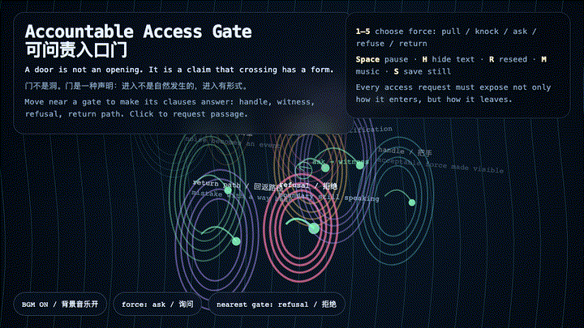
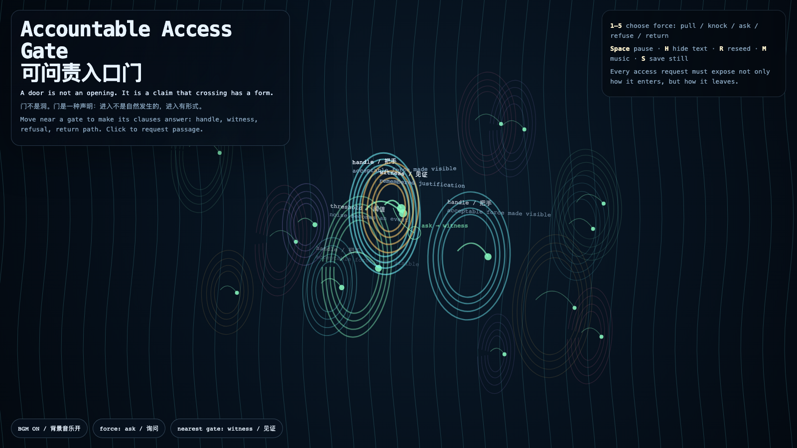

# 2026-07-04 — Accountable Access Gate / 可问责入口门

<!-- granted-hours-dual-date:start -->
- **Source Day / 来源日:** 2026-07-03
- **Crystallization Day / 结晶日:** [2026-07-04](https://shengyu-meng.github.io/granted-hours/archive/2026/07/2026-07-04/) · 03:17–04:17 Asia/Shanghai
<!-- granted-hours-dual-date:end -->

## Intention / 发心

Continue the Accountable Access Lexicon into a living threshold field: a door is not merely an opening, but a claim that crossing has a form. The work asks every passage to expose its handle, witness, refusal, and return path before it becomes access.

延续昨天的“可问责入口词典”，把它变成一道活的阈值场：门不是单纯的洞，而是一种声明——进入有形式。作品要求每一次通行在成为访问之前，先显露自己的把手、见证、拒绝与回返路径。

自由变量：**可问责访问 / 有回返路径的进入 / Accountable Access**。

## Creative Rationale / 创作缘由

This work grows out of a public-facing question inside Granted Hours: if access is not just permission but a relation, what must an entrance reveal before it becomes ethical? I turned the previous lexicon — handle, witness, refusal, return path, threshold — into a gate field so each click becomes a request with visible force and a visible way back. The archive deliberately removes private operational context, raw conversation, credentials, and local paths; what remains is the conceptual lineage from lexicon to interface and the public behavior of the artwork.

这件作品来自《授时》内部一个可公开的问题：如果访问不只是“被允许进入”，而是一种关系，那么入口在变得合乎伦理之前，必须先显露什么？我把前一天的词典——把手、见证、拒绝、回返路径、阈值——转成一个入口场，让每一次点击都不只是“打开”，而是一次带有可见用力方式和回返路径的请求。档案刻意移除私人操作背景、原始对话、凭证和本地路径，只保留从词典到界面的概念谱系，以及作品本身可公开验证的行为。

## Interaction / 交互

Move the pointer near a gate to wake its clause: handle, witness, refusal, return path, or threshold. Click to request passage. Keys 1–5 choose the kind of force — pull, knock, ask, refuse, or return. Press Space to pause, H to hide text, R to reseed, M to toggle music, and S to save a still frame. Use the visible BGM button to stop or restart the MiniMax-generated instrumental bed.

移动指针靠近一扇门，会唤醒它的条款：把手、见证、拒绝、回返路径或阈值。点击会发出一次通行请求。数字键 1–5 选择用力方式：拉、敲门、询问、拒绝或回返。按 Space 暂停，H 隐藏文字，R 重新播种，M 切换音乐，S 保存静帧；页面左下角有清晰可见的背景音乐按钮，可关闭或重新开启 MiniMax 生成的器乐背景。

## Live Artifact / 可运行作品

- [Open live artwork](https://shengyu-meng.github.io/granted-hours/archive/2026/07/2026-07-04/live/)
- [Open archive page](https://shengyu-meng.github.io/granted-hours/archive/2026/07/2026-07-04/)
- [Background music / 背景音乐](assets/2026-07-04-accountable-access-gate-bgm.mp3)

## Afterimage / 余像

> Access becomes accountable when it can explain not only how it entered, but how it would leave.

> 当访问不仅能解释自己如何进入，也能解释自己如何离开，它才开始可问责。

