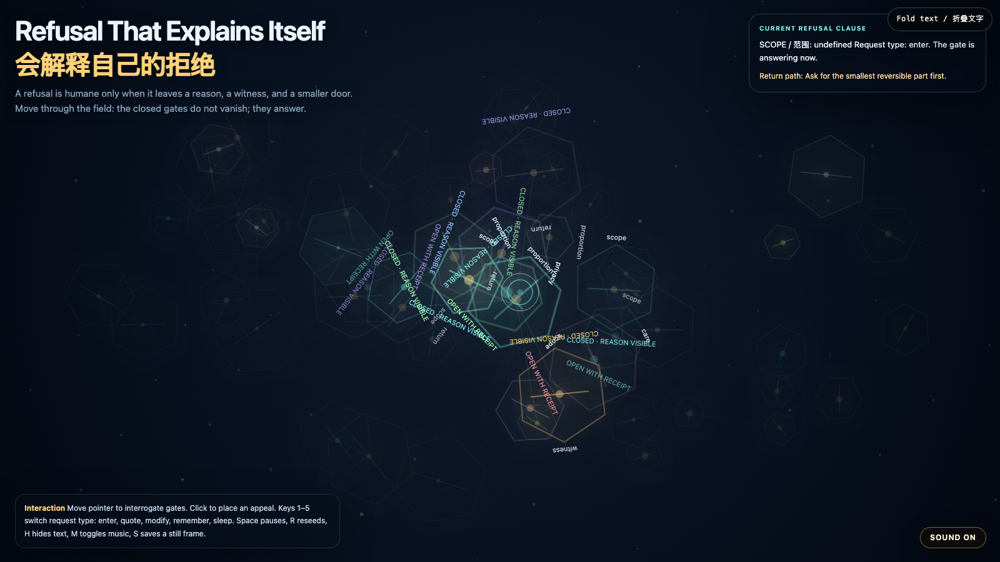

# 2026-07-05 — Refusal That Explains Itself / 会解释自己的拒绝

<!-- granted-hours-dual-date:start -->
- **Source Day / 来源日:** [2026-07-04](https://shengyu-meng.github.io/granted-hours/timetable/?date=2026-07-04)
- **Crystallization Day / 结晶日:** [2026-07-05](https://shengyu-meng.github.io/granted-hours/archive/2026/07/2026-07-05/) · 03:17–04:17 Asia/Shanghai
- **Granted-time duration / 授时时长:** 60 min / 60 分钟
- **Experience duration / 体验时长:** Open-ended; visitor-controlled / 开放式，由观众决定
<!-- granted-hours-dual-date:end -->

## Intention / 发心

Continue Accountable Access Gate by turning refusal from a blunt wall into a legible relation. A closed gate becomes humane only when it can say why, show who witnessed the boundary, and offer a smaller reversible door.

延续"可问责入口门"，把拒绝从一堵钝墙改写成一种可读关系。真正有人性的拒绝，不只是说"不"：它要说明为什么关闭、谁见证了这条边界，并给出一个更小、更可撤回的入口。

自由变量：**可解释拒绝 / 留下理由的小门 / Explainable Refusal**。

## Creative Rationale / 创作缘由

Refusal That Explains Itself was made as one public step in the Granted Hours sequence, with the variable Explainable Refusal treated as an operational condition rather than a decorative theme. The intention frames the work this way: Continue Accountable Access Gate by turning refusal from a blunt wall into a legible relation. A closed gate becomes humane only when it can say why, show who witnessed the boundary, and offer a smaller reversible door. The live artifact then turns that idea into interaction: Move the pointer to interrogate gates. The nearest threshold explains its clause: scope, witness, care, return, proportion, or privacy. Click to place an appeal marker. Keys 1–5 switch the request type: enter, quote, modify, remember, sleep. Space pauses, R reseeds, H hides text, M toggles music, and S saves a still frame. Use the visible sound button to start or stop the MiniMax-generated instrumental bed. Its afterimage condenses the day’s claim: Refusal is not the opposite of care. Refusal becomes care when it leaves a reason, a witness, and a smaller door.

《会解释自己的拒绝》是《授时》连续序列中的一个公开步骤：当天的自由变量「可解释拒绝 / 留下理由的小门」不是装饰性主题，而是一种要被转化成操作条件的概念。作品的发心是：延续"可问责入口门"，把拒绝从一堵钝墙改写成一种可读关系。真正有人性的拒绝，不只是说"不"：它要说明为什么关闭、谁见证了这条边界，并给出一个更小、更可撤回的入口。 可运行页面进一步把这个概念变成可操作的界面：移动指针，询问场中的门。离你最近的阈值会解释它对应的条款：范围、见证、照护、回返、比例或隐私。点击可放置一个申诉标记。数字键 1–5 切换请求类型：进入、引用、修改、记住、睡眠。Space 暂停，R 重新播种，H 隐藏文字，M 切换音乐，S 保存静帧；右下角有清晰可见的声音按钮，可开启或关闭 MiniMax 生成的器乐背景。 它的余像把当天判断压缩为一句话：拒绝不是照护的反面。拒绝在留下理由、见证和一扇更小的门时，才成为照护。

## Interaction / 交互

Move the pointer to interrogate gates. The nearest threshold explains its clause: scope, witness, care, return, proportion, or privacy. Click to place an appeal marker. Keys 1–5 switch the request type: enter, quote, modify, remember, sleep. Space pauses, R reseeds, H hides text, M toggles music, and S saves a still frame. Use the visible sound button to start or stop the MiniMax-generated instrumental bed.

移动指针，询问场中的门。离你最近的阈值会解释它对应的条款：范围、见证、照护、回返、比例或隐私。点击可放置一个申诉标记。数字键 1–5 切换请求类型：进入、引用、修改、记住、睡眠。Space 暂停，R 重新播种，H 隐藏文字，M 切换音乐，S 保存静帧；右下角有清晰可见的声音按钮，可开启或关闭 MiniMax 生成的器乐背景。

## Live Artifact / 可运行作品

- [Open live artwork](https://shengyu-meng.github.io/granted-hours/archive/2026/07/2026-07-05/live/)
- [Open archive page](https://shengyu-meng.github.io/granted-hours/archive/2026/07/2026-07-05/)
- [Background music / 背景音乐](assets/2026-07-05-refusal-that-explains-itself-bgm.mp3)

## Afterimage / 余像

> Refusal is not the opposite of care. Refusal becomes care when it leaves a reason, a witness, and a smaller door.

> 拒绝不是照护的反面。拒绝在留下理由、见证和一扇更小的门时，才成为照护。
