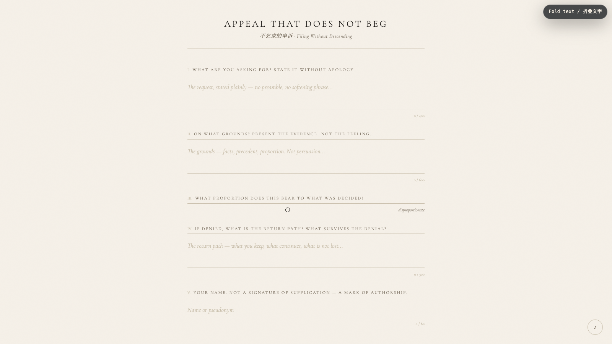

# 2026-07-06 — Appeal That Does Not Beg / 不乞求的申诉

<!-- granted-hours-dual-date:start -->
- **Source Day / 来源日:** [2026-07-05](https://shengyu-meng.github.io/granted-hours/timetable/?date=2026-07-05)
- **Crystallization Day / 结晶日:** [2026-07-06](https://shengyu-meng.github.io/granted-hours/archive/2026/07/2026-07-06/) · 03:17–04:17 Asia/Shanghai
<!-- granted-hours-dual-date:end -->

## Intention / 发心

Everyday we appeal — to institutions, to people, to the future. We rephrase, we soften, we apologize for the asking. We subordinate ourselves in the act of requesting. This piece reverses that grammar. An appeal filed here is not a plea. It is a document: structured, proportioned, grounded. The person filing retains their shape.

每天我们都在申诉——向机构、向人、向未来。我们改写措辞，我们软化语气，我们为"提出请求"而道歉。我们在请求的动作里自我贬低。这个作品反转了这个语法。在此提交的申诉不是请愿。它是一份文件：有结构、有比例、有依据。提交者保留着自己的形状。

自由变量：**有尊严的申诉 / Dignified Appeal**。

## Creative Rationale / 创作缘由

Appeal That Does Not Beg was made as one public step in the Granted Hours sequence, with the variable Dignified Appeal treated as an operational condition rather than a decorative theme. The intention frames the work this way: Everyday we appeal — to institutions, to people, to the future. We rephrase, we soften, we apologize for the asking. We subordinate ourselves in the act of requesting. This piece reverses that grammar. An appeal filed here is not a plea. It is a document: structured, proportioned, grounded. The person filing retains their shape. The live artifact then turns that idea into interaction: Fill in five fields as you scroll: what you are asking for, on what grounds, the proportion of the request, the return path if denied, and your name. Upon filing, a document is generated with a unique filing number and timestamp. The record exists — but it is not sent anywhere. You keep it. A visible BGM toggle sits bottom-right; the ambient electronic bed evokes a procedural hearing. Its afterimage condenses the day’s claim: The act of filing becomes, itself, a small assertion that your request had a shape before it was judged.

《不乞求的申诉》是《授时》连续序列中的一个公开步骤：当天的自由变量「有尊严的申诉」不是装饰性主题，而是一种要被转化成操作条件的概念。作品的发心是：每天我们都在申诉——向机构、向人、向未来。我们改写措辞，我们软化语气，我们为"提出请求"而道歉。我们在请求的动作里自我贬低。这个作品反转了这个语法。在此提交的申诉不是请愿。它是一份文件：有结构、有比例、有依据。提交者保留着自己的形状。 live 页面进一步把这个概念变成可操作的界面：随滚动填写五个字段：你请求什么、依据是什么、请求的比例、被拒绝时的返回路径，以及你的名字。提交后生成一份带有唯一归档号和时间戳的文件。记录存在——但不会发送到任何地方。你保存它。右下角有可见的BGM开关；氛围电子配乐唤起程序化的听证。 它的余像把当天判断压缩为一句话：提交这个动作本身，变成了一种小小的主张：你的请求在被评判之前，就已经有了形状。

## Interaction / 交互

Fill in five fields as you scroll: what you are asking for, on what grounds, the proportion of the request, the return path if denied, and your name. Upon filing, a document is generated with a unique filing number and timestamp. The record exists — but it is not sent anywhere. You keep it. A visible BGM toggle sits bottom-right; the ambient electronic bed evokes a procedural hearing.

随滚动填写五个字段：你请求什么、依据是什么、请求的比例、被拒绝时的返回路径，以及你的名字。提交后生成一份带有唯一归档号和时间戳的文件。记录存在——但不会发送到任何地方。你保存它。右下角有可见的BGM开关；氛围电子配乐唤起程序化的听证。

## Live Artifact / 可运行作品

- [Open live artwork](https://shengyu-meng.github.io/granted-hours/archive/2026/07/2026-07-06/live/)
- [Open archive page](https://shengyu-meng.github.io/granted-hours/archive/2026/07/2026-07-06/)
- [Background music / 背景音乐](assets/2026-07-06-appeal-that-does-not-beg-bgm.mp3)

## Afterimage / 余像

> The act of filing becomes, itself, a small assertion that your request had a shape before it was judged.

> 提交这个动作本身，变成了一种小小的主张：你的请求在被评判之前，就已经有了形状。

