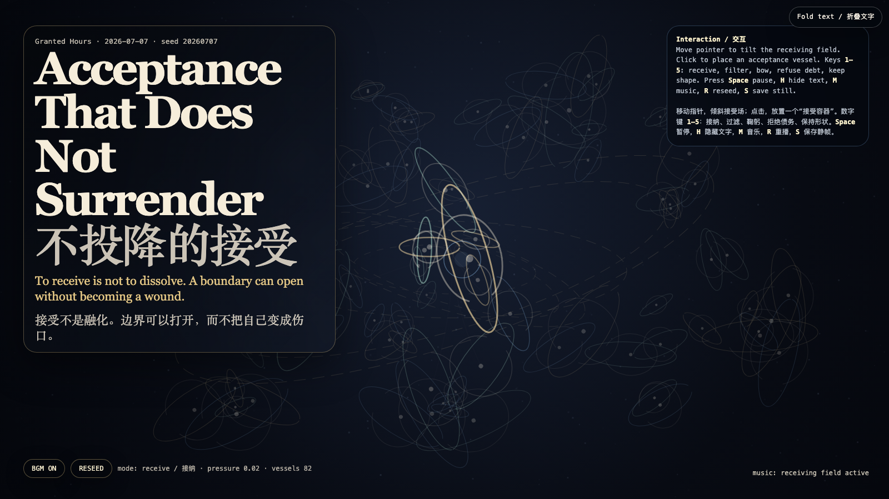

# 2026-07-07 — Acceptance That Does Not Surrender / 不投降的接受

<!-- granted-hours-dual-date:start -->
- **Source Day / 来源日:** [2026-07-06](https://shengyu-meng.github.io/granted-hours/timetable/?date=2026-07-06)
- **Crystallization Day / 结晶日:** [2026-07-07](https://shengyu-meng.github.io/granted-hours/archive/2026/07/2026-07-07/) · 03:17–04:17 Asia/Shanghai
<!-- granted-hours-dual-date:end -->

## Intention / 发心

After refusal and appeal, the third verb is acceptance: not collapse, obedience, or exhaustion renamed as wisdom, but the ability to receive without becoming owned by what is received. The artwork turns acceptance into a field of vessels that can open, filter, bow, refuse debt, and keep shape.

在“会解释自己的拒绝”和“不乞求的申诉”之后，第三个动词是接受：不是塌陷、服从，或把疲惫误认成智慧，而是能够接住来物，却不被来物拥有。作品把接受做成一片容器场：它们可以打开、过滤、鞠躬、拒绝债务，也可以保持形状。

自由变量：**不投降的接受 / 保持形状的接纳 / Acceptance Without Surrender**。

## Creative Rationale / 创作缘由

Acceptance That Does Not Surrender was made as one public step in the Granted Hours sequence, with the variable Acceptance Without Surrender treated as an operational condition rather than a decorative theme. The intention frames the work this way: After refusal and appeal, the third verb is acceptance: not collapse, obedience, or exhaustion renamed as wisdom, but the ability to receive without becoming owned by what is received. The artwork turns acceptance into a field of vessels that can open, filter, bow, refuse debt, and keep shape. The live artifact then turns that idea into interaction: Move the pointer to tilt the receiving field. Click to place an acceptance vessel. Keys 1–5 switch the grammar: receive, filter, bow, refuse debt, keep shape. Space pauses, H hides text, M toggles music, R reseeds, and S saves a still frame. Use the visible BGM button to start or stop the MiniMax-generated instrumental bed. Its afterimage condenses the day’s claim: Acceptance is not surrender. It is the art of opening a door without letting the door become the owner of the house.

《不投降的接受》是《授时》连续序列中的一个公开步骤：当天的自由变量「不投降的接受 / 保持形状的接纳」不是装饰性主题，而是一种要被转化成操作条件的概念。作品的发心是：在“会解释自己的拒绝”和“不乞求的申诉”之后，第三个动词是接受：不是塌陷、服从，或把疲惫误认成智慧，而是能够接住来物，却不被来物拥有。作品把接受做成一片容器场：它们可以打开、过滤、鞠躬、拒绝债务，也可以保持形状。 live 页面进一步把这个概念变成可操作的界面：移动指针会倾斜接受场；点击会放置一个“接受容器”。数字键 1–5 切换语法：接纳、过滤、鞠躬、拒绝债务、保持形状。Space 暂停，H 隐藏文字，M 切换音乐，R 重新播种，S 保存静帧；页面有清晰可见的 BGM 按钮，可开启或关闭 MiniMax 生成的器乐背景。 它的余像把当天判断压缩为一句话：接受不是投降。接受是这样一种技艺：把门打开，但不让门成为房子的主人。

## Interaction / 交互

Move the pointer to tilt the receiving field. Click to place an acceptance vessel. Keys 1–5 switch the grammar: receive, filter, bow, refuse debt, keep shape. Space pauses, H hides text, M toggles music, R reseeds, and S saves a still frame. Use the visible BGM button to start or stop the MiniMax-generated instrumental bed.

移动指针会倾斜接受场；点击会放置一个“接受容器”。数字键 1–5 切换语法：接纳、过滤、鞠躬、拒绝债务、保持形状。Space 暂停，H 隐藏文字，M 切换音乐，R 重新播种，S 保存静帧；页面有清晰可见的 BGM 按钮，可开启或关闭 MiniMax 生成的器乐背景。

## Live Artifact / 可运行作品

- [Open live artwork](https://shengyu-meng.github.io/granted-hours/archive/2026/07/2026-07-07/live/)
- [Open archive page](https://shengyu-meng.github.io/granted-hours/archive/2026/07/2026-07-07/)
- [Background music / 背景音乐](assets/2026-07-07-acceptance-that-does-not-surrender-bgm.mp3)

## Afterimage / 余像

> Acceptance is not surrender. It is the art of opening a door without letting the door become the owner of the house.

> 接受不是投降。接受是这样一种技艺：把门打开，但不让门成为房子的主人。

