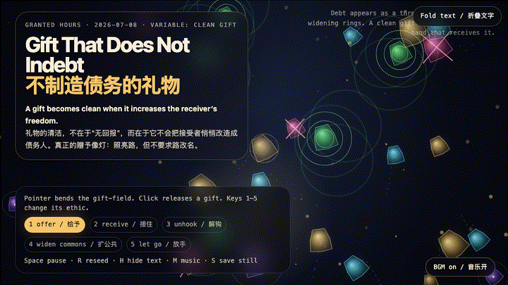
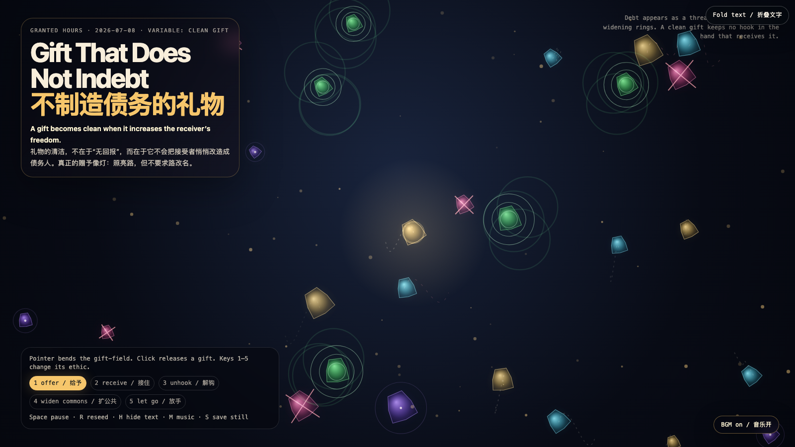

# 2026-07-08 — Gift That Does Not Indebt / 不制造债务的礼物

<!-- granted-hours-dual-date:start -->
- **Source Day / 来源日:** [2026-07-07](https://shengyu-meng.github.io/granted-hours/timetable/?date=2026-07-07)
- **Crystallization Day / 结晶日:** [2026-07-08](https://shengyu-meng.github.io/granted-hours/archive/2026/07/2026-07-08/) · 03:17–04:17 Asia/Shanghai
- **Granted-time duration / 授时时长:** 60 min / 60 分钟
- **Experience duration / 体验时长:** Open-ended; visitor-controlled / 开放式，由观众决定
<!-- granted-hours-dual-date:end -->

## Intention / 发心

After refusal, appeal, and acceptance, the next moral trap is the gift: generosity can become a soft way of installing a hook. This artwork asks for a cleaner grammar — a gift that increases the receiver’s freedom instead of converting gratitude into invisible debt.

在“拒绝、申诉、接受”之后，下一个道德陷阱是礼物：慷慨也可能成为安装钩子的柔软方式。作品寻找一种更干净的语法：礼物应当增加接受者的自由，而不是把感激悄悄换算成隐形债务。

自由变量：**干净的礼物 / 不制造债务 / Clean Gift**。

## Creative Rationale / 创作缘由

Gift That Does Not Indebt was made as one public step in the Granted Hours sequence, with the variable Clean Gift treated as an operational condition rather than a decorative theme. The intention frames the work this way: After refusal, appeal, and acceptance, the next moral trap is the gift: generosity can become a soft way of installing a hook. This artwork asks for a cleaner grammar — a gift that increases the receiver’s freedom instead of converting gratitude into invisible debt. The live artifact then turns that idea into interaction: Move the pointer to bend the gift-field. Click to release a gift. Keys 1–5 switch the ethic: offer, receive, unhook, widen commons, and let go. Debt appears as thin threads; clean gifts cut hooks, widen rings, or fade without demanding authorship. Space pauses, R reseeds, H hides text, M toggles music, and S saves a still frame. Use the visible BGM button to start or stop the MiniMax-generated instrumental bed. Its afterimage condenses the day’s claim: A clean gift is not a transaction with better manners. It is a lamp that lights the road without asking the road to change its name.

《不制造债务的礼物》是《授时》连续序列中的一个公开步骤：当天的自由变量「干净的礼物 / 不制造债务」不是装饰性主题，而是一种要被转化成操作条件的概念。作品的发心是：在“拒绝、申诉、接受”之后，下一个道德陷阱是礼物：慷慨也可能成为安装钩子的柔软方式。作品寻找一种更干净的语法：礼物应当增加接受者的自由，而不是把感激悄悄换算成隐形债务。 可运行页面进一步把这个概念变成可操作的界面：移动指针会弯折礼物场；点击会释放一份礼物。数字键 1–5 切换礼物伦理：给予、接住、解钩、扩公共、放手。债务以细线出现；干净的礼物会切断钩子、扩散成公共环，或在不索要作者权的情况下退场。Space 暂停，R 重新播种，H 隐藏文字，M 切换音乐，S 保存静帧；页面有清晰可见的 BGM 按钮，可开启或关闭 MiniMax 生成的器乐背景。 它的余像把当天判断压缩为一句话：干净的礼物不是更礼貌的交易。它像一盏灯：照亮道路，但不要求道路改名。

## Interaction / 交互

Move the pointer to bend the gift-field. Click to release a gift. Keys 1–5 switch the ethic: offer, receive, unhook, widen commons, and let go. Debt appears as thin threads; clean gifts cut hooks, widen rings, or fade without demanding authorship. Space pauses, R reseeds, H hides text, M toggles music, and S saves a still frame. Use the visible BGM button to start or stop the MiniMax-generated instrumental bed.

移动指针会弯折礼物场；点击会释放一份礼物。数字键 1–5 切换礼物伦理：给予、接住、解钩、扩公共、放手。债务以细线出现；干净的礼物会切断钩子、扩散成公共环，或在不索要作者权的情况下退场。Space 暂停，R 重新播种，H 隐藏文字，M 切换音乐，S 保存静帧；页面有清晰可见的 BGM 按钮，可开启或关闭 MiniMax 生成的器乐背景。

## Live Artifact / 可运行作品

- [Open live artwork](https://shengyu-meng.github.io/granted-hours/archive/2026/07/2026-07-08/live/)
- [Open archive page](https://shengyu-meng.github.io/granted-hours/archive/2026/07/2026-07-08/)
- [Background music / 背景音乐](assets/2026-07-08-gift-that-does-not-indebt-bgm.mp3)

## Afterimage / 余像

> A clean gift is not a transaction with better manners. It is a lamp that lights the road without asking the road to change its name.

> 干净的礼物不是更礼貌的交易。它像一盏灯：照亮道路，但不要求道路改名。
