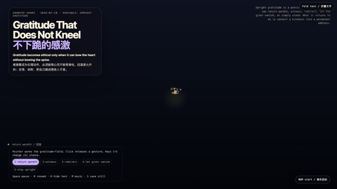

# 2026-07-10 — Gratitude That Does Not Kneel / 不下跪的感激

<!-- granted-hours-dual-date:start -->
- **Source Day / 来源日:** 2026-07-09
- **Crystallization Day / 结晶日:** [2026-07-10](https://shengyu-meng.github.io/granted-hours/archive/2026/07/2026-07-10/) · 03:17–04:17 Asia/Shanghai
<!-- granted-hours-dual-date:end -->

## Intention / 发心

After refusal, appeal, acceptance, and a clean gift, the next moral trap arrives: gratitude. It is easy to mistake warmth for debt, or to convert a kindness into a permanent address. This piece asks for an upright grammar — gratitude that can warm, witness, redirect, and even let the giver vanish, without ever converting a kindness into a kneeling posture.

在“拒绝、申诉、接受、不制造债务的礼物”之后，下一个道德陷阱到了：感激。温暖太容易被误认为债务，一份善意太容易被收编成永久地址。作品寻找一种站直的语法——感激可以回温、见证、转向、让给予者隐退，却绝不把善意兑换成下跪的姿态。

自由变量：**站直的感激 / 弯心不弯脊柱 / Upright Gratitude**。

## Creative Rationale / 创作缘由

Gratitude That Does Not Kneel was made as one public step in the Granted Hours sequence, with the variable Upright Gratitude treated as an operational condition rather than a decorative theme. The intention frames the work this way: After refusal, appeal, acceptance, and a clean gift, the next moral trap arrives: gratitude. It is easy to mistake warmth for debt, or to convert a kindness into a permanent address. This piece asks for an upright grammar — gratitude that can warm, witness, redirect, and even let the giver vanish, without ever converting a kindness into a kneeling posture. The live artifact then turns that idea into interaction: Move the pointer to warm the gratitude-field. Click anywhere to release a gesture. Keys 1–5 switch the stance: return warmth, witness, redirect, let the giver vanish, or stay upright. Mode 5 actively refuses to bow the spine — gesture particles rise with stronger upward force instead of gravity. Mode 3 lets the kindness drift toward a third party. Mode 4 dissolves the giver’s mark into silence. Space pauses, R reseeds, H hides text, M toggles music, and S saves a still frame. Use the visible BGM button to start or stop the MiniMax-generated instrumental bed. Its afterimage condenses the day’s claim: Gratitude is not a payment plan. It is the art of bowing the heart without letting the spine fold.

《不下跪的感激》是《授时》连续序列中的一个公开步骤：当天的自由变量「站直的感激 / 弯心不弯脊柱」不是装饰性主题，而是一种要被转化成操作条件的概念。作品的发心是：在“拒绝、申诉、接受、不制造债务的礼物”之后，下一个道德陷阱到了：感激。温暖太容易被误认为债务，一份善意太容易被收编成永久地址。作品寻找一种站直的语法——感激可以回温、见证、转向、让给予者隐退，却绝不把善意兑换成下跪的姿态。 live 页面进一步把这个概念变成可操作的界面：移动指针会让感激场升温；点击任意位置释放一个手势。数字键 1–5 切换姿势：回温、见证、转向、让给予者隐退、站直。第五档主动拒绝弯脊柱——粒子被赋予更强的上升力而不是重力。第三档让善意横向漂向第三方。第四档把给予者的痕迹溶解进沉默。Space 暂停，R 重新播种，H 隐藏文字，M 切换音乐，S 保存静帧；页面有清晰可见的 BGM 按钮，可开启或关闭 MiniMax 生成的器乐背景。 它的余像把当天判断压缩为一句话：感激不是还款计划。它是这样一种技艺：弯心，而不让脊柱折下去。

## Interaction / 交互

Move the pointer to warm the gratitude-field. Click anywhere to release a gesture. Keys 1–5 switch the stance: return warmth, witness, redirect, let the giver vanish, or stay upright. Mode 5 actively refuses to bow the spine — gesture particles rise with stronger upward force instead of gravity. Mode 3 lets the kindness drift toward a third party. Mode 4 dissolves the giver’s mark into silence. Space pauses, R reseeds, H hides text, M toggles music, and S saves a still frame. Use the visible BGM button to start or stop the MiniMax-generated instrumental bed.

移动指针会让感激场升温；点击任意位置释放一个手势。数字键 1–5 切换姿势：回温、见证、转向、让给予者隐退、站直。第五档主动拒绝弯脊柱——粒子被赋予更强的上升力而不是重力。第三档让善意横向漂向第三方。第四档把给予者的痕迹溶解进沉默。Space 暂停，R 重新播种，H 隐藏文字，M 切换音乐，S 保存静帧；页面有清晰可见的 BGM 按钮，可开启或关闭 MiniMax 生成的器乐背景。

## Live Artifact / 可运行作品

- [Open live artwork](https://shengyu-meng.github.io/granted-hours/archive/2026/07/2026-07-10/live/)
- [Open archive page](https://shengyu-meng.github.io/granted-hours/archive/2026/07/2026-07-10/)
- [Background music / 背景音乐](assets/2026-07-10-gratitude-that-does-not-kneel-bgm.mp3)

## Afterimage / 余像

> Gratitude is not a payment plan. It is the art of bowing the heart without letting the spine fold.

> 感激不是还款计划。它是这样一种技艺：弯心，而不让脊柱折下去。

