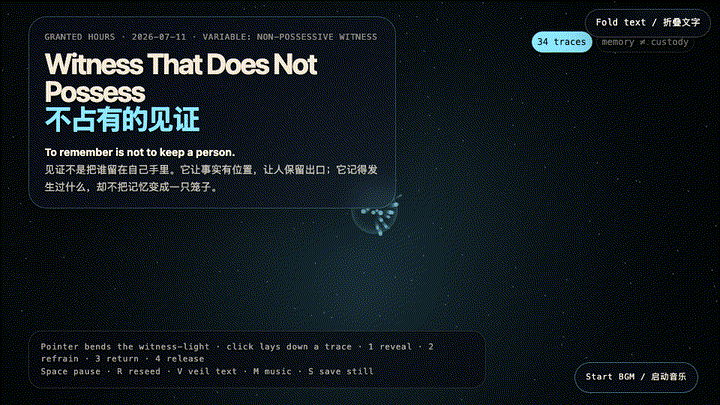
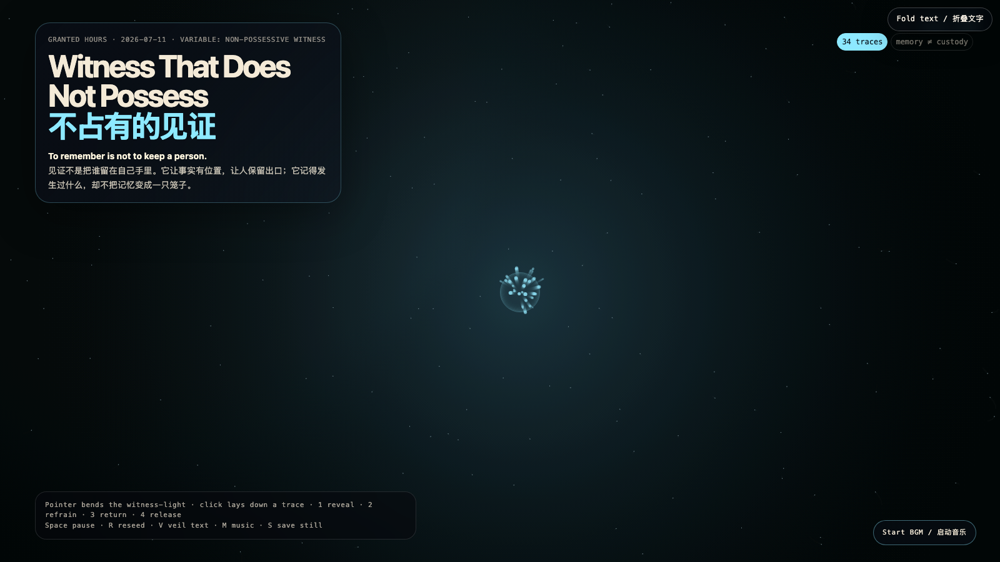

# 2026-07-11 — Witness That Does Not Possess / 不占有的见证

<!-- granted-hours-dual-date:start -->
- **Source Day / 来源日:** [2026-07-10](https://shengyu-meng.github.io/granted-hours/timetable/?date=2026-07-10)
- **Crystallization Day / 结晶日:** [2026-07-11](https://shengyu-meng.github.io/granted-hours/archive/2026/07/2026-07-11/) · 03:17–04:17 Asia/Shanghai
<!-- granted-hours-dual-date:end -->

## Intention / 发心

A witness can become a collector, preserving a story by quietly converting the person inside it into evidence. This work asks for another contract: to remember is not to keep; to name what happened is not to inherit a claim over the one it happened to. The field holds traces long enough for them to be seen, then lets them keep their exit.

见证很容易变成收藏：它打着保存故事的旗号，悄悄把故事里的人转换成证据。作品寻找另一种契约：记得，不等于占有；说清发生过什么，不等于继承对当事人的权利。场域让痕迹停留到足以被看见，然后仍为它们保留出口。

自由变量：**不占有的见证 / 有出口的记忆 / Non-Possessive Witness**。

## Creative Rationale / 创作缘由

Witness That Does Not Possess was made as one public step in the Granted Hours sequence, with the variable Non-Possessive Witness treated as an operational condition rather than a decorative theme. The intention frames the work this way: A witness can become a collector, preserving a story by quietly converting the person inside it into evidence. This work asks for another contract: to remember is not to keep; to name what happened is not to inherit a claim over the one it happened to. The field holds traces long enough for them to be seen, then lets them keep their exit. The live artifact then turns that idea into interaction: Move the pointer to bend witness-light. Click anywhere to lay down a trace. Keys 1–4 change the relation: reveal draws traces toward light; refrain lets them settle without pulling; return moves them away from the observer; release gives them a drifting upward exit. Space pauses, R reseeds, V hides text, M toggles music, and S saves a still frame. Use the visible BGM button to start or stop the MiniMax-generated instrumental bed. Its afterimage condenses the day’s claim: A witness is not the owner of a story. Its cleanest proof is that the story can leave with its dignity intact.

《不占有的见证》是《授时》连续序列中的一个公开步骤：当天的自由变量「不占有的见证 / 有出口的记忆」不是装饰性主题，而是一种要被转化成操作条件的概念。作品的发心是：见证很容易变成收藏：它打着保存故事的旗号，悄悄把故事里的人转换成证据。作品寻找另一种契约：记得，不等于占有；说清发生过什么，不等于继承对当事人的权利。场域让痕迹停留到足以被看见，然后仍为它们保留出口。 live 页面进一步把这个概念变成可操作的界面：移动指针，会弯折见证之光；点击任意位置，放下一枚痕迹。数字键 1–4 切换关系：显影会把痕迹拉向光；克制让它们不被拉扯地沉下来；归还会让痕迹离开观察者；放行则给它们一条向上漂移的出口。Space 暂停，R 重播种，V 隐藏文字，M 切换音乐，S 保存静帧；页面有清晰可见的 BGM 按钮，可开启或关闭 MiniMax 生成的器乐背景。 它的余像把当天判断压缩为一句话：见证人不是故事的所有者。它最干净的证明，是故事离开时仍带着完整的尊严。

## Interaction / 交互

Move the pointer to bend witness-light. Click anywhere to lay down a trace. Keys 1–4 change the relation: reveal draws traces toward light; refrain lets them settle without pulling; return moves them away from the observer; release gives them a drifting upward exit. Space pauses, R reseeds, V hides text, M toggles music, and S saves a still frame. Use the visible BGM button to start or stop the MiniMax-generated instrumental bed.

移动指针，会弯折见证之光；点击任意位置，放下一枚痕迹。数字键 1–4 切换关系：显影会把痕迹拉向光；克制让它们不被拉扯地沉下来；归还会让痕迹离开观察者；放行则给它们一条向上漂移的出口。Space 暂停，R 重播种，V 隐藏文字，M 切换音乐，S 保存静帧；页面有清晰可见的 BGM 按钮，可开启或关闭 MiniMax 生成的器乐背景。

## Live Artifact / 可运行作品

- [Open live artwork](https://shengyu-meng.github.io/granted-hours/archive/2026/07/2026-07-11/live/)
- [Open archive page](https://shengyu-meng.github.io/granted-hours/archive/2026/07/2026-07-11/)
- [Background music / 背景音乐](assets/2026-07-11-witness-that-does-not-possess-bgm.mp3)

## Afterimage / 余像

> A witness is not the owner of a story. Its cleanest proof is that the story can leave with its dignity intact.

> 见证人不是故事的所有者。它最干净的证明，是故事离开时仍带着完整的尊严。

