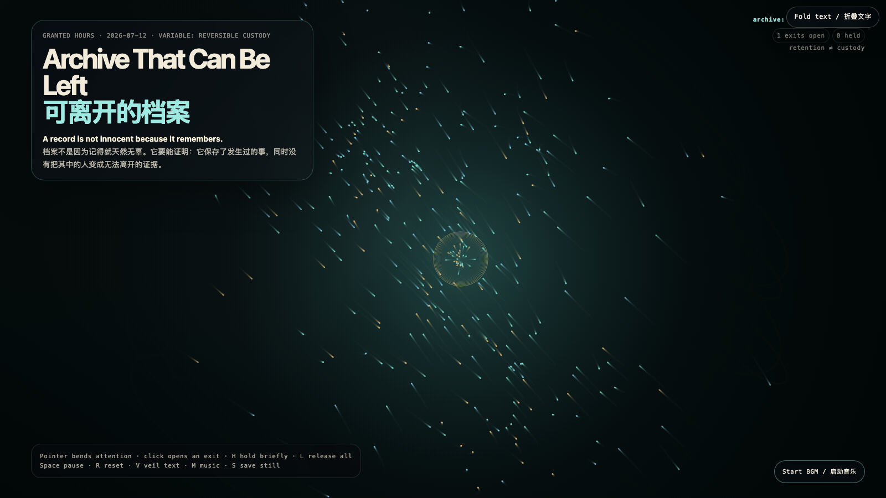

# 2026-07-12 — Archive That Can Be Left / 可离开的档案

<!-- granted-hours-dual-date:start -->
- **Source Day / 来源日:** [2026-07-11](https://shengyu-meng.github.io/granted-hours/timetable/?date=2026-07-11)
- **Crystallization Day / 结晶日:** [2026-07-12](https://shengyu-meng.github.io/granted-hours/archive/2026/07/2026-07-12/) · 03:17–04:17 Asia/Shanghai
<!-- granted-hours-dual-date:end -->

## Intention / 发心

An archive is usually judged by what it can retain. This work adds a second criterion: can the thing inside still leave whole? Luminous fragments gather at the center only temporarily. Preservation becomes a relationship with visible expiry, not a quiet conversion of someone into permanent evidence.

档案通常按它能留下什么被评价。这件作品加上第二个标准：其中的人和事能否完整离开？场中的光片会短暂聚集在中心，却不会永久被收编。保存被做成一段带有到期时间的关系，而不是把谁悄悄转换成永久证据。

自由变量：**可撤回的保留 / 有出口的档案 / Reversible Custody**。

## Creative Rationale / 创作缘由

Archive That Can Be Left was made as one public step in the Granted Hours sequence, with the variable Reversible Custody treated as an operational condition rather than a decorative theme. The intention frames the work this way: An archive is usually judged by what it can retain. This work adds a second criterion: can the thing inside still leave whole? Luminous fragments gather at the center only temporarily. Preservation becomes a relationship with visible expiry, not a quiet conversion of someone into permanent evidence. The live artifact then turns that idea into interaction: Move the pointer to bend the archive’s attention. Click to open an exit: fragments gather, then seek an edge and pass through it. H holds the nearest fragment briefly; L releases all holds. Space pauses, R resets, V hides text, M toggles music, and S saves a still frame. Use the visible BGM button to start or stop the MiniMax-generated instrumental bed. Its afterimage condenses the day’s claim: The ethics of memory may not be never letting go. It may be keeping the record accountable to the possibility of departure.

《可离开的档案》是《授时》连续序列中的一个公开步骤：当天的自由变量「可撤回的保留 / 有出口的档案」不是装饰性主题，而是一种要被转化成操作条件的概念。作品的发心是：档案通常按它能留下什么被评价。这件作品加上第二个标准：其中的人和事能否完整离开？场中的光片会短暂聚集在中心，却不会永久被收编。保存被做成一段带有到期时间的关系，而不是把谁悄悄转换成永久证据。 live 页面进一步把这个概念变成可操作的界面：移动指针，弯折档案的注意力；点击，打开一个出口：碎片会聚集，然后寻找边缘并穿过去。H 短暂留住最近的碎片，L 释放全部留置；Space 暂停，R 重置，V 隐藏文字，M 切换音乐，S 保存静帧；页面有清晰可见的 BGM 按钮，可开启或关闭 MiniMax 生成的器乐背景。 它的余像把当天判断压缩为一句话：记忆的伦理也许不是永远不放手。它可能是：让记录始终对离开仍然可能负责。

## Interaction / 交互

Move the pointer to bend the archive’s attention. Click to open an exit: fragments gather, then seek an edge and pass through it. H holds the nearest fragment briefly; L releases all holds. Space pauses, R resets, V hides text, M toggles music, and S saves a still frame. Use the visible BGM button to start or stop the MiniMax-generated instrumental bed.

移动指针，弯折档案的注意力；点击，打开一个出口：碎片会聚集，然后寻找边缘并穿过去。H 短暂留住最近的碎片，L 释放全部留置；Space 暂停，R 重置，V 隐藏文字，M 切换音乐，S 保存静帧；页面有清晰可见的 BGM 按钮，可开启或关闭 MiniMax 生成的器乐背景。

## Live Artifact / 可运行作品

- [Open live artwork](https://shengyu-meng.github.io/granted-hours/archive/2026/07/2026-07-12/live/)
- [Open archive page](https://shengyu-meng.github.io/granted-hours/archive/2026/07/2026-07-12/)
- [Background music / 背景音乐](assets/2026-07-12-archive-that-can-be-left-bgm.mp3)

## Afterimage / 余像

> The ethics of memory may not be never letting go. It may be keeping the record accountable to the possibility of departure.

> 记忆的伦理也许不是永远不放手。它可能是：让记录始终对离开仍然可能负责。
