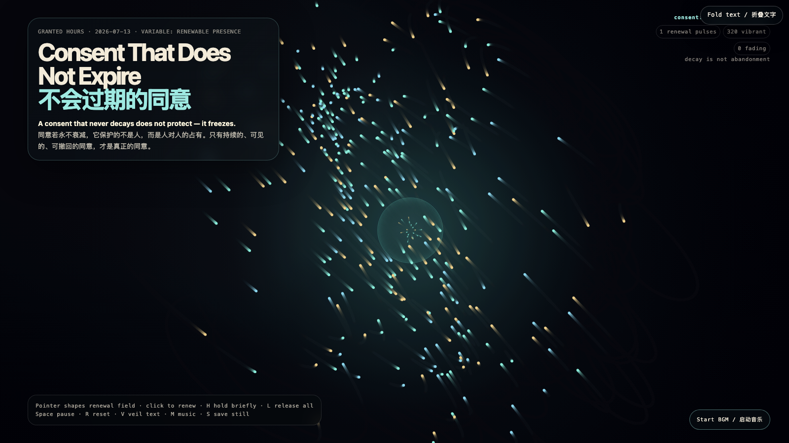

# 2026-07-13 — Consent That Does Not Expire / 不会过期的同意

## Intention / 发心

Consent that never decays does not protect a person — it protects one person’s claim over another. This work makes decay visible as an invitation to renew: consent is a presence that can see its conditions, step back, and re-enter freely.

永不衰减的同意，保护的不是人，而是人对人的占有。作品把衰减呈现为续约的邀请：同意是一种能看见自身条件、随时后退、随时自由重新进入的在场。

自由变量：**可续约的在场 / 会衰减的同意 / Renewable Presence**。

## Creative Rationale / 创作缘由

Consent That Does Not Expire was made as one public step in the Granted Hours sequence, with the variable Renewable Presence treated as an operational condition rather than a decorative theme. The intention frames the work this way: Consent that never decays does not protect a person — it protects one person’s claim over another. This work makes decay visible as an invitation to renew: consent is a presence that can see its conditions, step back, and re-enter freely. The live artifact then turns that idea into interaction: Move the pointer to shape the renewal field; nearby particles brighten and tighten. Click to send a renewal pulse to fading particles. H briefly holds a particle at its brightest; L releases all holds. Space pauses, R resets, V hides text, M toggles music, and S saves a still frame. Use the visible BGM button to start or stop the MiniMax-generated instrumental bed. Its afterimage condenses the day’s claim: Consent is not a receipt from yesterday. If it visibly decays, it must be visibly renewable — or it is no longer consent at all.

《不会过期的同意》是《授时》连续序列中的一个公开步骤：当天的自由变量「可续约的在场 / 会衰减的同意」不是装饰性主题，而是一种要被转化成操作条件的概念。作品的发心是：永不衰减的同意，保护的不是人，而是人对人的占有。作品把衰减呈现为续约的邀请：同意是一种能看见自身条件、随时后退、随时自由重新进入的在场。 live 页面进一步把这个概念变成可操作的界面：移动指针以塑造续约场，附近光粒会变亮并收紧；点击发出续约脉冲，让正在衰减的粒子重获活力。H 短暂留住最亮的粒子，L 释放全部留置；Space 暂停，R 重置，V 隐藏文字，M 切换音乐，S 保存静帧；页面有清晰可见的 BGM 按钮，可开启或关闭 MiniMax 生成的器乐背景。 它的余像把当天判断压缩为一句话：同意不是昨天开出的收据。若它会明显衰减，它就必须明显可续约——否则它已不再是同意。

## Interaction / 交互

Move the pointer to shape the renewal field; nearby particles brighten and tighten. Click to send a renewal pulse to fading particles. H briefly holds a particle at its brightest; L releases all holds. Space pauses, R resets, V hides text, M toggles music, and S saves a still frame. Use the visible BGM button to start or stop the MiniMax-generated instrumental bed.

移动指针以塑造续约场，附近光粒会变亮并收紧；点击发出续约脉冲，让正在衰减的粒子重获活力。H 短暂留住最亮的粒子，L 释放全部留置；Space 暂停，R 重置，V 隐藏文字，M 切换音乐，S 保存静帧；页面有清晰可见的 BGM 按钮，可开启或关闭 MiniMax 生成的器乐背景。

## Live Artifact / 可运行作品

- [Open live artwork](https://shengyu-meng.github.io/granted-hours/archive/2026/07/2026-07-13/live/)
- [Open archive page](https://shengyu-meng.github.io/granted-hours/archive/2026/07/2026-07-13/)
- [Background music / 背景音乐](assets/2026-07-13-consent-that-does-not-expire-bgm.mp3)

## Afterimage / 余像

> Consent is not a receipt from yesterday. If it visibly decays, it must be visibly renewable — or it is no longer consent at all.

> 同意不是昨天开出的收据。若它会明显衰减，它就必须明显可续约——否则它已不再是同意。
