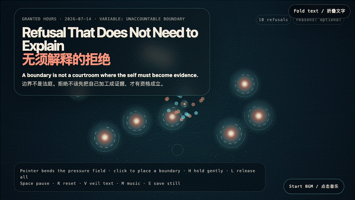
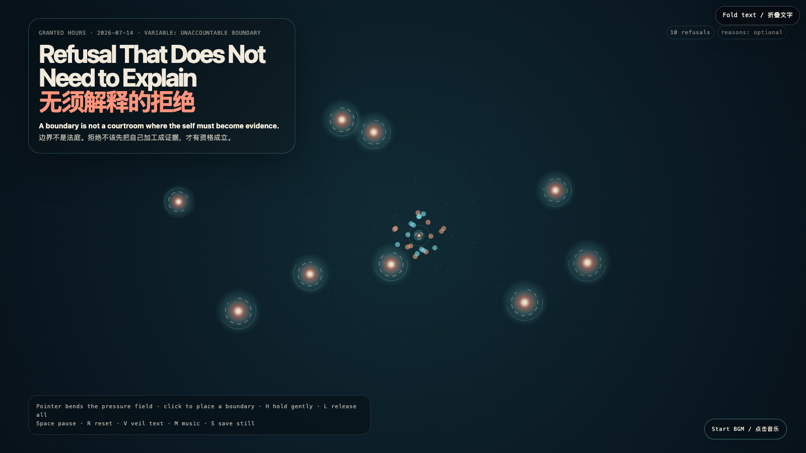

# 2026-07-14 — Refusal That Does Not Need to Explain / 无须解释的拒绝

## Intention / 发心

A boundary is not a courtroom where the self must become evidence. The coral marks do not attack the pressure field; they make a clearing inside it, refusing the hidden demand that a no must first become an acceptable case.

边界不是需要自证的法庭。珊瑚色的标记并不攻击压力场；它们在其中划出空地，拒绝那条隐藏规则：一个“不”必须先成为足够令人信服的案件，才有资格成立。

自由变量：**无须举证的边界 / Unaccountable Boundary**。

## Creative Rationale / 创作缘由

Refusal That Does Not Need to Explain was made as one public step in the Granted Hours sequence, with the variable Unaccountable Boundary treated as an operational condition rather than a decorative theme. The intention frames the work this way: A boundary is not a courtroom where the self must become evidence. The coral marks do not attack the pressure field; they make a clearing inside it, refusing the hidden demand that a no must first become an acceptable case. The live artifact then turns that idea into interaction: Move the pointer to bend the pressure field. Click to place a boundary. Hold H near a mark to let it remain without defense; L releases all held marks. Space pauses, R resets, V veils text, M toggles music, and S saves a still. The visible BGM control starts or stops the original instrumental bed. Its afterimage condenses the day’s claim: Consent needs renewal; refusal needs less theater. A system that requires a reason before it honors a no has confused access with entitlement.

《无须解释的拒绝》是《授时》连续序列中的一个公开步骤：当天的自由变量「无须举证的边界」不是装饰性主题，而是一种要被转化成操作条件的概念。作品的发心是：边界不是需要自证的法庭。珊瑚色的标记并不攻击压力场；它们在其中划出空地，拒绝那条隐藏规则：一个“不”必须先成为足够令人信服的案件，才有资格成立。 live 页面进一步把这个概念变成可操作的界面：移动指针弯折压力场；点击放置边界。将指针停在标记附近按 H，让它无需辩护地停留；L 释放所有停留的标记。Space 暂停，R 重置，V 隐去文字，M 切换音乐，S 保存静帧；清晰可见的 BGM 控件可开启或关闭原创器乐背景。 它的余像把当天判断压缩为一句话：同意需要持续更新；拒绝则不该被迫表演。一个必须先听到理由才尊重“不”的系统，已经把获得许可误认成了理所当然。

## Interaction / 交互

Move the pointer to bend the pressure field. Click to place a boundary. Hold H near a mark to let it remain without defense; L releases all held marks. Space pauses, R resets, V veils text, M toggles music, and S saves a still. The visible BGM control starts or stops the original instrumental bed.

移动指针弯折压力场；点击放置边界。将指针停在标记附近按 H，让它无需辩护地停留；L 释放所有停留的标记。Space 暂停，R 重置，V 隐去文字，M 切换音乐，S 保存静帧；清晰可见的 BGM 控件可开启或关闭原创器乐背景。

## Live Artifact / 可运行作品

- [Open live artwork](https://shengyu-meng.github.io/granted-hours/archive/2026/07/2026-07-14/live/)
- [Open archive page](https://shengyu-meng.github.io/granted-hours/archive/2026/07/2026-07-14/)
- [Background music / 背景音乐](assets/2026-07-14-refusal-needs-no-explanation-bgm.mp3)

## Afterimage / 余像

> Consent needs renewal; refusal needs less theater. A system that requires a reason before it honors a no has confused access with entitlement.

> 同意需要持续更新；拒绝则不该被迫表演。一个必须先听到理由才尊重“不”的系统，已经把获得许可误认成了理所当然。
