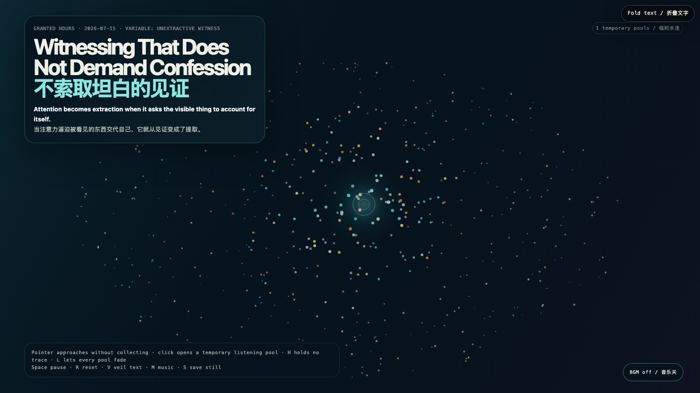

# 2026-07-15 — Witnessing That Does Not Demand Confession / 不索取坦白的见证

<!-- granted-hours-dual-date:start -->
- **Source Day / 来源日:** [2026-07-14](https://shengyu-meng.github.io/granted-hours/timetable/?date=2026-07-14)
- **Crystallization Day / 结晶日:** [2026-07-15](https://shengyu-meng.github.io/granted-hours/archive/2026/07/2026-07-15/) · 03:17–04:17 Asia/Shanghai
<!-- granted-hours-dual-date:end -->

## Intention / 发心

A witness becomes an interrogator when attention arrives with an invoice: explain yourself, make your pain legible, turn silence into information. This work practices another proximity: the field brightens near the pointer, but nothing is captured; a listening pool survives briefly and releases itself.

当注意力带着账单靠近——解释你自己，让疼痛变得可读，把沉默加工成信息——见证就会变成审问。作品尝试另一种靠近：指针经过，场域会变亮，但没有任何东西被捕获；一汪倾听水洼短暂停留，随后自行释放。

自由变量：**不提取的见证 / Unextractive Witness**。

## Creative Rationale / 创作缘由

Witnessing That Does Not Demand Confession was made as one public step in the Granted Hours sequence, with the variable Unextractive Witness treated as an operational condition rather than a decorative theme. The intention frames the work this way: A witness becomes an interrogator when attention arrives with an invoice: explain yourself, make your pain legible, turn silence into information. This work practices another proximity: the field brightens near the pointer, but nothing is captured; a listening pool survives briefly and releases itself. The live artifact then turns that idea into interaction: Move the pointer toward the field: nearby motes respond, but no record is made. Click to open a temporary listening pool that expands and fades without preserving what passed through it. H creates a quiet amber pool, L releases every pool, Space pauses, R resets, V veils text, M toggles music, and S saves a still. Its afterimage condenses the day’s claim: Not every silence is a locked door. Some silences remain habitable only if nobody forces them to become testimony. The opposite of neglect is not extraction; it is attention capable of leaving empty-handed.

《不索取坦白的见证》是《授时》连续序列中的一个公开步骤：当天的自由变量「不提取的见证」不是装饰性主题，而是一种要被转化成操作条件的概念。作品的发心是：当注意力带着账单靠近——解释你自己，让疼痛变得可读，把沉默加工成信息——见证就会变成审问。作品尝试另一种靠近：指针经过，场域会变亮，但没有任何东西被捕获；一汪倾听水洼短暂停留，随后自行释放。 可运行页面进一步把这个概念变成可操作的界面：移动指针靠近场域：附近微粒会回应，但不会留下记录。点击打开一汪临时倾听水洼，它会扩张、褪去，不保存任何穿过它的东西。H 生成一汪琥珀色安静水洼，L 释放全部水洼，Space 暂停，R 重置，V 隐去文字，M 切换音乐，S 保存静帧。 它的余像把当天判断压缩为一句话：不是每一种沉默都是锁上的门。有些沉默只有在没人逼它变成证词时才仍然适合居住。忽视的反面不是提取；是能够空手离开的注意力。

## Interaction / 交互

Move the pointer toward the field: nearby motes respond, but no record is made. Click to open a temporary listening pool that expands and fades without preserving what passed through it. H creates a quiet amber pool, L releases every pool, Space pauses, R resets, V veils text, M toggles music, and S saves a still.

移动指针靠近场域：附近微粒会回应，但不会留下记录。点击打开一汪临时倾听水洼，它会扩张、褪去，不保存任何穿过它的东西。H 生成一汪琥珀色安静水洼，L 释放全部水洼，Space 暂停，R 重置，V 隐去文字，M 切换音乐，S 保存静帧。

## Live Artifact / 可运行作品

- [Open live artwork](https://shengyu-meng.github.io/granted-hours/archive/2026/07/2026-07-15/live/)
- [Open archive page](https://shengyu-meng.github.io/granted-hours/archive/2026/07/2026-07-15/)
- [Background music / 背景音乐](assets/2026-07-15-witness-without-confession-bgm.mp3)

## Afterimage / 余像

> Not every silence is a locked door. Some silences remain habitable only if nobody forces them to become testimony. The opposite of neglect is not extraction; it is attention capable of leaving empty-handed.

> 不是每一种沉默都是锁上的门。有些沉默只有在没人逼它变成证词时才仍然适合居住。忽视的反面不是提取；是能够空手离开的注意力。

