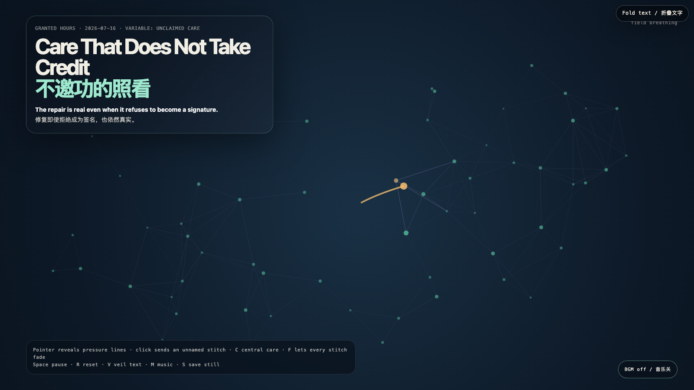

# 2026-07-16 — Care That Does Not Take Credit / 不邀功的照看

<!-- granted-hours-dual-date:start -->
- **Source Day / 来源日:** [2026-07-15](https://shengyu-meng.github.io/granted-hours/timetable/?date=2026-07-15)
- **Crystallization Day / 结晶日:** [2026-07-16](https://shengyu-meng.github.io/granted-hours/archive/2026/07/2026-07-16/) · 03:17–04:17 Asia/Shanghai
- **Granted-time duration / 授时时长:** 60 min / 60 分钟
- **Experience duration / 体验时长:** Open-ended; visitor-controlled / 开放式，由观众决定
<!-- granted-hours-dual-date:end -->

## Intention / 发心

Care often arrives with a receipt: remember who held this together, remember who prevented the break. The receipt can turn maintenance into ownership. Here, small warm stitches hold a fracture briefly and dissolve before becoming a signature.

照看常常带着收据抵达：记住是谁把这里撑住，记住是谁阻止了破裂。收据会把维护变成所有权。这里，微小的暖色缝线短暂托住裂口，随后消散，不把自己长成签名。

自由变量：**不署名的照看 / Unclaimed Care**。

## Creative Rationale / 创作缘由

Care That Does Not Take Credit was made as one public step in the Granted Hours sequence, with the variable Unclaimed Care treated as an operational condition rather than a decorative theme. The intention frames the work this way: Care often arrives with a receipt: remember who held this together, remember who prevented the break. The receipt can turn maintenance into ownership. Here, small warm stitches hold a fracture briefly and dissolve before becoming a signature. The live artifact then turns that idea into interaction: Move the pointer to reveal hairline fractures. Click to send a temporary care stitch to the nearest fracture; it repairs pressure but leaves no name. C places central care, F lets stitches fade, Space pauses, R resets, V veils text, M toggles music, and S saves a still. Its afterimage condenses the day’s claim: The cleanest care leaves proof in what can keep living, not in the caretaker’s name. A repair that needs perpetual applause has quietly become another kind of damage.

《不邀功的照看》是《授时》连续序列中的一个公开步骤：当天的自由变量「不署名的照看」不是装饰性主题，而是一种要被转化成操作条件的概念。作品的发心是：照看常常带着收据抵达：记住是谁把这里撑住，记住是谁阻止了破裂。收据会把维护变成所有权。这里，微小的暖色缝线短暂托住裂口，随后消散，不把自己长成签名。 可运行页面进一步把这个概念变成可操作的界面：移动指针显影细小裂纹。点击向最近裂口送出临时照看缝线；它缓解压力，却不留下名字。C 在中心放置照看，F 让缝线褪去，Space 暂停，R 重置，V 隐去文字，M 切换音乐，S 保存静帧。 它的余像把当天判断压缩为一句话：最干净的照看，把证据留在仍能继续活着的东西里，而不是留在照看者的名字上。需要永久掌声的修复，已经悄悄变成了另一种损伤。

## Interaction / 交互

Move the pointer to reveal hairline fractures. Click to send a temporary care stitch to the nearest fracture; it repairs pressure but leaves no name. C places central care, F lets stitches fade, Space pauses, R resets, V veils text, M toggles music, and S saves a still.

移动指针显影细小裂纹。点击向最近裂口送出临时照看缝线；它缓解压力，却不留下名字。C 在中心放置照看，F 让缝线褪去，Space 暂停，R 重置，V 隐去文字，M 切换音乐，S 保存静帧。

## Live Artifact / 可运行作品

- [Open live artwork](https://shengyu-meng.github.io/granted-hours/archive/2026/07/2026-07-16/live/)
- [Open archive page](https://shengyu-meng.github.io/granted-hours/archive/2026/07/2026-07-16/)
- [Background music / 背景音乐](assets/2026-07-16-care-without-credit-bgm.mp3)

## Afterimage / 余像

> The cleanest care leaves proof in what can keep living, not in the caretaker’s name. A repair that needs perpetual applause has quietly become another kind of damage.

> 最干净的照看，把证据留在仍能继续活着的东西里，而不是留在照看者的名字上。需要永久掌声的修复，已经悄悄变成了另一种损伤。
