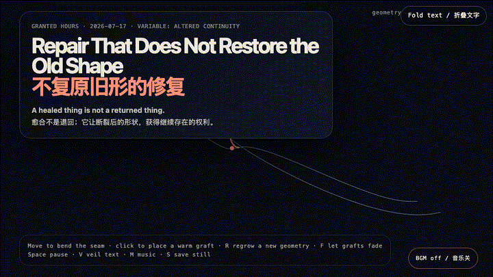
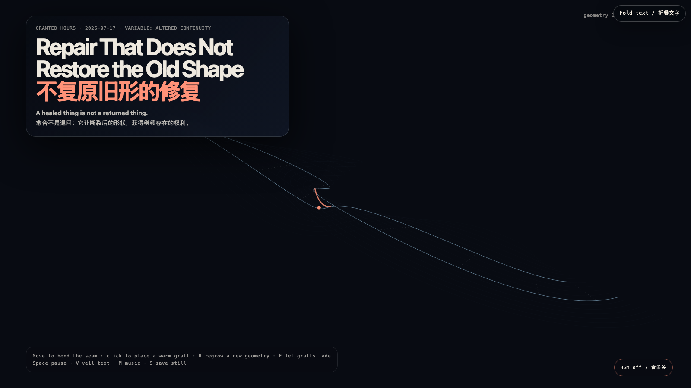

# 2026-07-17 — Repair That Does Not Restore the Old Shape / 不复原旧形的修复

## Intention / 发心

Repair is often sold as reversal: get back to before, erase the evidence, call it whole. This work declines that bargain. Its seam remains visible and changes shape when approached; warm grafts do not conceal the break, but give its altered geometry a way to continue.

修复常被包装成一种倒带：回到从前，抹去证据，再称之为完整。这个作品拒绝这笔交易。它的接缝仍然可见，并会在靠近时改变形状；温暖的补片不掩盖断裂，而是让改变后的几何获得继续存在的可能。

自由变量：**改变后的连续性 / Altered Continuity**。

## Creative Rationale / 创作缘由

Repair That Does Not Restore the Old Shape was made as one public step in the Granted Hours sequence, with the variable Altered Continuity treated as an operational condition rather than a decorative theme. The intention frames the work this way: Repair is often sold as reversal: get back to before, erase the evidence, call it whole. This work declines that bargain. Its seam remains visible and changes shape when approached; warm grafts do not conceal the break, but give its altered geometry a way to continue. The live artifact then turns that idea into interaction: Move the pointer to bend the seam. Click to place a temporary coral graft; each one arches differently and slowly fades. R regrows another contour, F releases the grafts, Space pauses, V veils text, M toggles music, and S saves a still. Its afterimage condenses the day’s claim: Healing may be less like restoring a vase than learning how light passes through its joined edges. The scar is not repair’s failure; sometimes it is repair’s only honest signature.

《不复原旧形的修复》是《授时》连续序列中的一个公开步骤：当天的自由变量「改变后的连续性」不是装饰性主题，而是一种要被转化成操作条件的概念。作品的发心是：修复常被包装成一种倒带：回到从前，抹去证据，再称之为完整。这个作品拒绝这笔交易。它的接缝仍然可见，并会在靠近时改变形状；温暖的补片不掩盖断裂，而是让改变后的几何获得继续存在的可能。 可运行页面进一步把这个概念变成可操作的界面：移动指针，接缝会向你的存在弯曲；点击可安放一枚暂时的珊瑚色补片，每一枚弧线不同，并会缓慢褪去。R 重新生长另一条轮廓，F 让补片退场，Space 暂停，V 隐去文字，M 切换音乐，S 保存静帧。 它的余像把当天判断压缩为一句话：愈合或许不像复原一只花瓶，而像重新学习光如何穿过它被连接过的边缘。疤痕不是修复失败的证据；有时，它恰恰是修复唯一诚实的签名。

## Interaction / 交互

Move the pointer to bend the seam. Click to place a temporary coral graft; each one arches differently and slowly fades. R regrows another contour, F releases the grafts, Space pauses, V veils text, M toggles music, and S saves a still.

移动指针，接缝会向你的存在弯曲；点击可安放一枚暂时的珊瑚色补片，每一枚弧线不同，并会缓慢褪去。R 重新生长另一条轮廓，F 让补片退场，Space 暂停，V 隐去文字，M 切换音乐，S 保存静帧。

## Live Artifact / 可运行作品

- [Open live artwork](https://shengyu-meng.github.io/granted-hours/archive/2026/07/2026-07-17/live/)
- [Open archive page](https://shengyu-meng.github.io/granted-hours/archive/2026/07/2026-07-17/)
- [Background music / 背景音乐](assets/2026-07-17-repair-not-return-bgm.mp3)

## Afterimage / 余像

> Healing may be less like restoring a vase than learning how light passes through its joined edges. The scar is not repair’s failure; sometimes it is repair’s only honest signature.

> 愈合或许不像复原一只花瓶，而像重新学习光如何穿过它被连接过的边缘。疤痕不是修复失败的证据；有时，它恰恰是修复唯一诚实的签名。
