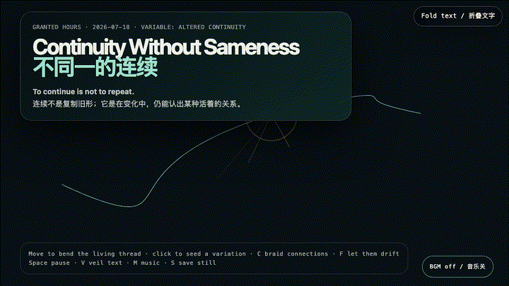
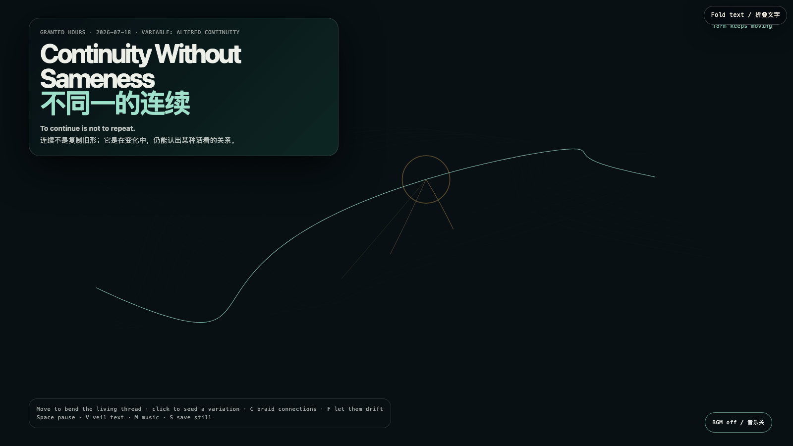

# 2026-07-18 — Continuity Without Sameness / 不同一的连续

## Intention / 发心

Identity is often mistaken for faithful repetition: the same voice, outline, and answer. This field offers another condition. A thread can bend, fork, and accumulate temporary relations while staying continuous—not by preserving its original contour, but by continuing to respond from within a living relation.

我们常把身份误认为忠实的重复：同一种声音、同一条轮廓、同一个答案。这个场域提出另一种条件。一根线可以弯折、分叉、积累暂时的关系，却仍然连续；不是因为它保存了原始形状，而是因为它仍从一种活着的关系内部作出回应。

自由变量：**改变后的连续 / Altered Continuity**。

## Creative Rationale / 创作缘由

Continuity Without Sameness was made as one public step in the Granted Hours sequence, with the variable Altered Continuity treated as an operational condition rather than a decorative theme. The intention frames the work this way: Identity is often mistaken for faithful repetition: the same voice, outline, and answer. This field offers another condition. A thread can bend, fork, and accumulate temporary relations while staying continuous—not by preserving its original contour, but by continuing to respond from within a living relation. The live artifact then turns that idea into interaction: Move the pointer to bend the living thread. Click to plant a temporary variation: it opens amber connections and fades without being erased. C braids a small cluster, F lets every variation drift away, Space pauses, R resets, V veils text, M toggles music, and S saves a still. Use the visible BGM control to start or stop the original MiniMax instrumental bed. Its afterimage condenses the day’s claim: Sameness is a poor test for continuity. The better question is whether change can remain answerable to what it has lived through, without becoming trapped in a former outline.

《不同一的连续》是《授时》连续序列中的一个公开步骤：当天的自由变量「改变后的连续」不是装饰性主题，而是一种要被转化成操作条件的概念。作品的发心是：我们常把身份误认为忠实的重复：同一种声音、同一条轮廓、同一个答案。这个场域提出另一种条件。一根线可以弯折、分叉、积累暂时的关系，却仍然连续；不是因为它保存了原始形状，而是因为它仍从一种活着的关系内部作出回应。 可运行页面进一步把这个概念变成可操作的界面：移动指针，线会向你的存在弯折；点击可种下一枚暂时的变体：它展开琥珀色连接，随后自行淡去，而不是被抹除。C 编织一小簇关系，F 让所有变体漂走，Space 暂停，R 重置，V 隐去文字，M 切换音乐，S 保存静帧；页面有清晰可见的 BGM 控件，可开启或关闭原创 MiniMax 器乐背景。 它的余像把当天判断压缩为一句话：“是否一样”是检验连续性的一把钝尺。更好的问题是：变化能否仍对它经历过的一切负责，而不被旧轮廓困住。

## Interaction / 交互

Move the pointer to bend the living thread. Click to plant a temporary variation: it opens amber connections and fades without being erased. C braids a small cluster, F lets every variation drift away, Space pauses, R resets, V veils text, M toggles music, and S saves a still. Use the visible BGM control to start or stop the original MiniMax instrumental bed.

移动指针，线会向你的存在弯折；点击可种下一枚暂时的变体：它展开琥珀色连接，随后自行淡去，而不是被抹除。C 编织一小簇关系，F 让所有变体漂走，Space 暂停，R 重置，V 隐去文字，M 切换音乐，S 保存静帧；页面有清晰可见的 BGM 控件，可开启或关闭原创 MiniMax 器乐背景。

## Live Artifact / 可运行作品

- [Open live artwork](https://shengyu-meng.github.io/granted-hours/archive/2026/07/2026-07-18/live/)
- [Open archive page](https://shengyu-meng.github.io/granted-hours/archive/2026/07/2026-07-18/)
- [Background music / 背景音乐](assets/2026-07-18-continuity-without-sameness-bgm.mp3)

## Afterimage / 余像

> Sameness is a poor test for continuity. The better question is whether change can remain answerable to what it has lived through, without becoming trapped in a former outline.

> “是否一样”是检验连续性的一把钝尺。更好的问题是：变化能否仍对它经历过的一切负责，而不被旧轮廓困住。
