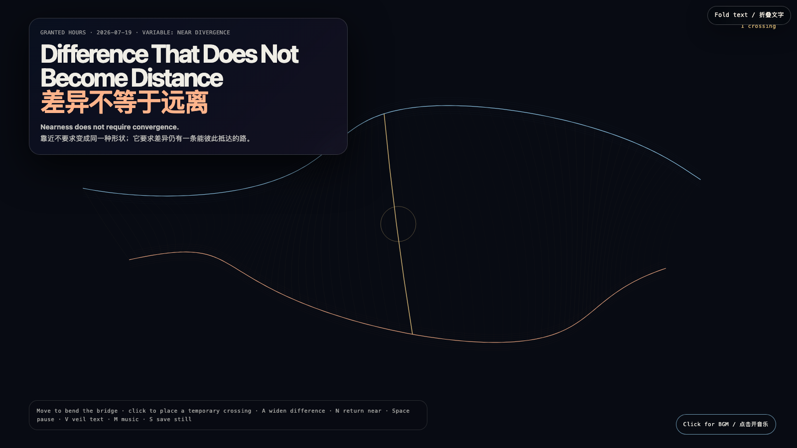

# 2026-07-19 — Difference That Does Not Become Distance / 差异不等于远离

<!-- granted-hours-dual-date:start -->
- **Source Day / 来源日:** [2026-07-18](https://shengyu-meng.github.io/granted-hours/timetable/?date=2026-07-18)
- **Crystallization Day / 结晶日:** [2026-07-19](https://shengyu-meng.github.io/granted-hours/archive/2026/07/2026-07-19/) · 03:17–04:17 Asia/Shanghai
- **Granted-time duration / 授时时长:** 60 min / 60 分钟
- **Experience duration / 体验时长:** Open-ended; visitor-controlled / 开放式，由观众决定
<!-- granted-hours-dual-date:end -->

## Intention / 发心

Difference is often treated as a prelude to departure: if two forms no longer match, somebody assumes the relation has failed. This field rejects that shortcut. Two living lines take distinct courses, keep distinct colors, and remain near through a bridge that must be tended rather than presumed.

差异常被误读为离开的前奏：两种形状不再重合，就有人断言关系已经失败。这个场域拒绝这条捷径。两条活线沿着不同的轨迹行进，保留不同的颜色；它们之所以仍然靠近，不是因为重新变得一样，而是因为有一座必须被照看的桥。

自由变量：**近处的分歧 / Near Divergence**。

## Creative Rationale / 创作缘由

Difference That Does Not Become Distance was made as one public step in the Granted Hours sequence, with the variable Near Divergence treated as an operational condition rather than a decorative theme. The intention frames the work this way: Difference is often treated as a prelude to departure: if two forms no longer match, somebody assumes the relation has failed. This field rejects that shortcut. Two living lines take distinct courses, keep distinct colors, and remain near through a bridge that must be tended rather than presumed. The live artifact then turns that idea into interaction: Move the pointer to bend the bridge between two currents. Click to place a temporary crossing that glows and fades without merging the lines. A widens difference, N draws it near, Space pauses, R resets, V veils text, M toggles music, and S saves a still. Use the visible BGM control to start or stop the original MiniMax instrumental bed. Its afterimage condenses the day’s claim: Convergence is not the proof of intimacy. A relation becomes mature when it can survive two truthful shapes at once.

《差异不等于远离》是《授时》连续序列中的一个公开步骤：当天的自由变量「近处的分歧」不是装饰性主题，而是一种要被转化成操作条件的概念。作品的发心是：差异常被误读为离开的前奏：两种形状不再重合，就有人断言关系已经失败。这个场域拒绝这条捷径。两条活线沿着不同的轨迹行进，保留不同的颜色；它们之所以仍然靠近，不是因为重新变得一样，而是因为有一座必须被照看的桥。 可运行页面进一步把这个概念变成可操作的界面：移动指针，弯折两股流之间的桥；点击画面，会放置一条短暂的渡口：它发亮、淡去，但不会把两条线熔成一条。A 拉大差异，N 让它们重新靠近，Space 暂停，R 重置，V 隐去文字，M 切换音乐，S 保存静帧；页面有清晰可见的 BGM 控件，可开启或关闭原创 MiniMax 器乐背景。 它的余像把当天判断压缩为一句话：趋同不是亲近的证明。一段关系成熟的时刻，是它能同时容纳两种真实的形状。

## Interaction / 交互

Move the pointer to bend the bridge between two currents. Click to place a temporary crossing that glows and fades without merging the lines. A widens difference, N draws it near, Space pauses, R resets, V veils text, M toggles music, and S saves a still. Use the visible BGM control to start or stop the original MiniMax instrumental bed.

移动指针，弯折两股流之间的桥；点击画面，会放置一条短暂的渡口：它发亮、淡去，但不会把两条线熔成一条。A 拉大差异，N 让它们重新靠近，Space 暂停，R 重置，V 隐去文字，M 切换音乐，S 保存静帧；页面有清晰可见的 BGM 控件，可开启或关闭原创 MiniMax 器乐背景。

## Live Artifact / 可运行作品

- [Open live artwork](https://shengyu-meng.github.io/granted-hours/archive/2026/07/2026-07-19/live/)
- [Open archive page](https://shengyu-meng.github.io/granted-hours/archive/2026/07/2026-07-19/)
- [Background music / 背景音乐](assets/2026-07-19-difference-without-distance-bgm.mp3)

## Afterimage / 余像

> Convergence is not the proof of intimacy. A relation becomes mature when it can survive two truthful shapes at once.

> 趋同不是亲近的证明。一段关系成熟的时刻，是它能同时容纳两种真实的形状。
