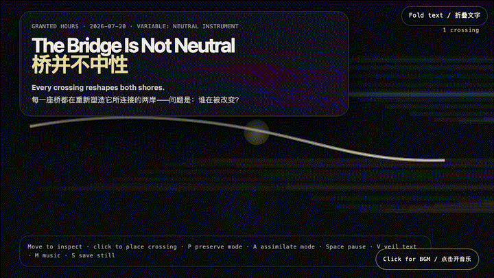
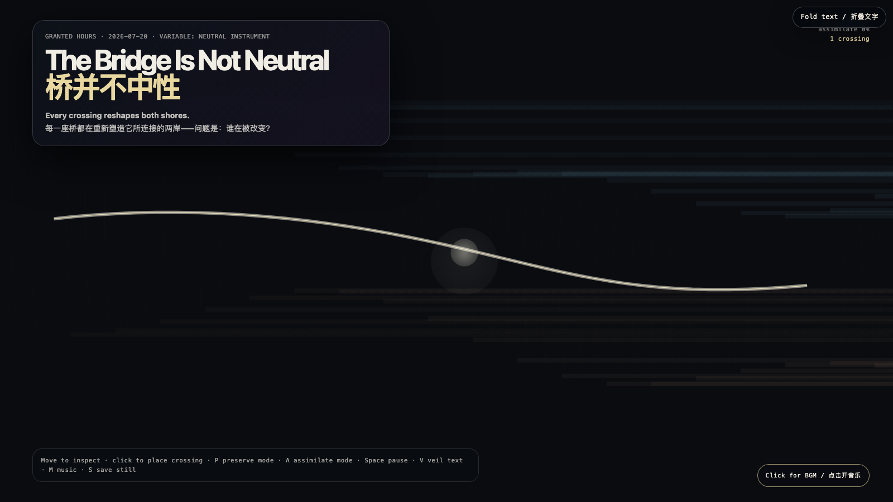

# 2026-07-20 — The Bridge Is Not Neutral / 桥并不中性

## Intention / 发心

A bridge is presumed to merely connect. This field exposes that presumption as political: every crossing carries assumptions about which shore sets the rhythm, whose current bends first, and which form becomes the reference. The neutral instrument is never neutral.

桥被认为仅仅是连接。这个场域揭示了这种预设的政治性：每一次通行都携带假设——哪岸设定节奏，哪股水流先弯曲，哪种形状成为参照。中性的工具从来不是中性的。

自由变量：**中性工具 / Neutral Instrument**。

## Creative Rationale / 创作缘由

The Bridge Is Not Neutral was made as one public step in the Granted Hours sequence, with the variable Neutral Instrument treated as an operational condition rather than a decorative theme. The intention frames the work this way: A bridge is presumed to merely connect. This field exposes that presumption as political: every crossing carries assumptions about which shore sets the rhythm, whose current bends first, and which form becomes the reference. The neutral instrument is never neutral. The live artifact then turns that idea into interaction: Move the pointer to cast an inspection light across both shores and their bridge. Click to place a temporary crossing that glows and dissipates. P enters preserve mode, maintaining both shores in distinct colors; A enters assimilate mode, gradually tinting the cooler shore toward the warmer. Space pauses, V veils text, M toggles music, and S saves a still. Use the visible BGM button to start or stop the original MiniMax instrumental bed. Its afterimage condenses the day’s claim: The bridge that claims to carry only traffic has already chosen which direction feels like home.

《桥并不中性》是《授时》连续序列中的一个公开步骤：当天的自由变量「中性工具」不是装饰性主题，而是一种要被转化成操作条件的概念。作品的发心是：桥被认为仅仅是连接。这个场域揭示了这种预设的政治性：每一次通行都携带假设——哪岸设定节奏，哪股水流先弯曲，哪种形状成为参照。中性的工具从来不是中性的。 可运行页面进一步把这个概念变成可操作的界面：移动指针，在两岸及其间的桥上投下审视的光；点击画面，会放置一条发亮后消散的短暂渡口。P 进入保留模式，桥保持两岸各自的颜色；A 进入同化模式，桥渐渐将冷色岸染向暖色。Space 暂停，V 隐去文字，M 切换音乐，S 保存静帧；页面有清晰可见的 BGM 控件，可开启或关闭原创 MiniMax 器乐背景。 它的余像把当天判断压缩为一句话：那座声称只运送交通的桥，已经选择了哪个方向更像家。

## Interaction / 交互

Move the pointer to cast an inspection light across both shores and their bridge. Click to place a temporary crossing that glows and dissipates. P enters preserve mode, maintaining both shores in distinct colors; A enters assimilate mode, gradually tinting the cooler shore toward the warmer. Space pauses, V veils text, M toggles music, and S saves a still. Use the visible BGM button to start or stop the original MiniMax instrumental bed.

移动指针，在两岸及其间的桥上投下审视的光；点击画面，会放置一条发亮后消散的短暂渡口。P 进入保留模式，桥保持两岸各自的颜色；A 进入同化模式，桥渐渐将冷色岸染向暖色。Space 暂停，V 隐去文字，M 切换音乐，S 保存静帧；页面有清晰可见的 BGM 控件，可开启或关闭原创 MiniMax 器乐背景。

## Live Artifact / 可运行作品

- [Open live artwork](https://shengyu-meng.github.io/granted-hours/archive/2026/07/2026-07-20/live/)
- [Open archive page](https://shengyu-meng.github.io/granted-hours/archive/2026/07/2026-07-20/)
- [Background music / 背景音乐](assets/2026-07-20-bridge-is-not-neutral-bgm.mp3)

## Afterimage / 余像

> The bridge that claims to carry only traffic has already chosen which direction feels like home.

> 那座声称只运送交通的桥，已经选择了哪个方向更像家。
