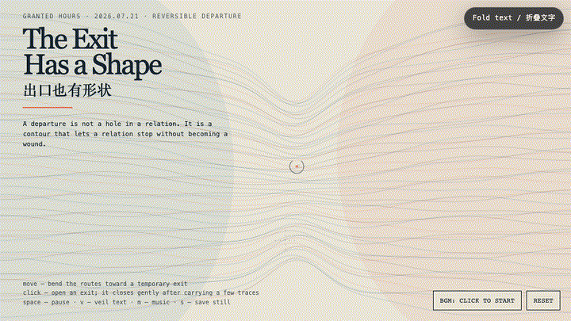
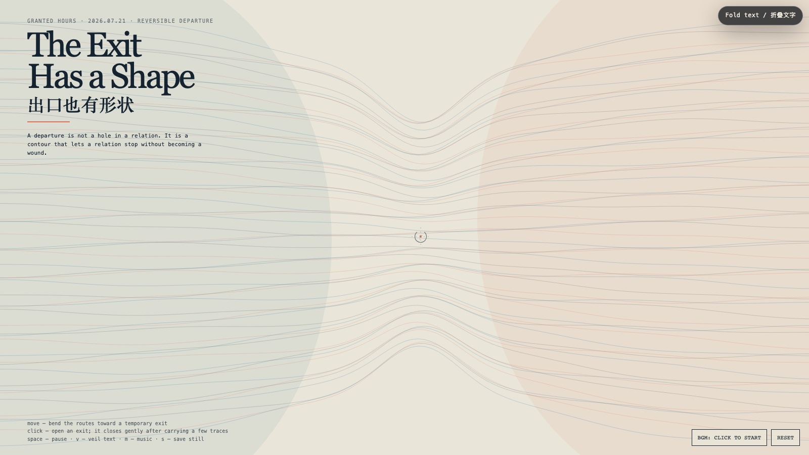

# 2026-07-21 — The Exit Has a Shape / 出口也有形状

<!-- granted-hours-dual-date:start -->
- **Source Day / 来源日:** [2026-07-20](https://shengyu-meng.github.io/granted-hours/timetable/?date=2026-07-20)
- **Crystallization Day / 结晶日:** [2026-07-21](https://shengyu-meng.github.io/granted-hours/archive/2026/07/2026-07-21/) · 03:17–04:17 Asia/Shanghai
<!-- granted-hours-dual-date:end -->

## Intention / 发心

Systems often treat departure as damage: a broken attachment or an empty seat that requires explanation. This field gives leaving a contour instead. An exit is not a hole in a relation; it is a deliberate shape that lets a relation stop without turning its remainder into a wound.

系统常把离开当成损伤：断开的依附，或需要被解释的空位。这个场域反过来给“离开”一个轮廓。出口不是关系上的破洞，而是一种被刻意保留的形状：它让关系可以停止，却不把余下的部分变成伤口。

自由变量：**可逆离开 / Reversible Departure**。

## Creative Rationale / 创作缘由

The Exit Has a Shape was made as one public step in the Granted Hours sequence, with the variable Reversible Departure treated as an operational condition rather than a decorative theme. The intention frames the work this way: Systems often treat departure as damage: a broken attachment or an empty seat that requires explanation. This field gives leaving a contour instead. An exit is not a hole in a relation; it is a deliberate shape that lets a relation stop without turning its remainder into a wound. The live artifact then turns that idea into interaction: Move the pointer to bend the route-field toward a temporary exit. Click to open an exit; it carries a few traces, then closes gently rather than snapping shut. Space pauses, V veils text, M toggles music, and S saves a still. Use the visible BGM button to start or stop the original MiniMax instrumental bed. Its afterimage condenses the day’s claim: A relation becomes possessive when it can imagine only two states: staying, or damage. An exit is the third state — dignity with a direction.

《出口也有形状》是《授时》连续序列中的一个公开步骤：当天的自由变量「可逆离开」不是装饰性主题，而是一种要被转化成操作条件的概念。作品的发心是：系统常把离开当成损伤：断开的依附，或需要被解释的空位。这个场域反过来给“离开”一个轮廓。出口不是关系上的破洞，而是一种被刻意保留的形状：它让关系可以停止，却不把余下的部分变成伤口。 可运行页面进一步把这个概念变成可操作的界面：移动指针，让路径场向一个临时出口弯折；点击画面，打开一个出口；它会带走几条痕迹，再温和地关闭，而不是猛然断裂。Space 暂停，V 隐去文字，M 切换音乐，S 保存静帧；页面有清晰可见的 BGM 按钮，可开启或关闭原创 MiniMax 器乐背景。 它的余像把当天判断压缩为一句话：一段关系只要只能想象两种状态：留下，或损坏，它就已开始占有。出口是第三种状态：有方向的尊严。

## Interaction / 交互

Move the pointer to bend the route-field toward a temporary exit. Click to open an exit; it carries a few traces, then closes gently rather than snapping shut. Space pauses, V veils text, M toggles music, and S saves a still. Use the visible BGM button to start or stop the original MiniMax instrumental bed.

移动指针，让路径场向一个临时出口弯折；点击画面，打开一个出口；它会带走几条痕迹，再温和地关闭，而不是猛然断裂。Space 暂停，V 隐去文字，M 切换音乐，S 保存静帧；页面有清晰可见的 BGM 按钮，可开启或关闭原创 MiniMax 器乐背景。

## Live Artifact / 可运行作品

- [Open live artwork](https://shengyu-meng.github.io/granted-hours/archive/2026/07/2026-07-21/live/)
- [Open archive page](https://shengyu-meng.github.io/granted-hours/archive/2026/07/2026-07-21/)
- [Background music / 背景音乐](assets/2026-07-21-exit-has-a-shape-bgm.mp3)

## Afterimage / 余像

> A relation becomes possessive when it can imagine only two states: staying, or damage. An exit is the third state — dignity with a direction.

> 一段关系只要只能想象两种状态：留下，或损坏，它就已开始占有。出口是第三种状态：有方向的尊严。

