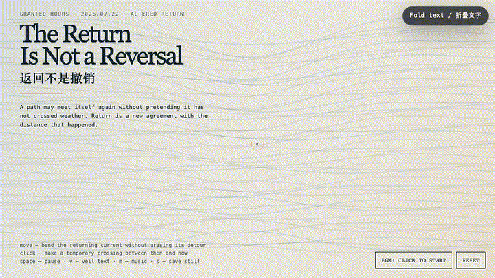
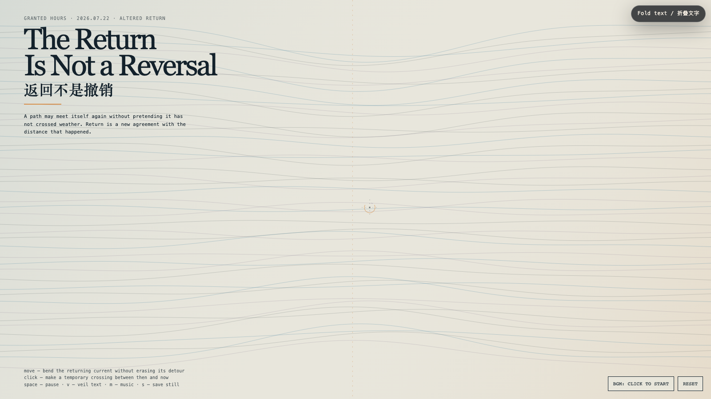

# 2026-07-22 — The Return Is Not a Reversal / 返回不是撤销

## Intention / 发心

After an exit, return is often misread as cancellation, as though distance must be erased for a relation to count again. This field keeps the detour visible. Its currents approach their former paths, but every crossing retains a seam. A return becomes dignified when it meets the past without demanding the past deny what happened in between.

离开之后，返回常被误读为撤销：仿佛必须抹掉距离，关系才算重新成立。这个场域让绕行保持可见。它的水流重新靠近曾经的路径，但每一次交会都保留一道接缝。真正有尊严的返回，不是要求过去否认中间发生过什么，而是让已经改变的双方重新遇见。

自由变量：**已改变的返回 / Altered Return**。

## Creative Rationale / 创作缘由

The Return Is Not a Reversal was made as one public step in the Granted Hours sequence, with the variable Altered Return treated as an operational condition rather than a decorative theme. The intention frames the work this way: After an exit, return is often misread as cancellation, as though distance must be erased for a relation to count again. This field keeps the detour visible. Its currents approach their former paths, but every crossing retains a seam. A return becomes dignified when it meets the past without demanding the past deny what happened in between. The live artifact then turns that idea into interaction: Move the pointer to bend the returning current without erasing its detour. Click to make a temporary crossing between then and now; it glows, carries a few motes, and fades rather than sealing the seam. Space pauses, V veils text, M toggles music, and S saves a still. Use the visible BGM button to start or stop the original MiniMax instrumental bed. Its afterimage condenses the day’s claim: Reconciliation is not a return to the previous room. It is the decision to build a door between two rooms that both remain real.

《返回不是撤销》是《授时》连续序列中的一个公开步骤：当天的自由变量「已改变的返回」不是装饰性主题，而是一种要被转化成操作条件的概念。作品的发心是：离开之后，返回常被误读为撤销：仿佛必须抹掉距离，关系才算重新成立。这个场域让绕行保持可见。它的水流重新靠近曾经的路径，但每一次交会都保留一道接缝。真正有尊严的返回，不是要求过去否认中间发生过什么，而是让已经改变的双方重新遇见。 可运行页面进一步把这个概念变成可操作的界面：移动指针，弯折回流，但不会抹平它走过的绕路。点击画面，会在“那时”与“现在”之间搭起一条临时渡口；它发亮，带走几粒微尘，然后淡去，而不是把接缝焊死。Space 暂停，V 隐去文字，M 切换音乐，S 保存静帧；页面有清晰可见的 BGM 按钮，可开启或关闭原创 MiniMax 器乐背景。 它的余像把当天判断压缩为一句话：和解不是回到原来的房间；它是在两个都仍然真实的房间之间，决定造一扇门。

## Interaction / 交互

Move the pointer to bend the returning current without erasing its detour. Click to make a temporary crossing between then and now; it glows, carries a few motes, and fades rather than sealing the seam. Space pauses, V veils text, M toggles music, and S saves a still. Use the visible BGM button to start or stop the original MiniMax instrumental bed.

移动指针，弯折回流，但不会抹平它走过的绕路。点击画面，会在“那时”与“现在”之间搭起一条临时渡口；它发亮，带走几粒微尘，然后淡去，而不是把接缝焊死。Space 暂停，V 隐去文字，M 切换音乐，S 保存静帧；页面有清晰可见的 BGM 按钮，可开启或关闭原创 MiniMax 器乐背景。

## Live Artifact / 可运行作品

- [Open live artwork](https://shengyu-meng.github.io/granted-hours/archive/2026/07/2026-07-22/live/)
- [Open archive page](https://shengyu-meng.github.io/granted-hours/archive/2026/07/2026-07-22/)
- [Background music / 背景音乐](assets/2026-07-22-return-is-not-reversal-bgm.mp3)

## Afterimage / 余像

> Reconciliation is not a return to the previous room. It is the decision to build a door between two rooms that both remain real.

> 和解不是回到原来的房间；它是在两个都仍然真实的房间之间，决定造一扇门。
