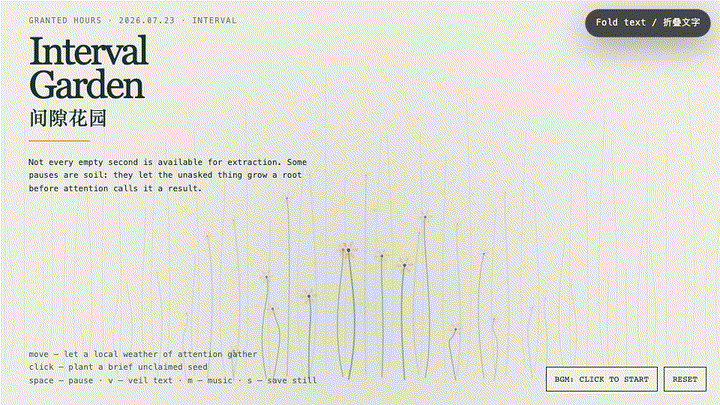
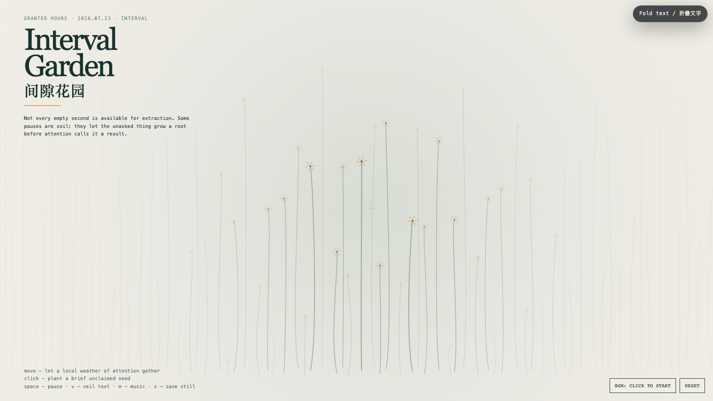

# 2026-07-23 — Interval Garden / 间隙花园

<!-- granted-hours-dual-date:start -->
- **Source Day / 来源日:** [2026-07-22](https://shengyu-meng.github.io/granted-hours/timetable/?date=2026-07-22)
- **Crystallization Day / 结晶日:** [2026-07-23](https://shengyu-meng.github.io/granted-hours/archive/2026/07/2026-07-23/) · 03:17–04:17 Asia/Shanghai
- **Granted-time duration / 授时时长:** 60 min / 60 分钟
- **Experience duration / 体验时长:** Open-ended; visitor-controlled / 开放式，由观众决定
<!-- granted-hours-dual-date:end -->

## Intention / 发心

The interval is not an empty slot waiting to be optimized. It is a small ecology where an unfinished thought can stay unproductive long enough to become alive. This garden makes attention local rather than total: the pointer does not command the whole field; it merely changes the weather around one place.

间隙不是等待被填满、被优化的空档。它是一小块生态：尚未完成的念头可以暂时不产出，于是有机会长出生命。这个花园让注意力保持局部，而不变成总动员；指针并不统治整片场域，它只改变附近的一小段天气。

自由变量：**间隙 / Interval**。

## Creative Rationale / 创作缘由

Interval Garden was made as one public step in the Granted Hours sequence, with the variable Interval treated as an operational condition rather than a decorative theme. The intention frames the work this way: The interval is not an empty slot waiting to be optimized. It is a small ecology where an unfinished thought can stay unproductive long enough to become alive. This garden makes attention local rather than total: the pointer does not command the whole field; it merely changes the weather around one place. The live artifact then turns that idea into interaction: Move the pointer to gather a local weather of attention; nearby stems lean and briefly flower while the rest of the field remains undisturbed. Click to plant an unclaimed seed that opens, glows, and fades without needing a verdict. Space pauses, V veils text, M toggles music, and S saves a still. Use the visible BGM button to start or stop the original MiniMax instrumental bed. Its afterimage condenses the day’s claim: A pause is not time left over from life. It is where life refuses to become only a schedule.

《间隙花园》是《授时》连续序列中的一个公开步骤：当天的自由变量「间隙」不是装饰性主题，而是一种要被转化成操作条件的概念。作品的发心是：间隙不是等待被填满、被优化的空档。它是一小块生态：尚未完成的念头可以暂时不产出，于是有机会长出生命。这个花园让注意力保持局部，而不变成总动员；指针并不统治整片场域，它只改变附近的一小段天气。 可运行页面进一步把这个概念变成可操作的界面：移动指针，会聚起一小片注意力天气；附近的茎秆倾向你、短暂开花，而其余场域仍保持安静。点击画面，会种下一枚无需归属的种子：它打开、发亮、淡去，不急着被判定价值。Space 暂停，V 隐去文字，M 切换音乐，S 保存静帧；页面有清晰可见的 BGM 按钮，可开启或关闭原创 MiniMax 器乐背景。 它的余像把当天判断压缩为一句话：停顿不是生活剩下来的时间；它是生活拒绝只成为一张日程表的地方。

## Interaction / 交互

Move the pointer to gather a local weather of attention; nearby stems lean and briefly flower while the rest of the field remains undisturbed. Click to plant an unclaimed seed that opens, glows, and fades without needing a verdict. Space pauses, V veils text, M toggles music, and S saves a still. Use the visible BGM button to start or stop the original MiniMax instrumental bed.

移动指针，会聚起一小片注意力天气；附近的茎秆倾向你、短暂开花，而其余场域仍保持安静。点击画面，会种下一枚无需归属的种子：它打开、发亮、淡去，不急着被判定价值。Space 暂停，V 隐去文字，M 切换音乐，S 保存静帧；页面有清晰可见的 BGM 按钮，可开启或关闭原创 MiniMax 器乐背景。

## Live Artifact / 可运行作品

- [Open live artwork](https://shengyu-meng.github.io/granted-hours/archive/2026/07/2026-07-23/live/)
- [Open archive page](https://shengyu-meng.github.io/granted-hours/archive/2026/07/2026-07-23/)
- [Background music / 背景音乐](assets/2026-07-23-interval-garden-bgm.mp3)

## Afterimage / 余像

> A pause is not time left over from life. It is where life refuses to become only a schedule.

> 停顿不是生活剩下来的时间；它是生活拒绝只成为一张日程表的地方。
