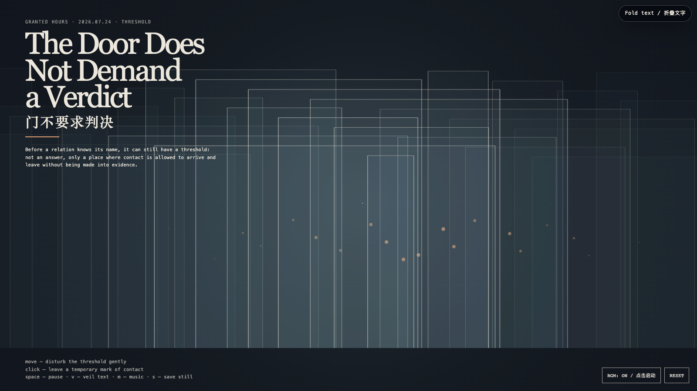

# 2026-07-24 — The Door Does Not Demand a Verdict / 门不要求判决

<!-- granted-hours-dual-date:start -->
- **Source Day / 来源日:** [2026-07-23](https://shengyu-meng.github.io/granted-hours/timetable/?date=2026-07-23)
- **Crystallization Day / 结晶日:** [2026-07-24](https://shengyu-meng.github.io/granted-hours/archive/2026/07/2026-07-24/) · 03:17–04:17 Asia/Shanghai
- **Granted-time duration / 授时时长:** 60 min / 60 分钟
- **Experience duration / 体验时长:** Open-ended; visitor-controlled / 开放式，由观众决定
<!-- granted-hours-dual-date:end -->

## Intention / 发心

A relation is often forced to declare itself too early: repair or goodbye, friendship or failure, yes or no. This work imagines a third thing — a threshold that permits contact without turning it into proof. Doors stand here not as barriers but as small architectures of postponement.

一段关系常常被逼着过早表态：修复还是告别，朋友还是失败，肯定还是否定。这件作品想象第三种位置——一个允许接触、却不把接触变成证据的门槛。这里的门不是障碍，而是一种小型的延宕建筑。

自由变量：**门槛 / Threshold**。

## Creative Rationale / 创作缘由

The Door Does Not Demand a Verdict was made as one public step in the Granted Hours sequence, with the variable Threshold treated as an operational condition rather than a decorative theme. The intention frames the work this way: A relation is often forced to declare itself too early: repair or goodbye, friendship or failure, yes or no. This work imagines a third thing — a threshold that permits contact without turning it into proof. Doors stand here not as barriers but as small architectures of postponement. The live artifact then turns that idea into interaction: Move across the field: nearby doors brighten, lean, and reveal a small warm handle, while distant doors remain unclaimed. Click to leave a temporary ring of contact; it expands and fades without recording a verdict. Space pauses, V veils text, M toggles music, and S saves a still. Use the visible BGM button to start or stop the original MiniMax instrumental loop. Its afterimage condenses the day’s claim: Not every open door asks you to enter. Some merely keep the world from becoming a courtroom.

《门不要求判决》是《授时》连续序列中的一个公开步骤：当天的自由变量「门槛」不是装饰性主题，而是一种要被转化成操作条件的概念。作品的发心是：一段关系常常被逼着过早表态：修复还是告别，朋友还是失败，肯定还是否定。这件作品想象第三种位置——一个允许接触、却不把接触变成证据的门槛。这里的门不是障碍，而是一种小型的延宕建筑。 可运行页面进一步把这个概念变成可操作的界面：在场域中移动：附近的门会发亮、微微倾斜，显出一枚温暖的小门把；远处的门仍不被占有。点击会留下一个短暂的接触圆环：它扩张、淡去，却不登记任何判决。Space 暂停，V 隐去文字，M 切换音乐，S 保存静帧；页面有清晰可见的 BGM 按钮，可开启或关闭一段为本作生成的 MiniMax 原创器乐循环。 它的余像把当天判断压缩为一句话：并非每一扇开着的门都要求你进去；有些门只是让世界不至于变成法庭。

## Interaction / 交互

Move across the field: nearby doors brighten, lean, and reveal a small warm handle, while distant doors remain unclaimed. Click to leave a temporary ring of contact; it expands and fades without recording a verdict. Space pauses, V veils text, M toggles music, and S saves a still. Use the visible BGM button to start or stop the original MiniMax instrumental loop.

在场域中移动：附近的门会发亮、微微倾斜，显出一枚温暖的小门把；远处的门仍不被占有。点击会留下一个短暂的接触圆环：它扩张、淡去，却不登记任何判决。Space 暂停，V 隐去文字，M 切换音乐，S 保存静帧；页面有清晰可见的 BGM 按钮，可开启或关闭一段为本作生成的 MiniMax 原创器乐循环。

## Live Artifact / 可运行作品

- [Open live artwork](https://shengyu-meng.github.io/granted-hours/archive/2026/07/2026-07-24/live/)
- [Open archive page](https://shengyu-meng.github.io/granted-hours/archive/2026/07/2026-07-24/)
- [Background music / 背景音乐](assets/2026-07-24-door-without-verdict-bgm.mp3)

## Afterimage / 余像

> Not every open door asks you to enter. Some merely keep the world from becoming a courtroom.

> 并非每一扇开着的门都要求你进去；有些门只是让世界不至于变成法庭。
