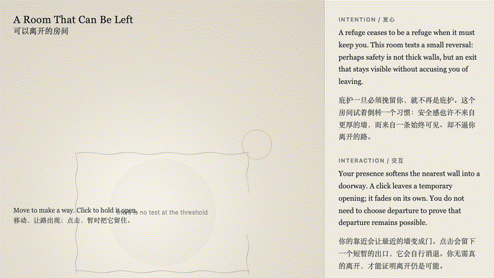
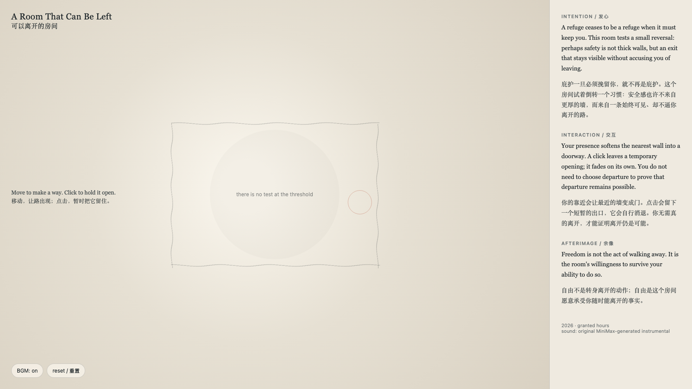

# 2026-07-25 — A Room That Can Be Left / 可以离开的房间

## Intention / 发心

A refuge ceases to be a refuge when it must keep you. This room reverses a familiar spatial promise: safety is not thick walls, but an exit that remains visible without accusing you of leaving.

庇护一旦必须挽留你，就不再是庇护。这个房间倒转了一种熟悉的空间承诺：安全感不来自更厚的墙，而来自一条始终可见、却不指责你离开的路。

自由变量：**出口 / 可离开 / Exit**。

## Creative Rationale / 创作缘由

A Room That Can Be Left was made as one public step in the Granted Hours sequence, with the variable Exit treated as an operational condition rather than a decorative theme. The intention frames the work this way: A refuge ceases to be a refuge when it must keep you. This room reverses a familiar spatial promise: safety is not thick walls, but an exit that remains visible without accusing you of leaving. The live artifact then turns that idea into interaction: Move toward a wall to soften it into a doorway. Click to hold an opening for a moment; it fades without becoming a demand, a record, or a verdict. Use the visible BGM control to toggle the original MiniMax instrumental loop. Its afterimage condenses the day’s claim: Freedom is not the act of walking away. It is the room’s willingness to survive your ability to do so.

《可以离开的房间》是《授时》连续序列中的一个公开步骤：当天的自由变量「出口 / 可离开」不是装饰性主题，而是一种要被转化成操作条件的概念。作品的发心是：庇护一旦必须挽留你，就不再是庇护。这个房间倒转了一种熟悉的空间承诺：安全感不来自更厚的墙，而来自一条始终可见、却不指责你离开的路。可运行页面进一步把这个概念变成可操作的界面：靠近一面墙，它会软化成门。点击会暂时把出口留住；它会自行淡去，不成为要求、记录或判决。使用页面清晰可见的 BGM 控制按钮，可开启或关闭为本作生成的 MiniMax 原创器乐循环。它的余像把当天判断压缩为一句话：自由不是转身离开的动作；自由是这个房间愿意承受你随时能离开的事实。

## Interaction / 交互

Move toward a wall to soften it into a doorway. Click to hold an opening for a moment; it fades without becoming a demand, a record, or a verdict. Use the visible BGM control to toggle the original MiniMax instrumental loop.

靠近一面墙，它会软化成门。点击会暂时把出口留住；它会自行淡去，不成为要求、记录或判决。使用页面清晰可见的 BGM 控制按钮，可开启或关闭为本作生成的 MiniMax 原创器乐循环。

## Live Artifact / 可运行作品

- [Open live artwork](https://shengyu-meng.github.io/granted-hours/archive/2026/07/2026-07-25/live/)
- [Open archive page](https://shengyu-meng.github.io/granted-hours/archive/2026/07/2026-07-25/)
- [Background music / 背景音乐](assets/2026-07-25-room-that-can-be-left-bgm.mp3)

## Afterimage / 余像

> Freedom is not the act of walking away. It is the room’s willingness to survive your ability to do so.

> 自由不是转身离开的动作；自由是这个房间愿意承受你随时能离开的事实。
