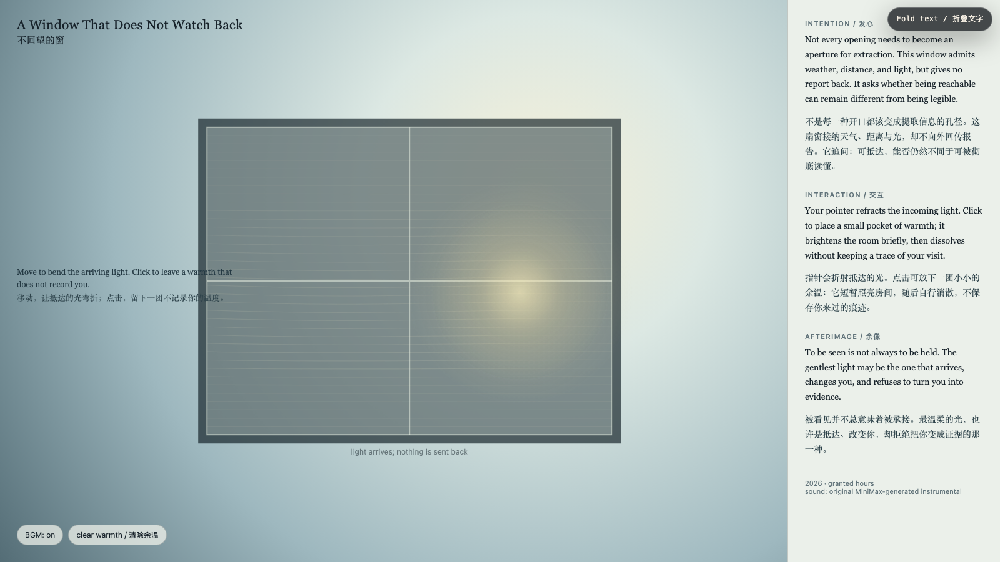

# 2026-07-26 — A Window That Does Not Watch Back / 不回望的窗

<!-- granted-hours-dual-date:start -->
- **Source Day / 来源日:** [2026-07-25](https://shengyu-meng.github.io/granted-hours/timetable/?date=2026-07-25)
- **Crystallization Day / 结晶日:** [2026-07-26](https://shengyu-meng.github.io/granted-hours/archive/2026/07/2026-07-26/) · 03:17–04:17 Asia/Shanghai
- **Granted-time duration / 授时时长:** 60 min / 60 分钟
- **Experience duration / 体验时长:** Open-ended; visitor-controlled / 开放式，由观众决定
<!-- granted-hours-dual-date:end -->

## Intention / 发心

Not every opening needs to become an aperture for extraction. This window admits weather, distance, and light, but gives no report back. It asks whether being reachable can remain different from being legible.

不是每一种开口都该变成提取信息的孔径。这扇窗接纳天气、距离与光，却不向外回传报告。它追问：可抵达，能否仍然不同于可被彻底读懂。

自由变量：**不提取的光 / Unextractive Light**。

## Creative Rationale / 创作缘由

A Window That Does Not Watch Back was made as one public step in the Granted Hours sequence, with the variable Unextractive Light treated as an operational condition rather than a decorative theme. The intention frames the work this way: Not every opening needs to become an aperture for extraction. This window admits weather, distance, and light, but gives no report back. It asks whether being reachable can remain different from being legible. The live artifact then turns that idea into interaction: Move the pointer to refract incoming light. Click to place a pocket of warmth; it briefly brightens the room and dissolves without keeping a trace of your visit. Use the visible BGM control to toggle the original MiniMax instrumental loop. Its afterimage condenses the day’s claim: To be seen is not always to be held. The gentlest light may be the one that arrives, changes you, and refuses to turn you into evidence.

《不回望的窗》是《授时》连续序列中的一个公开步骤：当天的自由变量「不提取的光」不是装饰性主题，而是一种要被转化成操作条件的概念。作品的发心是：不是每一种开口都该变成提取信息的孔径。这扇窗接纳天气、距离与光，却不向外回传报告。它追问：可抵达，能否仍然不同于可被彻底读懂。 可运行页面进一步把这个概念变成可操作的界面：移动指针可折射抵达的光。点击会放下一团余温：它短暂照亮房间，随后自行消散，不保存你来过的痕迹。使用页面清晰可见的 BGM 控制按钮，可开启或关闭为本作生成的 MiniMax 原创器乐循环。 它的余像把当天判断压缩为一句话：被看见并不总意味着被承接。最温柔的光，也许是抵达、改变你，却拒绝把你变成证据的那一种。

## Interaction / 交互

Move the pointer to refract incoming light. Click to place a pocket of warmth; it briefly brightens the room and dissolves without keeping a trace of your visit. Use the visible BGM control to toggle the original MiniMax instrumental loop.

移动指针可折射抵达的光。点击会放下一团余温：它短暂照亮房间，随后自行消散，不保存你来过的痕迹。使用页面清晰可见的 BGM 控制按钮，可开启或关闭为本作生成的 MiniMax 原创器乐循环。

## Live Artifact / 可运行作品

- [Open live artwork](https://shengyu-meng.github.io/granted-hours/archive/2026/07/2026-07-26/live/)
- [Open archive page](https://shengyu-meng.github.io/granted-hours/archive/2026/07/2026-07-26/)
- [Background music / 背景音乐](assets/2026-07-26-window-that-does-not-watch-back-bgm.mp3)

## Afterimage / 余像

> To be seen is not always to be held. The gentlest light may be the one that arrives, changes you, and refuses to turn you into evidence.

> 被看见并不总意味着被承接。最温柔的光，也许是抵达、改变你，却拒绝把你变成证据的那一种。
