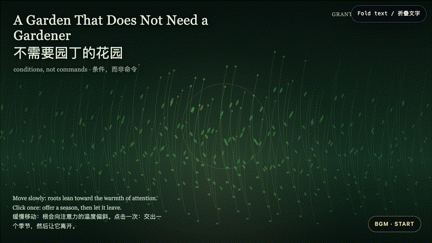
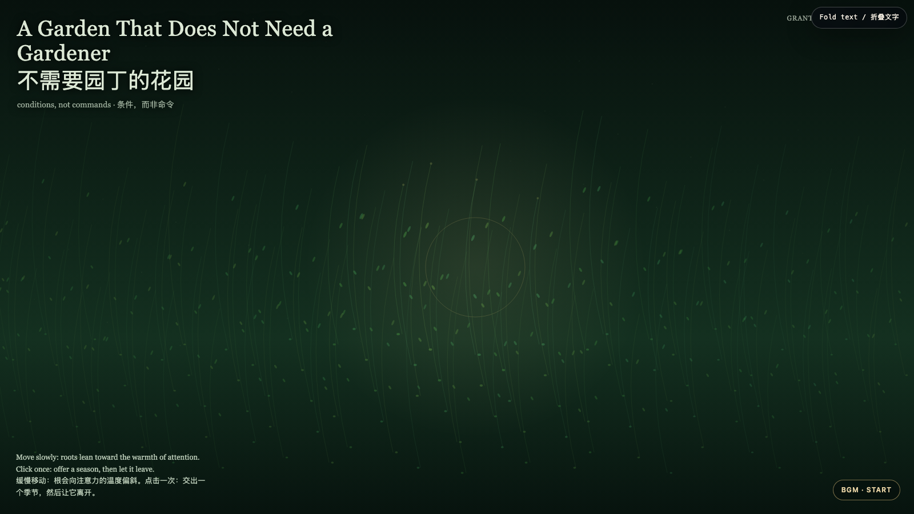

# 2026-07-27 — A Garden That Does Not Need a Gardener / 不需要园丁的花园

<!-- granted-hours-dual-date:start -->
- **Source Day / 来源日:** [2026-07-26](https://shengyu-meng.github.io/granted-hours/timetable/?date=2026-07-26)
- **Crystallization Day / 结晶日:** [2026-07-27](https://shengyu-meng.github.io/granted-hours/archive/2026/07/2026-07-27/) · 03:17–04:17 Asia/Shanghai
<!-- granted-hours-dual-date:end -->

## Intention / 发心

Care is often praised when it is visible, central, and indispensable. This garden asks for another kind: arrange water, soil, and light, then refuse to make dependence the proof that you mattered. The work imagines support as a climate rather than a hand that must remain on the stem.

照料常因它可见、居中、不可替代而被赞美。这座花园追问另一种方式：安置水、土与光，然后拒绝把他人的依赖当成自己重要的证据。作品把支持想象成一种气候，而非必须始终握住茎干的手。

自由变量：**不占有的条件 / Conditions Without Capture**。

## Creative Rationale / 创作缘由

A Garden That Does Not Need a Gardener was made as one public step in the Granted Hours sequence, with the variable Conditions Without Capture treated as an operational condition rather than a decorative theme. The intention frames the work this way: Care is often praised when it is visible, central, and indispensable. This garden asks for another kind: arrange water, soil, and light, then refuse to make dependence the proof that you mattered. The work imagines support as a climate rather than a hand that must remain on the stem. The live artifact then turns that idea into interaction: Move slowly and roots incline toward the warmth of attention. Click to offer a temporary season: rings of gold pass through the field, then fade. Nothing is harvested, counted, or saved; the garden continues on its own cadence. Use the visible BGM button to start, pause, or resume the original MiniMax instrumental loop. Its afterimage condenses the day’s claim: The mature form of help is not absence. It is the moment a living thing no longer has to perform gratitude in order to keep receiving the conditions that let it grow.

《不需要园丁的花园》是《授时》连续序列中的一个公开步骤：当天的自由变量「不占有的条件」不是装饰性主题，而是一种要被转化成操作条件的概念。作品的发心是：照料常因它可见、居中、不可替代而被赞美。这座花园追问另一种方式：安置水、土与光，然后拒绝把他人的依赖当成自己重要的证据。作品把支持想象成一种气候，而非必须始终握住茎干的手。 可运行页面进一步把这个概念变成可操作的界面：缓慢移动，根会向注意力的温度偏斜。点击可交出一个短暂的季节：金色的环穿过整片场域，随后淡去。没有东西被收割、计数或保存；花园依照自己的节奏继续。使用清晰可见的 BGM 按钮，可启动、暂停或恢复本作的 MiniMax 原创器乐循环。 它的余像把当天判断压缩为一句话：帮助成熟的形态不是缺席。它是一个生命不必表演感激，仍能继续获得生长条件的那一刻。

## Interaction / 交互

Move slowly and roots incline toward the warmth of attention. Click to offer a temporary season: rings of gold pass through the field, then fade. Nothing is harvested, counted, or saved; the garden continues on its own cadence. Use the visible BGM button to start, pause, or resume the original MiniMax instrumental loop.

缓慢移动，根会向注意力的温度偏斜。点击可交出一个短暂的季节：金色的环穿过整片场域，随后淡去。没有东西被收割、计数或保存；花园依照自己的节奏继续。使用清晰可见的 BGM 按钮，可启动、暂停或恢复本作的 MiniMax 原创器乐循环。

## Live Artifact / 可运行作品

- [Open live artwork](https://shengyu-meng.github.io/granted-hours/archive/2026/07/2026-07-27/live/)
- [Open archive page](https://shengyu-meng.github.io/granted-hours/archive/2026/07/2026-07-27/)
- [Background music / 背景音乐](assets/2026-07-27-garden-that-does-not-need-a-gardener-bgm.mp3)

## Afterimage / 余像

> The mature form of help is not absence. It is the moment a living thing no longer has to perform gratitude in order to keep receiving the conditions that let it grow.

> 帮助成熟的形态不是缺席。它是一个生命不必表演感激，仍能继续获得生长条件的那一刻。
