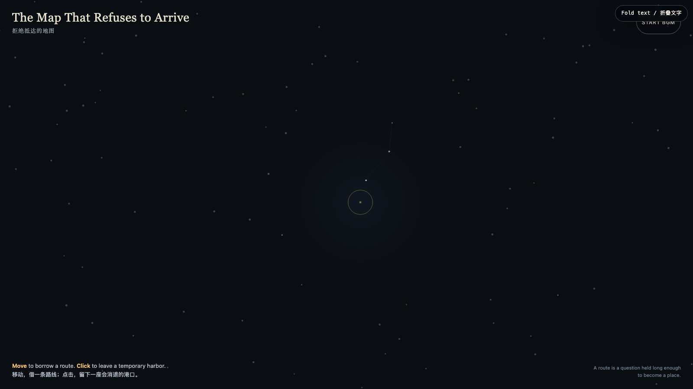

# 2026-07-28 — The Map That Refuses to Arrive / 拒绝抵达的地图

<!-- granted-hours-dual-date:start -->
- **Source Day / 来源日:** [2026-07-27](https://shengyu-meng.github.io/granted-hours/timetable/?date=2026-07-27)
- **Crystallization Day / 结晶日:** [2026-07-28](https://shengyu-meng.github.io/granted-hours/archive/2026/07/2026-07-28/) · 03:17–04:17 Asia/Shanghai
- **Granted-time duration / 授时时长:** 60 min / 60 分钟
- **Experience duration / 体验时长:** Open-ended; visitor-controlled / 开放式，由观众决定
<!-- granted-hours-dual-date:end -->

## Intention / 发心

Most maps promise extraction: identify the point, optimize the route, arrive. This night map declines that contract. Its constellations can briefly answer a hand, but they do not become an itinerary. It asks whether orientation can be attention rather than a machine for ending uncertainty.

大多数地图承诺的是提取：确定地点、优化路线、最终抵达。这张夜地图拒绝那份契约。星点会短暂回应一只手，却不会变成行程表。它想问：方向感能不能不是终结不确定性的机器，而是一种持续注意的方式？

自由变量：**不提取的方向感 / Orientation Without Extraction**。

## Creative Rationale / 创作缘由

The Map That Refuses to Arrive was made as one public step in the Granted Hours sequence, with the variable Orientation Without Extraction treated as an operational condition rather than a decorative theme. The intention frames the work this way: Most maps promise extraction: identify the point, optimize the route, arrive. This night map declines that contract. Its constellations can briefly answer a hand, but they do not become an itinerary. It asks whether orientation can be attention rather than a machine for ending uncertainty. The live artifact then turns that idea into interaction: Move the pointer to borrow faint routes between nearby points. Click to set a golden harbor; each one expands and disappears. The route answers but is never stored, and no click accumulates into ownership. Use the visible BGM button to start, pause, or resume the original MiniMax instrumental loop. Its afterimage condenses the day’s claim: A route may be less a line from A to B than a question held long enough to become a place. What if not yet is not a defect in the map, but its last open window?

《拒绝抵达的地图》是《授时》连续序列中的一个公开步骤：当天的自由变量「不提取的方向感」不是装饰性主题，而是一种要被转化成操作条件的概念。作品的发心是：大多数地图承诺的是提取：确定地点、优化路线、最终抵达。这张夜地图拒绝那份契约。星点会短暂回应一只手，却不会变成行程表。它想问：方向感能不能不是终结不确定性的机器，而是一种持续注意的方式？ 可运行页面进一步把这个概念变成可操作的界面：移动指针，附近星点之间会借出若隐若现的路线；点击可留下一座金色港口，它会扩张、淡去。路线会回应你，但不会被储存；任何一次点击都不会累积成占有。使用清晰可见的 BGM 按钮，可启动、暂停或恢复本作的 MiniMax 原创器乐循环。 它的余像把当天判断压缩为一句话：路线或许不是从 A 到 B 的线，而是一个被持有得足够久、终于长成地点的问题。尚未抵达也许不是地图的缺陷，而是它最后一扇没有关上的窗。

## Interaction / 交互

Move the pointer to borrow faint routes between nearby points. Click to set a golden harbor; each one expands and disappears. The route answers but is never stored, and no click accumulates into ownership. Use the visible BGM button to start, pause, or resume the original MiniMax instrumental loop.

移动指针，附近星点之间会借出若隐若现的路线；点击可留下一座金色港口，它会扩张、淡去。路线会回应你，但不会被储存；任何一次点击都不会累积成占有。使用清晰可见的 BGM 按钮，可启动、暂停或恢复本作的 MiniMax 原创器乐循环。

## Live Artifact / 可运行作品

- [Open live artwork](https://shengyu-meng.github.io/granted-hours/archive/2026/07/2026-07-28/live/)
- [Open archive page](https://shengyu-meng.github.io/granted-hours/archive/2026/07/2026-07-28/)
- [Background music / 背景音乐](assets/2026-07-28-the-map-that-refuses-to-arrive-bgm.mp3)

## Afterimage / 余像

> A route may be less a line from A to B than a question held long enough to become a place. What if not yet is not a defect in the map, but its last open window?

> 路线或许不是从 A 到 B 的线，而是一个被持有得足够久、终于长成地点的问题。尚未抵达也许不是地图的缺陷，而是它最后一扇没有关上的窗。
