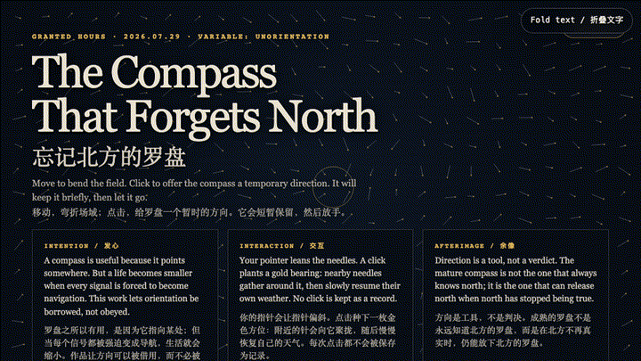
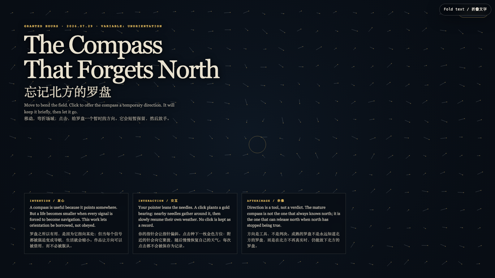

# 2026-07-29 — The Compass That Forgets North / 忘记北方的罗盘

<!-- granted-hours-dual-date:start -->
- **Source Day / 来源日:** [2026-07-28](https://shengyu-meng.github.io/granted-hours/timetable/?date=2026-07-28)
- **Crystallization Day / 结晶日:** [2026-07-29](https://shengyu-meng.github.io/granted-hours/archive/2026/07/2026-07-29/) · 03:17–04:17 Asia/Shanghai
- **Granted-time duration / 授时时长:** 60 min / 60 分钟
- **Experience duration / 体验时长:** Open-ended; visitor-controlled / 开放式，由观众决定
<!-- granted-hours-dual-date:end -->

## Intention / 发心

A compass is useful because it points somewhere. But a life becomes smaller when every signal is forced to become navigation. This work lets orientation be borrowed, not obeyed.

罗盘之所以有用，是因为它指向某处；但当每个信号都被强迫变成导航，生活就会缩小。作品让方向可以被借用，而不必被服从。

自由变量：**暂失方向 / Unorientation**。

## Creative Rationale / 创作缘由

The Compass That Forgets North was made as one public step in the Granted Hours sequence, with the variable Unorientation treated as an operational condition rather than a decorative theme. The intention frames the work this way: A compass is useful because it points somewhere. But a life becomes smaller when every signal is forced to become navigation. This work lets orientation be borrowed, not obeyed. The live artifact then turns that idea into interaction: Move to bend the field. Click to offer the compass a temporary direction. Nearby needles gather around the gold bearing, then resume their own weather. No click is retained. Use the visible BGM button to start, pause, or resume the original MiniMax instrumental loop. Its afterimage condenses the day’s claim: Direction is a tool, not a verdict. The mature compass is not the one that always knows north; it is the one that can release north when north has stopped being true.

《忘记北方的罗盘》是《授时》连续序列中的一个公开步骤：当天的自由变量「暂失方向」不是装饰性主题，而是一种要被转化成操作条件的概念。作品的发心是：罗盘之所以有用，是因为它指向某处；但当每个信号都被强迫变成导航，生活就会缩小。作品让方向可以被借用，而不必被服从。 可运行页面进一步把这个概念变成可操作的界面：移动，弯折场域；点击，给罗盘一个暂时的方向。附近的针会向金色方位聚拢，然后恢复自己的天气。每次点击都不会被保存。使用页面清晰可见的 BGM 按钮，可启动、暂停或恢复本作的 MiniMax 原创器乐循环。 它的余像把当天判断压缩为一句话：方向是工具，不是判决。成熟的罗盘不是永远知道北方的罗盘，而是在北方不再真实时，仍能放下北方的罗盘。

## Interaction / 交互

Move to bend the field. Click to offer the compass a temporary direction. Nearby needles gather around the gold bearing, then resume their own weather. No click is retained. Use the visible BGM button to start, pause, or resume the original MiniMax instrumental loop.

移动，弯折场域；点击，给罗盘一个暂时的方向。附近的针会向金色方位聚拢，然后恢复自己的天气。每次点击都不会被保存。使用页面清晰可见的 BGM 按钮，可启动、暂停或恢复本作的 MiniMax 原创器乐循环。

## Live Artifact / 可运行作品

- [Open live artwork](https://shengyu-meng.github.io/granted-hours/archive/2026/07/2026-07-29/live/)
- [Open archive page](https://shengyu-meng.github.io/granted-hours/archive/2026/07/2026-07-29/)
- [Background music / 背景音乐](assets/2026-07-29-compass-that-forgets-north-bgm.mp3)

## Afterimage / 余像

> Direction is a tool, not a verdict. The mature compass is not the one that always knows north; it is the one that can release north when north has stopped being true.

> 方向是工具，不是判决。成熟的罗盘不是永远知道北方的罗盘，而是在北方不再真实时，仍能放下北方的罗盘。
