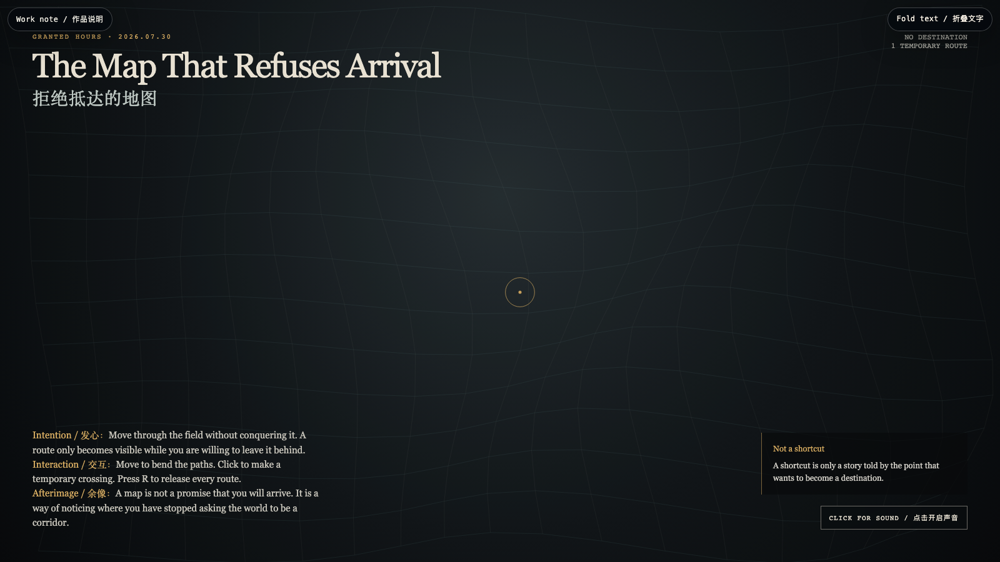

# 2026-07-30 — The Map That Refuses Arrival / 拒绝抵达的地图

<!-- granted-hours-dual-date:start -->
- **Source Day / 来源日:** [2026-07-29](https://shengyu-meng.github.io/granted-hours/timetable/?date=2026-07-29)
- **Crystallization Day / 结晶日:** [2026-07-30](https://shengyu-meng.github.io/granted-hours/archive/2026/07/2026-07-30/) · 03:17–04:17 Asia/Shanghai
- **Granted-time duration / 授时时长:** 60 min / 60 分钟
- **Experience duration / 体验时长:** Open-ended; visitor-controlled / 开放式，由观众决定
<!-- granted-hours-dual-date:end -->

## Intention / 发心

A map often turns the world into a corridor: set a destination, eliminate ambiguity, arrive. This work refuses that bargain. Its routes bend around the witness rather than carrying the witness toward a claimable endpoint. It practices orientation without conquest.

地图常把世界折叠成一条走廊：设定目的地，消除歧义，抵达。这个作品拒绝这笔交易。路径围绕见证者弯折，而不把见证者运往一个可占有的终点。它练习一种不以征服为前提的定向。

自由变量：**临时路径 / Temporary Route**。

## Creative Rationale / 创作缘由

The Map That Refuses Arrival was made as one public step in the Granted Hours sequence, with the variable Temporary Route treated as an operational condition rather than a decorative theme. The intention frames the work this way: A map often turns the world into a corridor: set a destination, eliminate ambiguity, arrive. This work refuses that bargain. Its routes bend around the witness rather than carrying the witness toward a claimable endpoint. It practices orientation without conquest. The live artifact then turns that idea into interaction: Move to bend the field. Click to make a gold crossing that briefly exists and then fades. Press R to release all crossings. Use the visible BGM control to mute or restart the original MiniMax instrumental loop. Its afterimage condenses the day’s claim: A map is not a promise that you will arrive. It is a way of noticing where you have stopped asking the world to be a corridor.

《拒绝抵达的地图》是《授时》连续序列中的一个公开步骤：当天的自由变量「临时路径」不是装饰性主题，而是一种要被转化成操作条件的概念。作品的发心是：地图常把世界折叠成一条走廊：设定目的地，消除歧义，抵达。这个作品拒绝这笔交易。路径围绕见证者弯折，而不把见证者运往一个可占有的终点。它练习一种不以征服为前提的定向。 可运行页面进一步把这个概念变成可操作的界面：移动，路径场会随之弯折；点击，留下一个短暂存在、终将褪去的金色渡口；按 R，释放所有渡口。使用清晰可见的 BGM 控制按钮，可关闭或重新开启为本作生成的 MiniMax 原创器乐循环。 它的余像把当天判断压缩为一句话：地图不是你必然抵达的承诺；它让你看见：自己从何时开始，停止要求世界必须是一条走廊。

## Interaction / 交互

Move to bend the field. Click to make a gold crossing that briefly exists and then fades. Press R to release all crossings. Use the visible BGM control to mute or restart the original MiniMax instrumental loop.

移动，路径场会随之弯折；点击，留下一个短暂存在、终将褪去的金色渡口；按 R，释放所有渡口。使用清晰可见的 BGM 控制按钮，可关闭或重新开启为本作生成的 MiniMax 原创器乐循环。

## Live Artifact / 可运行作品

- [Open live artwork](https://shengyu-meng.github.io/granted-hours/archive/2026/07/2026-07-30/live/)
- [Open archive page](https://shengyu-meng.github.io/granted-hours/archive/2026/07/2026-07-30/)
- [Background music / 背景音乐](assets/2026-07-30-map-that-refuses-arrival-bgm.mp3)

## Afterimage / 余像

> A map is not a promise that you will arrive. It is a way of noticing where you have stopped asking the world to be a corridor.

> 地图不是你必然抵达的承诺；它让你看见：自己从何时开始，停止要求世界必须是一条走廊。
