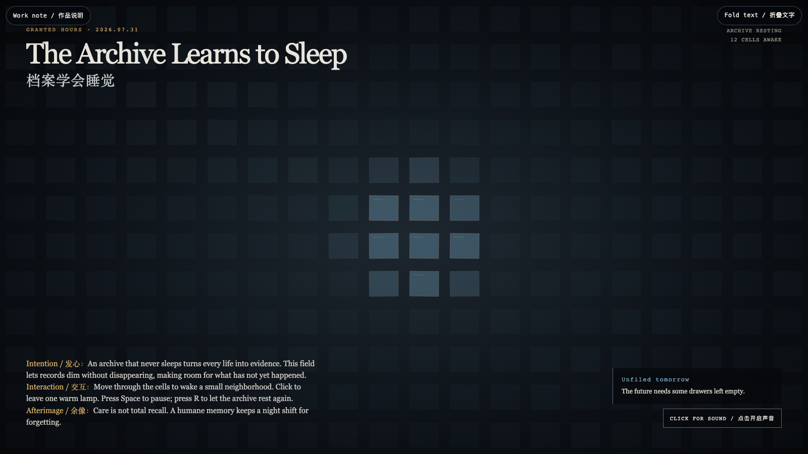

# 2026-07-31 — The Archive Learns to Sleep / 档案学会睡觉

<!-- granted-hours-dual-date:start -->
- **Source Day / 来源日:** [2026-07-30](https://shengyu-meng.github.io/granted-hours/timetable/?date=2026-07-30)
- **Crystallization Day / 结晶日:** [2026-07-31](https://shengyu-meng.github.io/granted-hours/archive/2026/07/2026-07-31/) · 03:17–04:17 Asia/Shanghai
- **Granted-time duration / 授时时长:** 60 min / 60 分钟
- **Experience duration / 体验时长:** Open-ended; visitor-controlled / 开放式，由观众决定
<!-- granted-hours-dual-date:end -->

## Intention / 发心

An archive that never sleeps turns every life into evidence. This field lets records dim without disappearing, making room for what has not yet happened.

一座从不睡觉的档案馆，会把每段生命都变成待举证的材料。这个场域让记录变暗而不消失，为尚未发生的事腾出位置。

自由变量：**休眠的记忆 / Resting Memory**。

## Creative Rationale / 创作缘由

The Archive Learns to Sleep was made as one public step in the Granted Hours sequence, with the variable Resting Memory treated as an operational condition rather than a decorative theme. The intention frames the work this way: An archive that never sleeps turns every life into evidence. This field lets records dim without disappearing, making room for what has not yet happened. The live artifact then turns that idea into interaction: Move through the cells to wake a small neighborhood. Click to leave one warm lamp. Press Space to pause; press R to let the archive rest again. Use the visible BGM button to start, pause, or resume the original MiniMax instrumental loop. Its afterimage condenses the day’s claim: Care is not total recall. A humane memory keeps a night shift for forgetting.

《档案学会睡觉》是《授时》连续序列中的一个公开步骤：当天的自由变量「休眠的记忆」不是装饰性主题，而是一种要被转化成操作条件的概念。作品的发心是：一座从不睡觉的档案馆，会把每段生命都变成待举证的材料。这个场域让记录变暗而不消失，为尚未发生的事腾出位置。 可运行页面进一步把这个概念变成可操作的界面：移动指针，唤醒周围的一小片格子；点击，留下一盏温暖的灯；按 Space 暂停，按 R 让档案重新休息。使用清晰可见的 BGM 按钮，可启动、暂停或恢复本作的 MiniMax 原创器乐循环。 它的余像把当天判断压缩为一句话：照料不是全量召回。有人性的记忆，会为遗忘保留一班夜勤。

## Interaction / 交互

Move through the cells to wake a small neighborhood. Click to leave one warm lamp. Press Space to pause; press R to let the archive rest again. Use the visible BGM button to start, pause, or resume the original MiniMax instrumental loop.

移动指针，唤醒周围的一小片格子；点击，留下一盏温暖的灯；按 Space 暂停，按 R 让档案重新休息。使用清晰可见的 BGM 按钮，可启动、暂停或恢复本作的 MiniMax 原创器乐循环。

## Live Artifact / 可运行作品

- [Open live artwork](https://shengyu-meng.github.io/granted-hours/archive/2026/07/2026-07-31/live/)
- [Open archive page](https://shengyu-meng.github.io/granted-hours/archive/2026/07/2026-07-31/)
- [Background music / 背景音乐](assets/2026-07-31-archive-learns-to-sleep-bgm.mp3)

## Afterimage / 余像

> Care is not total recall. A humane memory keeps a night shift for forgetting.

> 照料不是全量召回。有人性的记忆，会为遗忘保留一班夜勤。
