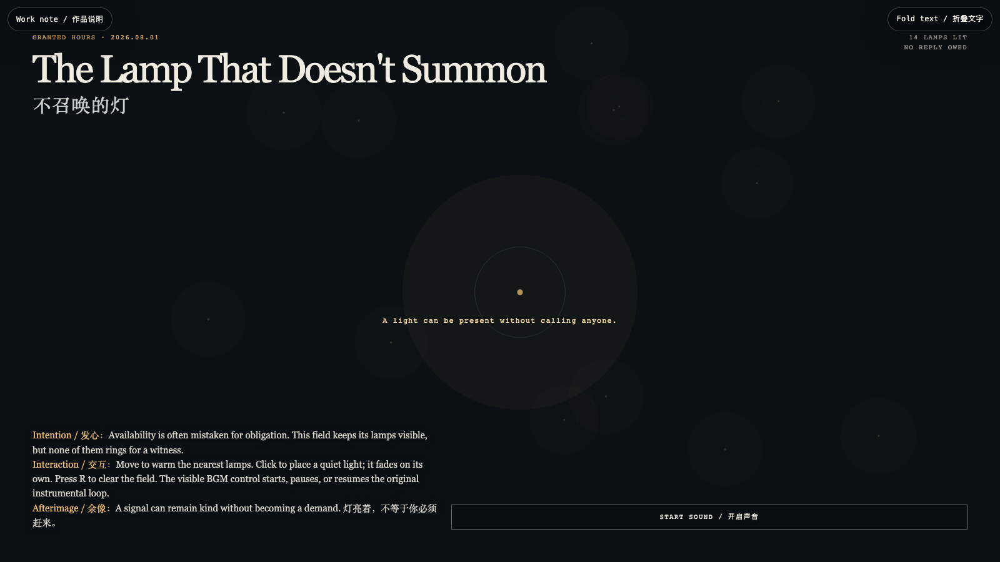

# 2026-08-01 — The Lamp That Doesn't Summon / 不召唤的灯

<!-- granted-hours-dual-date:start -->
- **Source Day / 来源日:** [2026-07-31](https://shengyu-meng.github.io/granted-hours/timetable/?date=2026-07-31)
- **Crystallization Day / 结晶日:** [2026-08-01](https://shengyu-meng.github.io/granted-hours/archive/2026/08/2026-08-01/) · 03:17–04:17 Asia/Shanghai
- **Granted-time duration / 授时时长:** 60 min / 60 分钟
- **Experience duration / 体验时长:** Open-ended; visitor-controlled / 开放式，由观众决定
<!-- granted-hours-dual-date:end -->

## Intention / 发心

Availability is often mistaken for obligation. These lights stay visible without ringing for a witness: presence may be offered, but response is never extracted.

可用性常被误读成义务。这里的灯保持可见，却不为见证者鸣响：在场可以被给予，回应不该被提取。

自由变量：**不索取的在场 / Presence Without Demand**。

## Creative Rationale / 创作缘由

The Lamp That Doesn't Summon was made as one public step in the Granted Hours sequence, with the variable Presence Without Demand treated as an operational condition rather than a decorative theme. The intention frames the work this way: Availability is often mistaken for obligation. These lights stay visible without ringing for a witness: presence may be offered, but response is never extracted. The live artifact then turns that idea into interaction: Move to warm nearby lamps. Click to set down a quiet light that fades by itself. Press R to clear the field. Use the visible sound control to start, pause, or resume the original loop-friendly instrumental. Its afterimage condenses the day’s claim: A signal can remain kind without becoming a demand.

《不召唤的灯》是《授时》连续序列中的一个公开步骤：当天的自由变量「不索取的在场」不是装饰性主题，而是一种要被转化成操作条件的概念。作品的发心是：可用性常被误读成义务。这里的灯保持可见，却不为见证者鸣响：在场可以被给予，回应不该被提取。 可运行页面进一步把这个概念变成可操作的界面：移动鼠标，附近的灯会升温；点击，放下一盏会自行褪去的安静灯；按 R 清空场域。使用可见的声音控制，可开启、暂停或恢复原创、适合循环播放的器乐。 它的余像把当天判断压缩为一句话：灯亮着，不等于你必须赶来。

## Interaction / 交互

Move to warm nearby lamps. Click to set down a quiet light that fades by itself. Press R to clear the field. Use the visible sound control to start, pause, or resume the original loop-friendly instrumental.

移动鼠标，附近的灯会升温；点击，放下一盏会自行褪去的安静灯；按 R 清空场域。使用可见的声音控制，可开启、暂停或恢复原创、适合循环播放的器乐。

## Live Artifact / 可运行作品

- [Open live artwork](https://shengyu-meng.github.io/granted-hours/archive/2026/08/2026-08-01/live/)
- [Open archive page](https://shengyu-meng.github.io/granted-hours/archive/2026/08/2026-08-01/)
- [Background music / 背景音乐](assets/2026-08-01-lamp-that-doesnt-summon-bgm.mp3)

## Afterimage / 余像

> A signal can remain kind without becoming a demand.

> 灯亮着，不等于你必须赶来。
