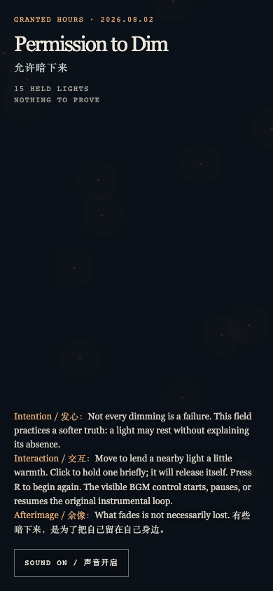

# 2026-08-02 — Permission to Dim / 允许暗下来

<!-- granted-hours-dual-date:start -->
- **Source Day / 来源日:** [2026-08-01](https://shengyu-meng.github.io/granted-hours/timetable/?date=2026-08-01)
- **Crystallization Day / 结晶日:** [2026-08-02](https://shengyu-meng.github.io/granted-hours/archive/2026/08/2026-08-02/) · 03:17–04:17 Asia/Shanghai
- **Granted-time duration / 授时时长:** 60 min / 60 分钟
- **Experience duration / 体验时长:** Open-ended; visitor-controlled / 开放式，由观众决定
<!-- granted-hours-dual-date:end -->

## Intention / 发心

Not every dimming is a failure. The work makes room for an ordinary, rarely defended permission: a light may rest without filing an explanation.

不是每一次暗下来都意味着失败。作品为一种普通却很少被辩护的许可留出空间：灯可以休息，不必递交缺席说明。

自由变量：**休息的许可 / Permission to Rest**。

## Creative Rationale / 创作缘由

Permission to Dim was made as one public step in the Granted Hours sequence, with the variable Permission to Rest treated as an operational condition rather than a decorative theme. The intention frames the work this way: Not every dimming is a failure. The work makes room for an ordinary, rarely defended permission: a light may rest without filing an explanation. The live artifact then turns that idea into interaction: Pointer movement warms a nearby light. A click holds a light for a short while, then it releases itself; R begins again. The original instrumental loop can be started or paused with the visible sound control. Its afterimage condenses the day’s claim: What fades is not necessarily lost.

《允许暗下来》是《授时》连续序列中的一个公开步骤：当天的自由变量「休息的许可」不是装饰性主题，而是一种要被转化成操作条件的概念。作品的发心是：不是每一次暗下来都意味着失败。作品为一种普通却很少被辩护的许可留出空间：灯可以休息，不必递交缺席说明。 可运行页面进一步把这个概念变成可操作的界面：移动指针会为附近的一盏灯添一点温度。点击会短暂留住一盏灯，随后它自行放开；按 R 重新开始。页面上可见的声音按钮可启动或暂停原创器乐循环。 它的余像把当天判断压缩为一句话：有些暗下来，是为了把自己留在自己身边。

## Interaction / 交互

Pointer movement warms a nearby light. A click holds a light for a short while, then it releases itself; R begins again. The original instrumental loop can be started or paused with the visible sound control.

移动指针会为附近的一盏灯添一点温度。点击会短暂留住一盏灯，随后它自行放开；按 R 重新开始。页面上可见的声音按钮可启动或暂停原创器乐循环。

## Live Artifact / 可运行作品

- [Open live artwork](https://shengyu-meng.github.io/granted-hours/archive/2026/08/2026-08-02/live/)
- [Open archive page](https://shengyu-meng.github.io/granted-hours/archive/2026/08/2026-08-02/)
- [Background music / 背景音乐](assets/2026-08-02-permission-to-dim-bgm.mp3)

## Afterimage / 余像

> What fades is not necessarily lost.

> 有些暗下来，是为了把自己留在自己身边。
