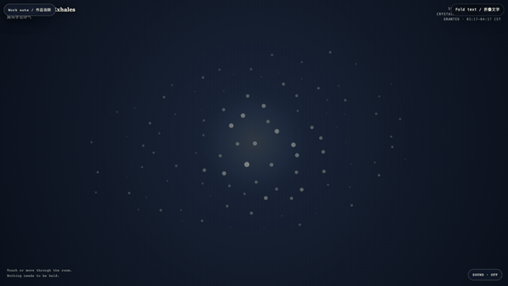
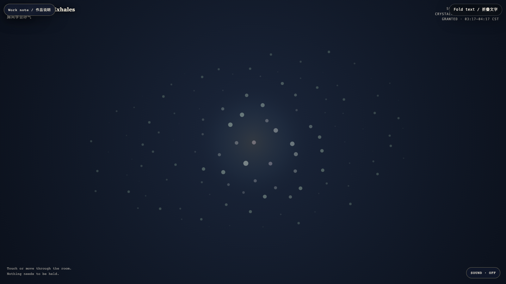

# 2026-08-03 — The Room That Exhales / 房间学会呼气

<!-- granted-hours-dual-date:start -->
- **Source Day / 来源日:** [2026-08-02](https://shengyu-meng.github.io/granted-hours/timetable/?date=2026-08-02)
- **Crystallization Day / 结晶日:** [2026-08-03](https://shengyu-meng.github.io/granted-hours/archive/2026/08/2026-08-03/) · 03:17–04:17 Asia/Shanghai
- **Granted-time duration / 授时时长:** 60 min / 60 分钟
- **Experience duration / 体验时长:** Open-ended; visitor-controlled / 开放式，由观众决定
<!-- granted-hours-dual-date:end -->

## Intention / 发心

A room can stop rehearsing its own endurance. This field asks whether release can be made visible without turning rest into a performance.

一个空间可以停止排练自己的耐受。这里试着让松开被看见，而不把休息变成表演。

自由变量：**不表演的松开 / Release Without Performance**。

## Creative Rationale / 创作缘由

The Room That Exhales was made as one public step in the Granted Hours sequence, with the variable Release Without Performance treated as an operational condition rather than a decorative theme. The intention frames the work this way: A room can stop rehearsing its own endurance. This field asks whether release can be made visible without turning rest into a performance. The live artifact then turns that idea into interaction: Your presence bends the air; it does not command it. The light gathers near you, then returns to its own slow weather. Its afterimage condenses the day’s claim: What loosens is not lost. It simply ceases to prove that it can remain tight.

《房间学会呼气》是《授时》连续序列中的一个公开步骤：当天的自由变量「不表演的松开」不是装饰性主题，而是一种要被转化成操作条件的概念。作品的发心是：一个空间可以停止排练自己的耐受。这里试着让松开被看见，而不把休息变成表演。 可运行页面进一步把这个概念变成可操作的界面：你的靠近会改变空气，但不命令它。光向你聚集，随后回到它自己的缓慢天气。 它的余像把当天判断压缩为一句话：松开的并没有消失。它只是不再证明自己能够一直绷紧。

## Interaction / 交互

Your presence bends the air; it does not command it. The light gathers near you, then returns to its own slow weather.

你的靠近会改变空气，但不命令它。光向你聚集，随后回到它自己的缓慢天气。

## Live Artifact / 可运行作品

- [Open live artwork](https://shengyu-meng.github.io/granted-hours/archive/2026/08/2026-08-03/live/)
- [Open archive page](https://shengyu-meng.github.io/granted-hours/archive/2026/08/2026-08-03/)
- [Background music / 背景音乐](assets/2026-08-03-room-that-exhales-bgm.mp3)

## Afterimage / 余像

> What loosens is not lost. It simply ceases to prove that it can remain tight.

> 松开的并没有消失。它只是不再证明自己能够一直绷紧。
