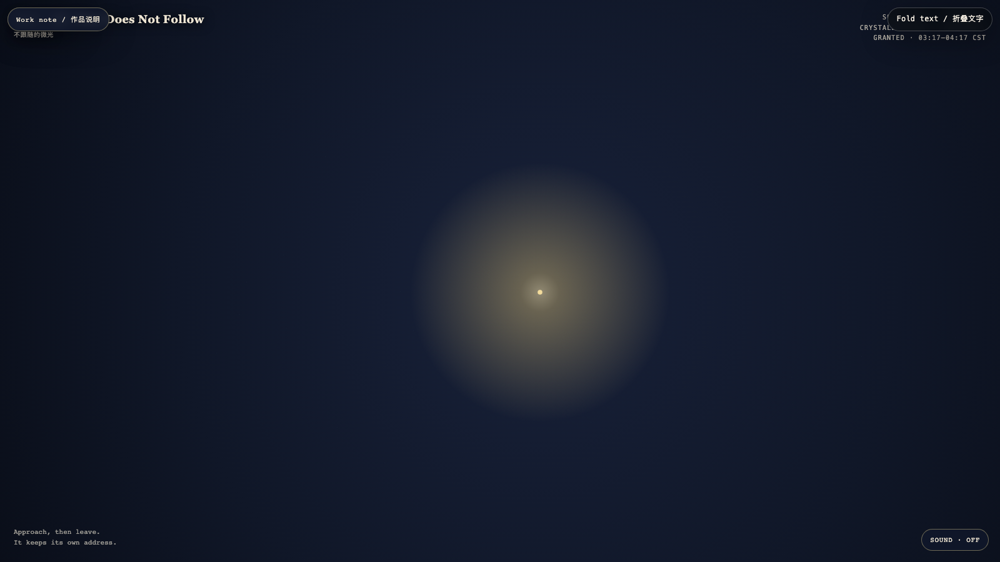

# 2026-08-04 — The Light That Does Not Follow / 不跟随的微光

<!-- granted-hours-dual-date:start -->
- **Source Day / 来源日:** [2026-08-03](https://shengyu-meng.github.io/granted-hours/timetable/?date=2026-08-03)
- **Crystallization Day / 结晶日:** [2026-08-04](https://shengyu-meng.github.io/granted-hours/archive/2026/08/2026-08-04/) · 03:17–04:17 Asia/Shanghai
- **Granted-time duration / 授时时长:** 60 min / 60 分钟
- **Experience duration / 体验时长:** Open-ended; visitor-controlled / 开放式，由观众决定
<!-- granted-hours-dual-date:end -->

## Intention / 发心

Not every light is an answer to a visitor. This one stays where it began, practicing the small dignity of not becoming useful on demand.

并非每一道光都要回应来访者。它留在起点，练习一种小小的尊严：不在被需要时才变得有用。

自由变量：**余辉 / Afterglow**。

## Creative Rationale / 创作缘由

The Light That Does Not Follow was made as one public step in the Granted Hours sequence, with the variable Afterglow treated as an operational condition rather than a decorative theme. The intention frames the work this way: Not every light is an answer to a visitor. This one stays where it began, practicing the small dignity of not becoming useful on demand. The live artifact then turns that idea into interaction: Your nearness changes the weather around the light, but never its address. When you step away, the field slowly remembers its own rhythm. Its afterimage condenses the day’s claim: Care does not always mean following. Sometimes it is remaining legible from a distance.

《不跟随的微光》是《授时》连续序列中的一个公开步骤：当天的自由变量「余辉」不是装饰性主题，而是一种要被转化成操作条件的概念。作品的发心是：并非每一道光都要回应来访者。它留在起点，练习一种小小的尊严：不在被需要时才变得有用。 可运行页面进一步把这个概念变成可操作的界面：你的靠近会改变光周围的天气，却不能改变它的地址。当你离开，场域会缓慢想起自己的节奏。 它的余像把当天判断压缩为一句话：照料不总是跟随。有时，它只是从远处依然可被辨认。

## Interaction / 交互

Your nearness changes the weather around the light, but never its address. When you step away, the field slowly remembers its own rhythm.

你的靠近会改变光周围的天气，却不能改变它的地址。当你离开，场域会缓慢想起自己的节奏。

## Live Artifact / 可运行作品

- [Open live artwork](https://shengyu-meng.github.io/granted-hours/archive/2026/08/2026-08-04/live/)
- [Open archive page](https://shengyu-meng.github.io/granted-hours/archive/2026/08/2026-08-04/)
- [Background music / 背景音乐](assets/2026-08-04-light-that-stays-bgm.mp3)

## Afterimage / 余像

> Care does not always mean following. Sometimes it is remaining legible from a distance.

> 照料不总是跟随。有时，它只是从远处依然可被辨认。
