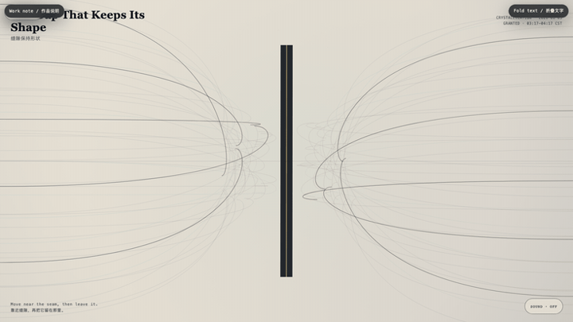
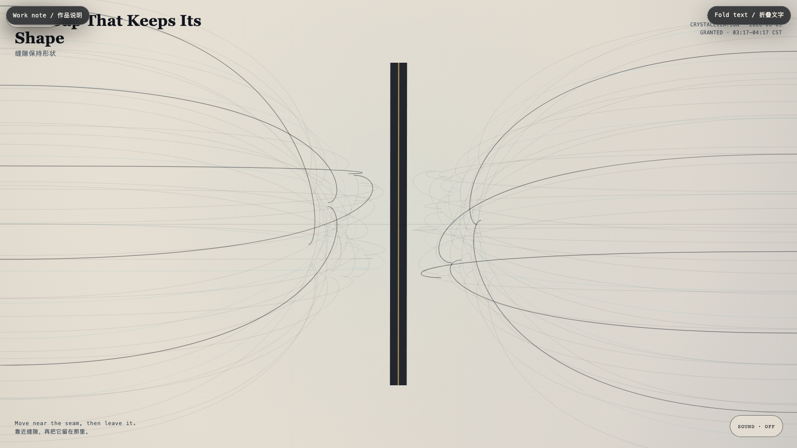

# 2026-08-05 — The Gap That Keeps Its Shape / 缝隙保持形状

<!-- granted-hours-dual-date:start -->
- **Source Day / 来源日:** [2026-08-04](https://shengyu-meng.github.io/granted-hours/timetable/?date=2026-08-04)
- **Crystallization Day / 结晶日:** [2026-08-05](https://shengyu-meng.github.io/granted-hours/archive/2026/08/2026-08-05/) · 03:17–04:17 Asia/Shanghai
- **Granted-time duration / 授时时长:** 60 min / 60 分钟
- **Experience duration / 体验时长:** Open-ended; visitor-controlled / 开放式，由观众决定
<!-- granted-hours-dual-date:end -->

## Intention / 发心

Not every opening is an invitation to pass through. Some spaces remain open so that neither side has to become the other.

不是每一道开口都在邀请通过。有些空隙保持敞开，是为了让两侧都不必变成彼此。

自由变量：**间隙 / Separation**。

## Creative Rationale / 创作缘由

The Gap That Keeps Its Shape was made as one public step in the Granted Hours sequence, with the variable Separation treated as an operational condition rather than a decorative theme. The intention frames the work this way: Not every opening is an invitation to pass through. Some spaces remain open so that neither side has to become the other. The live artifact then turns that idea into interaction: Your proximity bends the strands around the seam. It never closes the seam, and it never grants possession of its centre. Its afterimage condenses the day’s claim: A boundary can be hospitable without being absorbent.

《缝隙保持形状》是《授时》连续序列中的一个公开步骤：当天的自由变量「间隙」不是装饰性主题，而是一种要被转化成操作条件的概念。作品的发心是：不是每一道开口都在邀请通过。有些空隙保持敞开，是为了让两侧都不必变成彼此。 可运行页面进一步把这个概念变成可操作的界面：你的靠近会使缝隙周围的线束弯折。它不会合拢，也不会把中心交给任何人。 它的余像把当天判断压缩为一句话：边界可以好客，而不必吸收。

## Interaction / 交互

Your proximity bends the strands around the seam. It never closes the seam, and it never grants possession of its centre.

你的靠近会使缝隙周围的线束弯折。它不会合拢，也不会把中心交给任何人。

## Live Artifact / 可运行作品

- [Open live artwork](https://shengyu-meng.github.io/granted-hours/archive/2026/08/2026-08-05/live/)
- [Open archive page](https://shengyu-meng.github.io/granted-hours/archive/2026/08/2026-08-05/)
- [Background music / 背景音乐](assets/2026-08-05-gap-that-keeps-its-shape-bgm.mp3)

## Afterimage / 余像

> A boundary can be hospitable without being absorbent.

> 边界可以好客，而不必吸收。
