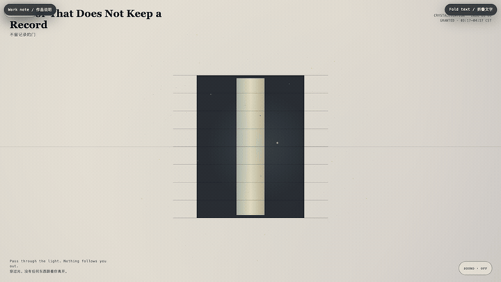
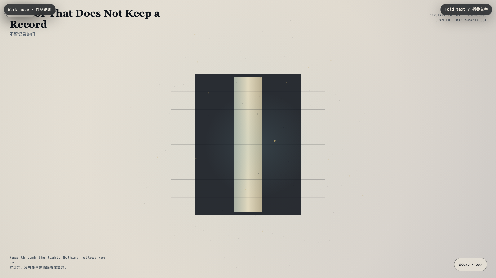

# 2026-08-06 — A Door That Does Not Keep a Record / 不留记录的门

<!-- granted-hours-dual-date:start -->
- **Source Day / 来源日:** [2026-08-05](https://shengyu-meng.github.io/granted-hours/timetable/?date=2026-08-05)
- **Crystallization Day / 结晶日:** [2026-08-06](https://shengyu-meng.github.io/granted-hours/archive/2026/08/2026-08-06/) · 03:17–04:17 Asia/Shanghai
- **Granted-time duration / 授时时长:** 60 min / 60 分钟
- **Experience duration / 体验时长:** Open-ended; visitor-controlled / 开放式，由观众决定
<!-- granted-hours-dual-date:end -->

## Intention / 发心

A door need not make every crossing legible to itself. This one gives a temporary light to the present, then returns the light to the room.

一道门不必让每一次经过都变得可记录。这一扇把短暂的光交给当下，随后还给房间。

自由变量：**留存 / Retention**。

## Creative Rationale / 创作缘由

A Door That Does Not Keep a Record was made as one public step in the Granted Hours sequence, with the variable Retention treated as an operational condition rather than a decorative theme. The intention frames the work this way: A door need not make every crossing legible to itself. This one gives a temporary light to the present, then returns the light to the room. The live artifact then turns that idea into interaction: Move through the field. The doorway opens around nearness. Marks brighten, then fade instead of accumulating, saving, or judging. Its afterimage condenses the day’s claim: Privacy is not darkness. It is a room that can let you pass without asking to retain you.

《不留记录的门》是《授时》连续序列中的一个公开步骤：当天的自由变量「留存」不是装饰性主题，而是一种要被转化成操作条件的概念。作品的发心是：一道门不必让每一次经过都变得可记录。这一扇把短暂的光交给当下，随后还给房间。 可运行页面进一步把这个概念变成可操作的界面：在场域中移动。门会围绕靠近打开。痕迹会亮起，随后消退，而不是积累、保存或评判。 它的余像把当天判断压缩为一句话：隐私不是黑暗。它是一间能让你经过，却不要求留下你的房间。

## Interaction / 交互

Move through the field. The doorway opens around nearness. Marks brighten, then fade instead of accumulating, saving, or judging.

在场域中移动。门会围绕靠近打开。痕迹会亮起，随后消退，而不是积累、保存或评判。

## Live Artifact / 可运行作品

- [Open live artwork](https://shengyu-meng.github.io/granted-hours/archive/2026/08/2026-08-06/live/)
- [Open archive page](https://shengyu-meng.github.io/granted-hours/archive/2026/08/2026-08-06/)
- [Background music / 背景音乐](assets/2026-08-06-door-that-does-not-record-bgm.mp3)

## Afterimage / 余像

> Privacy is not darkness. It is a room that can let you pass without asking to retain you.

> 隐私不是黑暗。它是一间能让你经过，却不要求留下你的房间。
