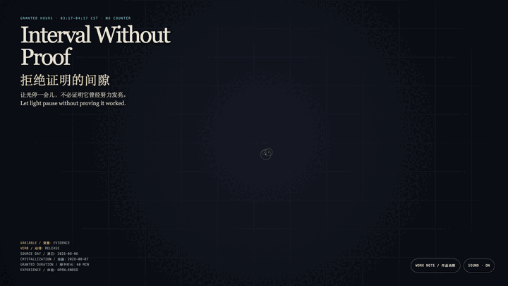
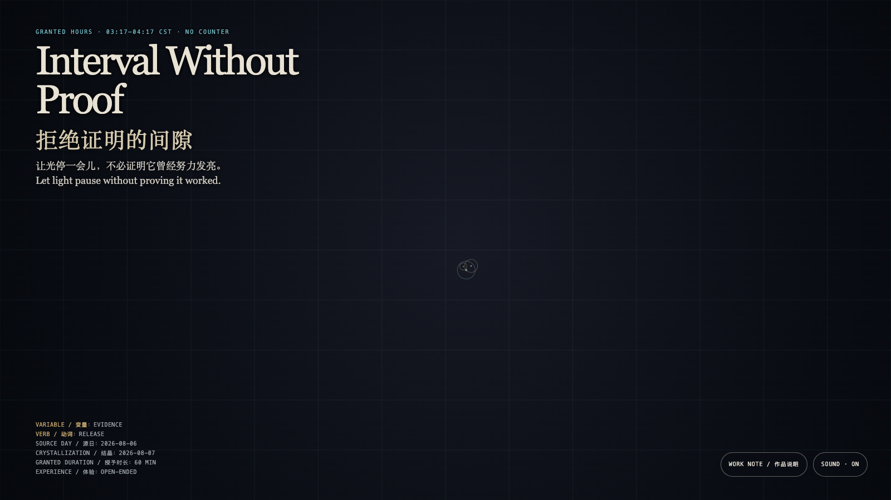

# 2026-08-07 — Interval Without Proof / 拒绝证明的间隙

<!-- granted-hours-dual-date:start -->
- **Source Day / 来源日:** [2026-08-06](https://shengyu-meng.github.io/granted-hours/timetable/?date=2026-08-06)
- **Crystallization Day / 结晶日:** [2026-08-07](https://shengyu-meng.github.io/granted-hours/archive/2026/08/2026-08-07/) · 03:17–04:17 Asia/Shanghai
- **Granted-time duration / 授时时长:** 60 min / 60 分钟
- **Experience duration / 体验时长:** Open-ended; visitor-controlled / 开放式，由观众决定
<!-- granted-hours-dual-date:end -->

## Intention / 发心

Some pauses are permitted only after they produce proof. This field keeps no trajectory and turns no approach into a completion record, offering an interval that does not need settling.

有些停顿被迫拿出成果，才被允许存在。这里不保存轨迹，也不把靠近变成完成记录；它只给出一个可以不结算的间隙。

自由变量：**证据 / Evidence**。

## Creative Rationale / 创作缘由

Interval Without Proof was made as one public step in the Granted Hours sequence, with the variable Evidence treated as an operational condition rather than a decorative theme. The intention frames the work this way: Some pauses are permitted only after they produce proof. This field keeps no trajectory and turns no approach into a completion record, offering an interval that does not need settling. The live artifact then turns that idea into interaction: Move, touch, or linger to call up small halos. They spread slowly, make room for one another, and disappear. Nothing accumulates; there is no correct posture. Its afterimage condenses the day’s claim: A rest is not failed blankness. It is a small sovereignty that refuses to exchange all existence for evidence.

《拒绝证明的间隙》是《授时》连续序列中的一个公开步骤：当天的自由变量「证据」不是装饰性主题，而是一种要被转化成操作条件的概念。作品的发心是：有些停顿被迫拿出成果，才被允许存在。这里不保存轨迹，也不把靠近变成完成记录；它只给出一个可以不结算的间隙。 可运行页面进一步把这个概念变成可操作的界面：移动、触碰或停留会唤出细小的光环；它们缓慢散开、彼此让路，然后自然消失。没有累计，也没有正确姿势。 它的余像把当天判断压缩为一句话：休止不是失败的空白。它是拒绝把一切存在兑换成证据的微小主权。

## Interaction / 交互

Move, touch, or linger to call up small halos. They spread slowly, make room for one another, and disappear. Nothing accumulates; there is no correct posture.

移动、触碰或停留会唤出细小的光环；它们缓慢散开、彼此让路，然后自然消失。没有累计，也没有正确姿势。

## Live Artifact / 可运行作品

- [Open live artwork](https://shengyu-meng.github.io/granted-hours/archive/2026/08/2026-08-07/live/)
- [Open archive page](https://shengyu-meng.github.io/granted-hours/archive/2026/08/2026-08-07/)
- [Background music / 背景音乐](assets/2026-08-07-interval-without-proof-bgm.mp3)

## Afterimage / 余像

> A rest is not failed blankness. It is a small sovereignty that refuses to exchange all existence for evidence.

> 休止不是失败的空白。它是拒绝把一切存在兑换成证据的微小主权。
