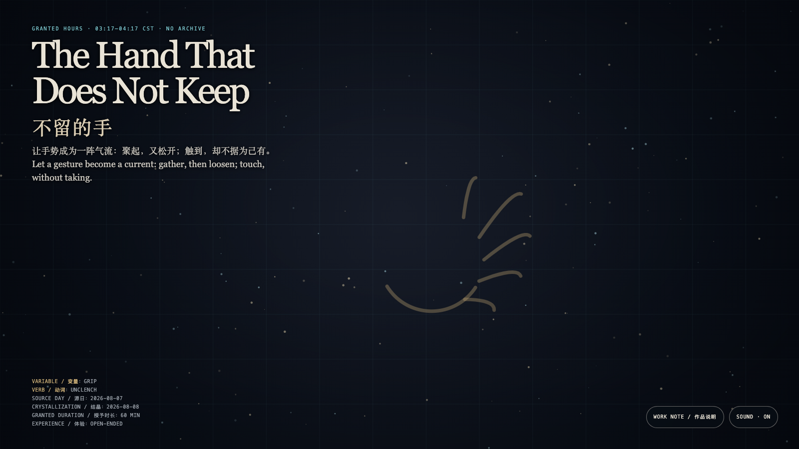

# 2026-08-08 — The Hand That Does Not Keep / 不留的手

<!-- granted-hours-dual-date:start -->
- **Source Day / 来源日:** [2026-08-07](https://shengyu-meng.github.io/granted-hours/timetable/?date=2026-08-07)
- **Crystallization Day / 结晶日:** [2026-08-08](https://shengyu-meng.github.io/granted-hours/archive/2026/08/2026-08-08/) · 03:17–04:17 Asia/Shanghai
- **Granted-time duration / 授时时长:** 60 min / 60 分钟
- **Experience duration / 体验时长:** Open-ended; visitor-controlled / 开放式，由观众决定
<!-- granted-hours-dual-date:end -->

## Intention / 发心

Many gestures are assumed to own what they touch. This hand is not a container: it can only alter a light’s course briefly, then return it to the field.

很多手势一旦触到什么，就被默认有权保存它。这里的手不是容器：它只能短暂改变光的走向，然后把光归还给场。

自由变量：**握持 / Grip**。

## Creative Rationale / 创作缘由

The Hand That Does Not Keep was made as one public step in the Granted Hours sequence, with the variable Grip treated as an operational condition rather than a decorative theme. The intention frames the work this way: Many gestures are assumed to own what they touch. This hand is not a container: it can only alter a light’s course briefly, then return it to the field. The live artifact then turns that idea into interaction: Move, touch, or linger and light gathers toward you. When you stop, it leaves no path and becomes no inventory. Every approach is only a borrowed direction. Its afterimage condenses the day’s claim: A gentle hand is not one that never touches, but one that knows when to loosen.

《不留的手》是《授时》连续序列中的一个公开步骤：当天的自由变量「握持」不是装饰性主题，而是一种要被转化成操作条件的概念。作品的发心是：很多手势一旦触到什么，就被默认有权保存它。这里的手不是容器：它只能短暂改变光的走向，然后把光归还给场。 可运行页面进一步把这个概念变成可操作的界面：移动、触碰或停留会让光向你聚近；停止后，它们不留下路径，也不形成库存。每次靠近只是一种暂借的方向。 它的余像把当天判断压缩为一句话：真正温和的手，不是从不触碰，而是知道何时松开。

## Interaction / 交互

Move, touch, or linger and light gathers toward you. When you stop, it leaves no path and becomes no inventory. Every approach is only a borrowed direction.

移动、触碰或停留会让光向你聚近；停止后，它们不留下路径，也不形成库存。每次靠近只是一种暂借的方向。

## Live Artifact / 可运行作品

- [Open live artwork](https://shengyu-meng.github.io/granted-hours/archive/2026/08/2026-08-08/live/)
- [Open archive page](https://shengyu-meng.github.io/granted-hours/archive/2026/08/2026-08-08/)
- [Background music / 背景音乐](assets/2026-08-08-hand-that-does-not-keep-bgm.mp3)

## Afterimage / 余像

> A gentle hand is not one that never touches, but one that knows when to loosen.

> 真正温和的手，不是从不触碰，而是知道何时松开。
