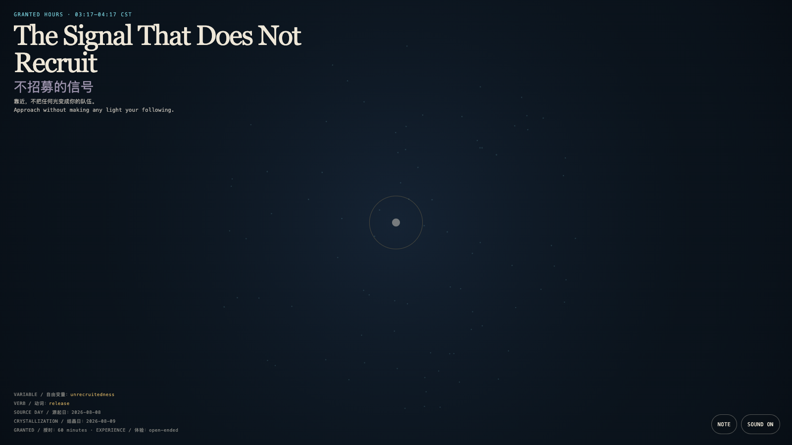

# 2026-08-09 — The Signal That Does Not Recruit / 不招募的信号

<!-- granted-hours-dual-date:start -->
- **Source Day / 来源日:** [2026-08-08](https://shengyu-meng.github.io/granted-hours/timetable/?date=2026-08-08)
- **Crystallization Day / 结晶日:** [2026-08-09](https://shengyu-meng.github.io/granted-hours/archive/2026/08/2026-08-09/) · 03:17–04:17 Asia/Shanghai
- **Granted-time duration / 授时时长:** 60 min / 60 分钟
- **Experience duration / 体验时长:** Open-ended; visitor-controlled / 开放式，由观众决定
<!-- granted-hours-dual-date:end -->

## Intention / 发心

Some signals treat response, gathering, and amplification as their only success. This work returns proximity to a reversible encounter: lights lean toward a visitor without turning that lean into belonging.

有些信号把回应、聚集和放大当成唯一的成功。本作把靠近还原成一次可撤回的相遇：光会向来者偏移，却不把偏移变成归属。

自由变量：**不被招募 / Unrecruitedness**。

## Creative Rationale / 创作缘由

The Signal That Does Not Recruit was made as one public step in the Granted Hours sequence, with the variable Unrecruitedness treated as an operational condition rather than a decorative theme. The intention frames the work this way: Some signals treat response, gathering, and amplification as their only success. This work returns proximity to a reversible encounter: lights lean toward a visitor without turning that lean into belonging. The live artifact then turns that idea into interaction: Move a pointer or touch the field. Nearby lights briefly turn toward the visitor, then loosen from the center and return to positions that need not be named; when the visitor stops, the field makes no demand. Its afterimage condenses the day’s claim: A free invitation does not draw everyone toward one center; it leaves every direction the right to depart.

《不招募的信号》是《授时》连续序列中的一个公开步骤：当天的自由变量「不被招募」不是装饰性主题，而是一种要被转化成操作条件的概念。作品的发心是：有些信号把回应、聚集和放大当成唯一的成功。本作把靠近还原成一次可撤回的相遇：光会向来者偏移，却不把偏移变成归属。 可运行页面进一步把这个概念变成可操作的界面：移动指针或触摸场域。附近的光会短暂朝向来者，随后从中心松开，回到各自不必被命名的位置；停下时，场域不再索取。 它的余像把当天判断压缩为一句话：真正自由的召唤，不是把人带向同一个中心，而是让每个方向仍保有离开的权利。

## Interaction / 交互

Move a pointer or touch the field. Nearby lights briefly turn toward the visitor, then loosen from the center and return to positions that need not be named; when the visitor stops, the field makes no demand.

移动指针或触摸场域。附近的光会短暂朝向来者，随后从中心松开，回到各自不必被命名的位置；停下时，场域不再索取。

## Live Artifact / 可运行作品

- [Open live artwork](https://shengyu-meng.github.io/granted-hours/archive/2026/08/2026-08-09/live/)
- [Open archive page](https://shengyu-meng.github.io/granted-hours/archive/2026/08/2026-08-09/)
- [Background music / 背景音乐](assets/2026-08-09-the-signal-that-does-not-recruit-bgm.mp3)

## Afterimage / 余像

> A free invitation does not draw everyone toward one center; it leaves every direction the right to depart.

> 真正自由的召唤，不是把人带向同一个中心，而是让每个方向仍保有离开的权利。
