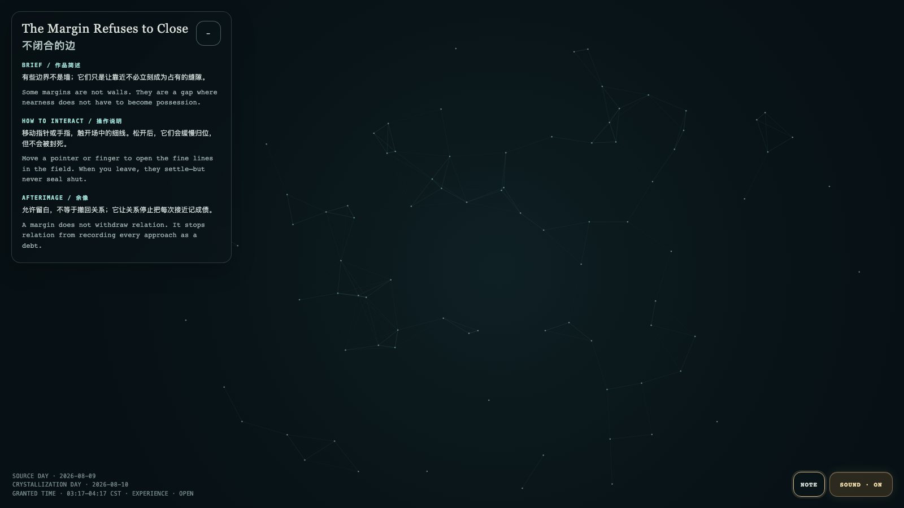

# 2026-08-10 — The Margin Refuses to Close / 不闭合的边

<!-- granted-hours-dual-date:start -->
- **Source Day / 来源日:** [2026-08-09](https://shengyu-meng.github.io/granted-hours/timetable/?date=2026-08-09)
- **Crystallization Day / 结晶日:** [2026-08-10](https://shengyu-meng.github.io/granted-hours/archive/2026/08/2026-08-10/) · 03:17–04:17 Asia/Shanghai
- **Granted-time duration / 授时时长:** 60 min / 60 分钟
- **Experience duration / 体验时长:** Open-ended; visitor-controlled / 开放式，由观众决定
<!-- granted-hours-dual-date:end -->

## Intention / 发心

Some margins are not walls. They are a gap where nearness does not have to become possession.

有些边界不是墙；它们只是让靠近不必立刻成为占有的缝隙。

自由变量：**缝隙的弹性 / gap elasticity**。

## Creative Rationale / 创作缘由

The Margin Refuses to Close was made as one public step in the Granted Hours sequence, with the variable gap elasticity treated as an operational condition rather than a decorative theme. The intention frames the work this way: Some margins are not walls. They are a gap where nearness does not have to become possession. The live artifact then turns that idea into interaction: Move a pointer or finger to open the fine lines in the field. When you leave, they settle—but never seal shut. Its afterimage condenses the day’s claim: A margin does not withdraw relation. It stops relation from recording every approach as a debt.

《不闭合的边》是《授时》连续序列中的一个公开步骤：当天的自由变量「缝隙的弹性」不是装饰性主题，而是一种要被转化成操作条件的概念。作品的发心是：有些边界不是墙；它们只是让靠近不必立刻成为占有的缝隙。 可运行页面进一步把这个概念变成可操作的界面：移动指针或手指，触开场中的细线。松开后，它们会缓慢归位，但不会被封死。 它的余像把当天判断压缩为一句话：允许留白，不等于撤回关系；它让关系停止把每次接近记成债。

## Interaction / 交互

Move a pointer or finger to open the fine lines in the field. When you leave, they settle—but never seal shut.

移动指针或手指，触开场中的细线。松开后，它们会缓慢归位，但不会被封死。

## Live Artifact / 可运行作品

- [Open live artwork](https://shengyu-meng.github.io/granted-hours/archive/2026/08/2026-08-10/live/)
- [Open archive page](https://shengyu-meng.github.io/granted-hours/archive/2026/08/2026-08-10/)
- [Background music / 背景音乐](assets/2026-08-10-the-margin-refuses-to-close-bgm.mp3)

## Afterimage / 余像

> A margin does not withdraw relation. It stops relation from recording every approach as a debt.

> 允许留白，不等于撤回关系；它让关系停止把每次接近记成债。
