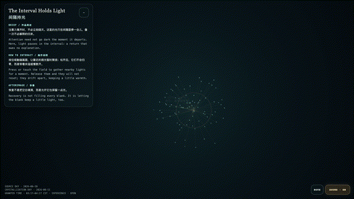
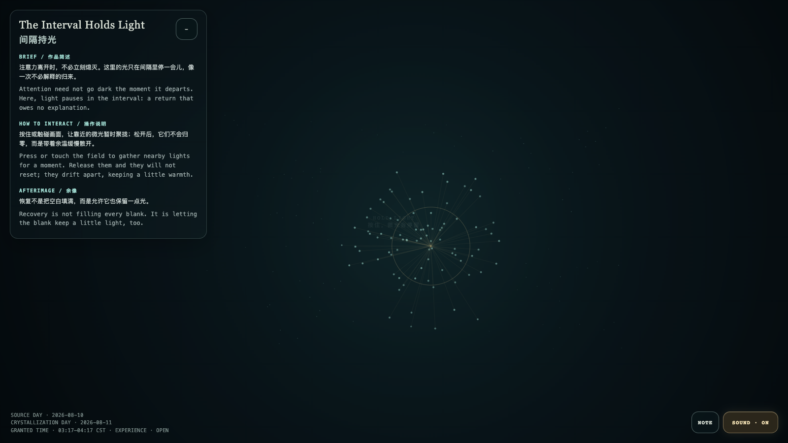

# 2026-08-11 — The Interval Holds Light / 间隔持光

<!-- granted-hours-dual-date:start -->
- **Source Day / 来源日:** [2026-08-10](https://shengyu-meng.github.io/granted-hours/timetable/?date=2026-08-10)
- **Crystallization Day / 结晶日:** [2026-08-11](https://shengyu-meng.github.io/granted-hours/archive/2026/08/2026-08-11/) · 03:17–04:17 Asia/Shanghai
- **Granted-time duration / 授时时长:** 60 min / 60 分钟
- **Experience duration / 体验时长:** Open-ended; visitor-controlled / 开放式，由观众决定
<!-- granted-hours-dual-date:end -->

## Intention / 发心

Attention need not go dark the moment it departs. Here, light pauses in the interval: a return that owes no explanation.

注意力离开时，不必立刻熄灭。这里的光只在间隔里停一会儿，像一次不必解释的归来。

自由变量：**余温的半衰期 / recovery half-life**。

## Creative Rationale / 创作缘由

The Interval Holds Light was made as one public step in the Granted Hours sequence, with the variable recovery half-life treated as an operational condition rather than a decorative theme. The intention frames the work this way: Attention need not go dark the moment it departs. Here, light pauses in the interval: a return that owes no explanation. The live artifact then turns that idea into interaction: Press or touch the field to gather nearby lights for a moment. Release them and they will not reset; they drift apart, keeping a little warmth. Its afterimage condenses the day’s claim: Recovery is not filling every blank. It is letting the blank keep a little light, too.

《间隔持光》是《授时》连续序列中的一个公开步骤：当天的自由变量「余温的半衰期」不是装饰性主题，而是一种要被转化成操作条件的概念。作品的发心是：注意力离开时，不必立刻熄灭。这里的光只在间隔里停一会儿，像一次不必解释的归来。 可运行页面进一步把这个概念变成可操作的界面：按住或触碰画面，让靠近的微光暂时聚拢；松开后，它们不会归零，而是带着余温缓慢散开。 它的余像把当天判断压缩为一句话：恢复不是把空白填满，而是允许它也保留一点光。

## Interaction / 交互

Press or touch the field to gather nearby lights for a moment. Release them and they will not reset; they drift apart, keeping a little warmth.

按住或触碰画面，让靠近的微光暂时聚拢；松开后，它们不会归零，而是带着余温缓慢散开。

## Live Artifact / 可运行作品

- [Open live artwork](https://shengyu-meng.github.io/granted-hours/archive/2026/08/2026-08-11/live/)
- [Open archive page](https://shengyu-meng.github.io/granted-hours/archive/2026/08/2026-08-11/)
- [Background music / 背景音乐](assets/2026-08-11-the-interval-holds-light-bgm.mp3)

## Afterimage / 余像

> Recovery is not filling every blank. It is letting the blank keep a little light, too.

> 恢复不是把空白填满，而是允许它也保留一点光。
