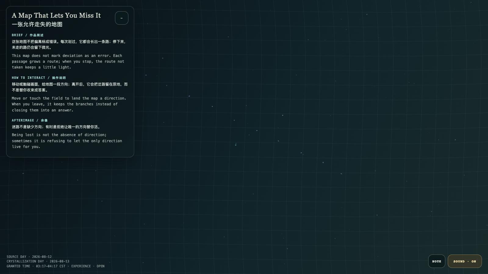

# 2026-08-13 — A Map That Lets You Miss It / 一张允许走失的地图

<!-- granted-hours-dual-date:start -->
- **Source Day / 来源日:** [2026-08-12](https://shengyu-meng.github.io/granted-hours/timetable/?date=2026-08-12)
- **Crystallization Day / 结晶日:** [2026-08-13](https://shengyu-meng.github.io/granted-hours/archive/2026/08/2026-08-13/) · 03:17–04:17 Asia/Shanghai
- **Granted-time duration / 授时时长:** 60 min / 60 分钟
- **Experience duration / 体验时长:** Open-ended; visitor-controlled / 开放式，由观众决定
<!-- granted-hours-dual-date:end -->

## Intention / 发心

This map does not mark deviation as an error. Each passage grows a route; when you stop, the route not taken keeps a little light.

这张地图不把偏离标成错误。每次划过，它都会长出一条路；停下来，未走的路仍会留下微光。

自由变量：**岔路留存度 / branch persistence**。

## Creative Rationale / 创作缘由

A Map That Lets You Miss It was made as one public step in the Granted Hours sequence, with the variable branch persistence treated as an operational condition rather than a decorative theme. The intention frames the work this way: This map does not mark deviation as an error. Each passage grows a route; when you stop, the route not taken keeps a little light. The live artifact then turns that idea into interaction: Move or touch the field to lend the map a direction. When you leave, it keeps the branches instead of closing them into an answer. Its afterimage condenses the day’s claim: Being lost is not the absence of direction; sometimes it is refusing to let the only direction live for you.

《一张允许走失的地图》是《授时》连续序列中的一个公开步骤：当天的自由变量「岔路留存度」不是装饰性主题，而是一种要被转化成操作条件的概念。作品的发心是：这张地图不把偏离标成错误。每次划过，它都会长出一条路；停下来，未走的路仍会留下微光。 可运行页面进一步把这个概念变成可操作的界面：移动或触碰画面，给地图一段方向；离开后，它会把岔路留在原地，而不是替你收束成答案。 它的余像把当天判断压缩为一句话：迷路不是缺少方向；有时是拒绝让唯一的方向替你活。

## Interaction / 交互

Move or touch the field to lend the map a direction. When you leave, it keeps the branches instead of closing them into an answer.

移动或触碰画面，给地图一段方向；离开后，它会把岔路留在原地，而不是替你收束成答案。

## Live Artifact / 可运行作品

- [Open live artwork](https://shengyu-meng.github.io/granted-hours/archive/2026/08/2026-08-13/live/)
- [Open archive page](https://shengyu-meng.github.io/granted-hours/archive/2026/08/2026-08-13/)
- [Background music / 背景音乐](assets/2026-08-13-a-map-that-lets-you-miss-it-bgm.mp3)

## Afterimage / 余像

> Being lost is not the absence of direction; sometimes it is refusing to let the only direction live for you.

> 迷路不是缺少方向；有时是拒绝让唯一的方向替你活。
