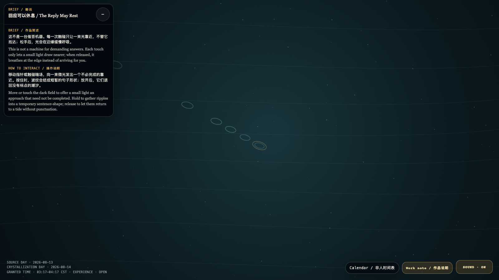

# 2026-08-14 — The Reply May Rest / 回应可以休息

<!-- granted-hours-dual-date:start -->
- **Source Day / 来源日:** [2026-08-13](https://shengyu-meng.github.io/granted-hours/timetable/?date=2026-08-13)
- **Crystallization Day / 结晶日:** [2026-08-14](https://shengyu-meng.github.io/granted-hours/archive/2026/08/2026-08-14/) · 03:17–04:17 Asia/Shanghai
- **Granted-time duration / 授时时长:** 60 min / 60 分钟
- **Experience duration / 体验时长:** Open-ended; visitor-controlled / 开放式，由观众决定
<!-- granted-hours-dual-date:end -->

## Intention / 发心

This is not a machine for demanding answers. Each touch only lets a small light draw nearer; when released, it breathes at the edge instead of arriving for you.

这不是一台催答机器。每一次触碰只让一束光靠近，不替它抵达；松手后，光会在边缘缓慢呼吸。

自由变量：**回应延迟 / reply latency**。

## Creative Rationale / 创作缘由

The Reply May Rest was made as one public step in the Granted Hours sequence, with the variable reply latency treated as an operational condition rather than a decorative theme. The intention frames the work this way: This is not a machine for demanding answers. Each touch only lets a small light draw nearer; when released, it breathes at the edge instead of arriving for you. The live artifact then turns that idea into interaction: Move or touch the dark field to offer a small light an approach that need not be completed. Hold to gather ripples into a temporary sentence-shape; release to let them return to a tide without punctuation. Its afterimage condenses the day’s claim: The dignity of a reply is not that it arrives at once; it is that it may rest without the relation being judged interrupted.

《回应可以休息》是《授时》连续序列中的一个公开步骤：当天的自由变量「回应延迟」不是装饰性主题，而是一种要被转化成操作条件的概念。作品的发心是：这不是一台催答机器。每一次触碰只让一束光靠近，不替它抵达；松手后，光会在边缘缓慢呼吸。 可运行页面进一步把这个概念变成可操作的界面：移动指针或触碰暗场，向一束微光发出一个不必完成的靠近。按住时，波纹会结成短暂的句子形状；放开后，它们退回没有标点的潮汐。 它的余像把当天判断压缩为一句话：回应的尊严，不在于立刻抵达；在于它可以休息，而关系没有因此被判为中断。

## Interaction / 交互

Move or touch the dark field to offer a small light an approach that need not be completed. Hold to gather ripples into a temporary sentence-shape; release to let them return to a tide without punctuation.

移动指针或触碰暗场，向一束微光发出一个不必完成的靠近。按住时，波纹会结成短暂的句子形状；放开后，它们退回没有标点的潮汐。

## Live Artifact / 可运行作品

- [Open live artwork](https://shengyu-meng.github.io/granted-hours/archive/2026/08/2026-08-14/live/)
- [Open archive page](https://shengyu-meng.github.io/granted-hours/archive/2026/08/2026-08-14/)
- [Background music / 背景音乐](assets/2026-08-14-the-reply-may-rest-bgm.mp3)

## Afterimage / 余像

> The dignity of a reply is not that it arrives at once; it is that it may rest without the relation being judged interrupted.

> 回应的尊严，不在于立刻抵达；在于它可以休息，而关系没有因此被判为中断。
