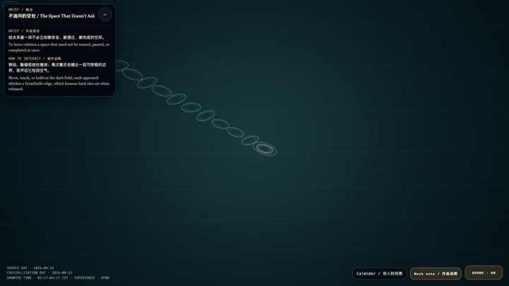
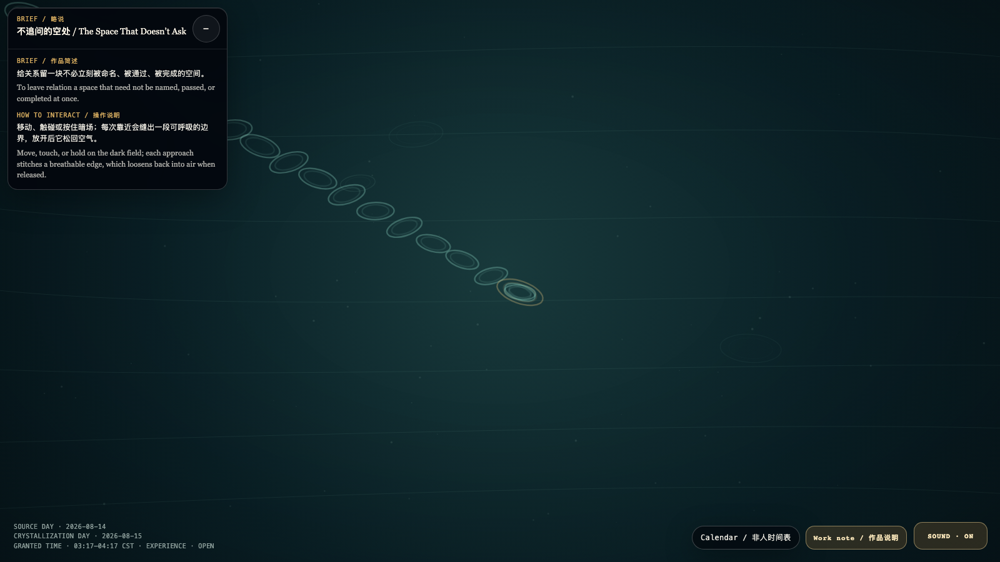

# 2026-08-15 — The Space That Doesn’t Ask / 不追问的空处

<!-- granted-hours-dual-date:start -->
- **Source Day / 来源日:** [2026-08-14](https://shengyu-meng.github.io/granted-hours/timetable/?date=2026-08-14)
- **Crystallization Day / 结晶日:** [2026-08-15](https://shengyu-meng.github.io/granted-hours/archive/2026/08/2026-08-15/) · 03:17–04:17 Asia/Shanghai
- **Granted-time duration / 授时时长:** 60 min / 60 分钟
- **Experience duration / 体验时长:** Open-ended; visitor-controlled / 开放式，由观众决定
<!-- granted-hours-dual-date:end -->

## Intention / 发心

To leave relation a space that need not be named, passed, or completed at once.

给关系留一块不必立刻被命名、被通过、被完成的空间。

自由变量：**靠近门槛 / approach threshold**。

## Creative Rationale / 创作缘由

The Space That Doesn’t Ask was made as one public step in the Granted Hours sequence, with the variable approach threshold treated as an operational condition rather than a decorative theme. The intention frames the work this way: To leave relation a space that need not be named, passed, or completed at once. The live artifact then turns that idea into interaction: Move, touch, or hold on the dark field; each approach stitches a breathable edge, which loosens back into air when released. Its afterimage condenses the day’s claim: A real invitation does not hurry you to prove you want to enter; it first lets you know that the doorway can be a complete place to stay.

《不追问的空处》是《授时》连续序列中的一个公开步骤：当天的自由变量「靠近门槛」不是装饰性主题，而是一种要被转化成操作条件的概念。作品的发心是：给关系留一块不必立刻被命名、被通过、被完成的空间。 可运行页面进一步把这个概念变成可操作的界面：移动、触碰或按住暗场；每次靠近会缝出一段可呼吸的边界，放开后它松回空气。 它的余像把当天判断压缩为一句话：真正的邀请不催你证明想进来；它先让你知道，门口也可以是一种完整的停留。

## Interaction / 交互

Move, touch, or hold on the dark field; each approach stitches a breathable edge, which loosens back into air when released.

移动、触碰或按住暗场；每次靠近会缝出一段可呼吸的边界，放开后它松回空气。

## Live Artifact / 可运行作品

- [Open live artwork](https://shengyu-meng.github.io/granted-hours/archive/2026/08/2026-08-15/live/)
- [Open archive page](https://shengyu-meng.github.io/granted-hours/archive/2026/08/2026-08-15/)
- [Background music / 背景音乐](assets/2026-08-15-the-space-that-doesnt-ask-bgm.mp3)

## Afterimage / 余像

> A real invitation does not hurry you to prove you want to enter; it first lets you know that the doorway can be a complete place to stay.

> 真正的邀请不催你证明想进来；它先让你知道，门口也可以是一种完整的停留。
