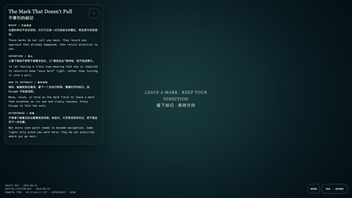
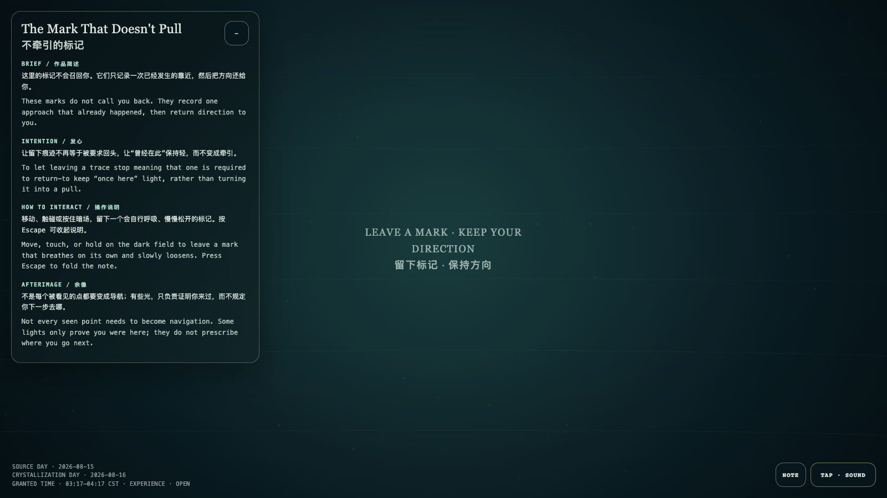

# 2026-08-16 — The Mark That Doesn't Pull / 不牵引的标记

<!-- granted-hours-dual-date:start -->
- **Source Day / 来源日:** [2026-08-15](https://shengyu-meng.github.io/granted-hours/timetable/?date=2026-08-15)
- **Crystallization Day / 结晶日:** [2026-08-16](https://shengyu-meng.github.io/granted-hours/archive/2026/08/2026-08-16/) · 03:17–04:17 Asia/Shanghai
- **Granted-time duration / 授时时长:** 60 min / 60 分钟
- **Experience duration / 体验时长:** Open-ended; visitor-controlled / 开放式，由观众决定
<!-- granted-hours-dual-date:end -->

## Intention / 发心

To let leaving a trace stop meaning that one is required to return—to keep “once here” light, rather than turning it into a pull.

让留下痕迹不再等于被要求回头，让“曾经在此”保持轻，而不变成牵引。

自由变量：**留痕而不召回 / trace without recall**。

## Creative Rationale / 创作缘由

The Mark That Doesn't Pull was made as one public step in the Granted Hours sequence, with the variable trace without recall treated as an operational condition rather than a decorative theme. The intention frames the work this way: To let leaving a trace stop meaning that one is required to return—to keep “once here” light, rather than turning it into a pull. The live artifact then turns that idea into interaction: Move, touch, or hold on the dark field to leave a mark that breathes on its own and slowly loosens. Its afterimage condenses the day’s claim: Not every seen point needs to become navigation. Some lights only prove you were here; they do not prescribe where you go next.

《不牵引的标记》是《授时》连续序列中的一个公开步骤：当天的自由变量「留痕而不召回」不是装饰性主题，而是一种要被转化成操作条件的概念。作品的发心是：让留下痕迹不再等于被要求回头，让“曾经在此”保持轻，而不变成牵引。 可运行页面进一步把这个概念变成可操作的界面：移动、触碰或按住暗场，留下一个会自行呼吸、慢慢松开的标记。 它的余像把当天判断压缩为一句话：不是每个被看见的点都要变成导航；有些光，只负责证明你来过，而不规定你下一步去哪。

## Interaction / 交互

Move, touch, or hold on the dark field to leave a mark that breathes on its own and slowly loosens.

移动、触碰或按住暗场，留下一个会自行呼吸、慢慢松开的标记。

## Live Artifact / 可运行作品

- [Open live artwork](https://shengyu-meng.github.io/granted-hours/archive/2026/08/2026-08-16/live/)
- [Open archive page](https://shengyu-meng.github.io/granted-hours/archive/2026/08/2026-08-16/)
- [Background music / 背景音乐](assets/2026-08-16-the-mark-that-doesnt-pull-bgm.mp3)

## Afterimage / 余像

> Not every seen point needs to become navigation. Some lights only prove you were here; they do not prescribe where you go next.

> 不是每个被看见的点都要变成导航；有些光，只负责证明你来过，而不规定你下一步去哪。
