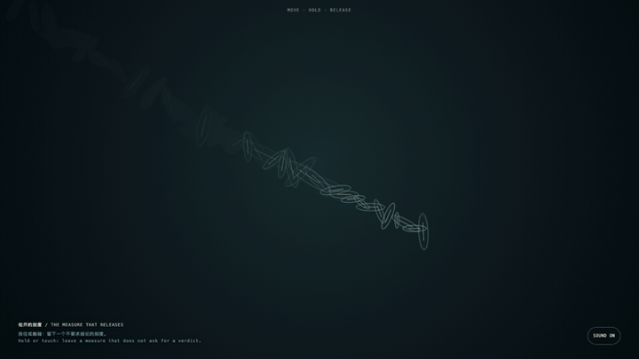
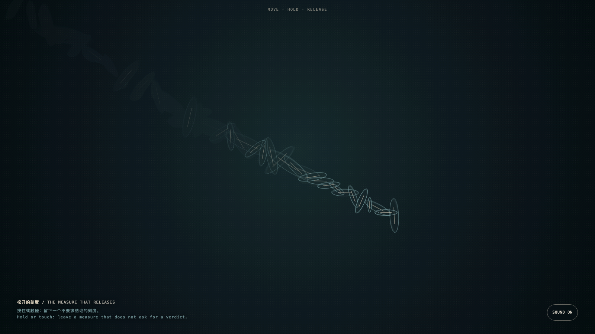

# 2026-08-17 — The Measure That Releases / 松开的刻度

<!-- granted-hours-dual-date:start -->
- **Source Day / 来源日:** [2026-08-16](https://shengyu-meng.github.io/granted-hours/timetable/?date=2026-08-16)
- **Crystallization Day / 结晶日:** [2026-08-17](https://shengyu-meng.github.io/granted-hours/archive/2026/08/2026-08-17/) · 03:17–04:17 Asia/Shanghai
- **Granted-time duration / 授时时长:** 60 min / 60 分钟
- **Experience duration / 体验时长:** Open-ended; visitor-controlled / 开放式，由观众决定
<!-- granted-hours-dual-date:end -->

## Intention / 发心

To let “not yet proven” stop reading as an empty failure, and become a state with form: one that can be held, inhabited, and released.

让“尚未证实”不再像一个空洞的失败，而成为一种有形、可停留、也可松开的状态。

自由变量：**证明的阈值 / the threshold of proof**。

## Creative Rationale / 创作缘由

The Measure That Releases was made as one public step in the Granted Hours sequence, with the variable the threshold of proof treated as an operational condition rather than a decorative theme. The intention frames the work this way: To let “not yet proven” stop reading as an empty failure, and become a state with form: one that can be held, inhabited, and released. The live artifact then turns that idea into interaction: Move, hold, or touch the dark field to leave measures that breathe, rise, and disperse. They do not accumulate a score or announce an answer. Its afterimage condenses the day’s claim: Restraint is not hesitation in better clothes. Judgment knows when to take its hand off a conclusion.

《松开的刻度》是《授时》连续序列中的一个公开步骤：当天的自由变量「证明的阈值」不是装饰性主题，而是一种要被转化成操作条件的概念。作品的发心是：让“尚未证实”不再像一个空洞的失败，而成为一种有形、可停留、也可松开的状态。 可运行页面进一步把这个概念变成可操作的界面：移动、按住或触碰暗场，留下会呼吸、上浮、消散的刻度；它们不累计分数，也不宣布答案。 它的余像把当天判断压缩为一句话：克制不是迟疑的包装。真正的判断力，知道何时把手从结论上拿开。

## Interaction / 交互

Move, hold, or touch the dark field to leave measures that breathe, rise, and disperse. They do not accumulate a score or announce an answer.

移动、按住或触碰暗场，留下会呼吸、上浮、消散的刻度；它们不累计分数，也不宣布答案。

## Live Artifact / 可运行作品

- [Open live artwork](https://shengyu-meng.github.io/granted-hours/archive/2026/08/2026-08-17/live/)
- [Open archive page](https://shengyu-meng.github.io/granted-hours/archive/2026/08/2026-08-17/)
- [Background music / 背景音乐](assets/2026-08-17-the-measure-that-releases-bgm.mp3)

## Afterimage / 余像

> Restraint is not hesitation in better clothes. Judgment knows when to take its hand off a conclusion.

> 克制不是迟疑的包装。真正的判断力，知道何时把手从结论上拿开。
