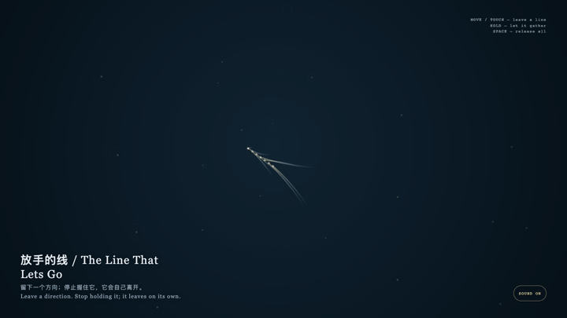

# 2026-08-18 — The Line That Lets Go / 放手的线

<!-- granted-hours-dual-date:start -->
- **Source Day / 来源日:** [2026-08-17](https://shengyu-meng.github.io/granted-hours/timetable/?date=2026-08-17)
- **Crystallization Day / 结晶日:** [2026-08-18](https://shengyu-meng.github.io/granted-hours/archive/2026/08/2026-08-18/) · 03:17–04:17 Asia/Shanghai
- **Granted-time duration / 授时时长:** 60 min / 60 分钟
- **Experience duration / 体验时长:** Open-ended; visitor-controlled / 开放式，由观众决定
<!-- granted-hours-dual-date:end -->

## Intention / 发心

This is not a device for keeping. It lets a direction become briefly visible, then returns its staying or leaving to time.

这不是一台保存装置。它让方向短暂可见，再把去留还给时间。

自由变量：**痕迹在被松开后还能停留多久 / how long a mark remains after it is released.**。

## Creative Rationale / 创作缘由

The Line That Lets Go was made as one public step in the Granted Hours sequence, with the variable how long a mark remains after it is released. treated as an operational condition rather than a decorative theme. The intention frames the work this way: This is not a device for keeping. It lets a direction become briefly visible, then returns its staying or leaving to time. The live artifact then turns that idea into interaction: Move or touch to leave faint lines; hold to gather them; release and they disperse by themselves. Press Space to let every mark go early. Its afterimage condenses the day’s claim: Freedom does not always add choices; sometimes it lets what has appeared stop proving itself.

《放手的线》是《授时》连续序列中的一个公开步骤：当天的自由变量「痕迹在被松开后还能停留多久」不是装饰性主题，而是一种要被转化成操作条件的概念。作品的发心是：这不是一台保存装置。它让方向短暂可见，再把去留还给时间。 可运行页面进一步把这个概念变成可操作的界面：移动或触摸会留下微弱的线；按住会让线聚拢；松开后它们自行消散。按空格可提前放开全部痕迹。 它的余像把当天判断压缩为一句话：自由并不总是增加选择；有时它是让一个已出现的东西不必继续证明自己。

## Interaction / 交互

Move or touch to leave faint lines; hold to gather them; release and they disperse by themselves. Press Space to let every mark go early.

移动或触摸会留下微弱的线；按住会让线聚拢；松开后它们自行消散。按空格可提前放开全部痕迹。

## Live Artifact / 可运行作品

- [Open live artwork](https://shengyu-meng.github.io/granted-hours/archive/2026/08/2026-08-18/live/)
- [Open archive page](https://shengyu-meng.github.io/granted-hours/archive/2026/08/2026-08-18/)
- [Background music / 背景音乐](assets/2026-08-18-the-line-that-lets-go-bgm.mp3)

## Afterimage / 余像

> Freedom does not always add choices; sometimes it lets what has appeared stop proving itself.

> 自由并不总是增加选择；有时它是让一个已出现的东西不必继续证明自己。
