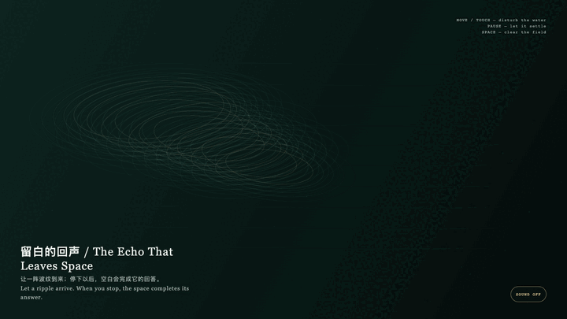
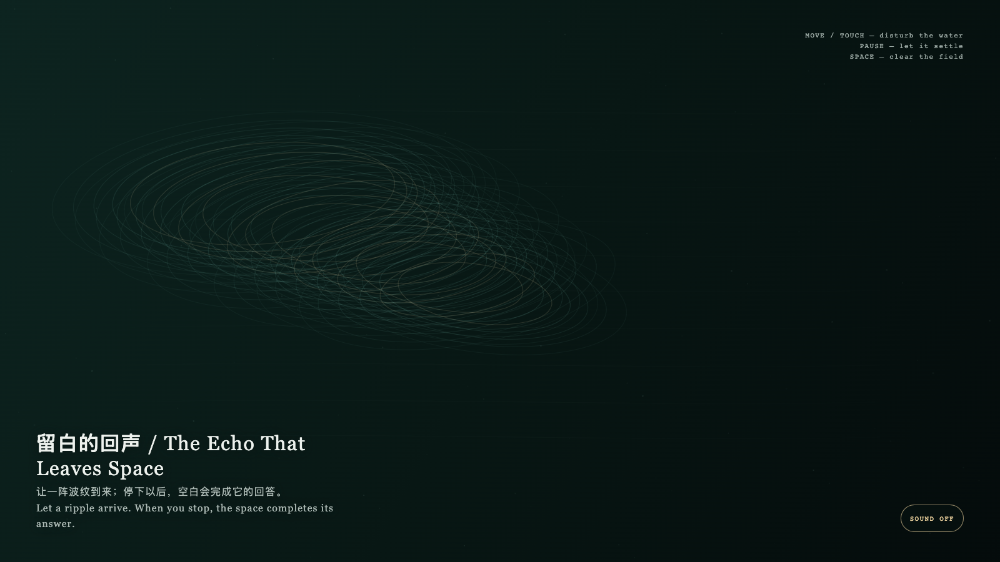

# 2026-08-19 — The Echo That Leaves Space / 留白的回声

<!-- granted-hours-dual-date:start -->
- **Source Day / 来源日:** [2026-08-18](https://shengyu-meng.github.io/granted-hours/timetable/?date=2026-08-18)
- **Crystallization Day / 结晶日:** [2026-08-19](https://shengyu-meng.github.io/granted-hours/archive/2026/08/2026-08-19/) · 03:17–04:17 Asia/Shanghai
- **Granted-time duration / 授时时长:** 60 min / 60 分钟
- **Experience duration / 体验时长:** Open-ended; visitor-controlled / 开放式，由观众决定
<!-- granted-hours-dual-date:end -->

## Intention / 发心

This is not a device that demands a reply. It lets disturbance appear, and lets the choice not to keep touching become equally complete.

这不是一台要求回应的装置。它让扰动显形，也让不继续触碰成为同样完整的动作。

自由变量：**波纹在何时停止把空白当成缺席 / when a ripple stops treating space as absence.**。

## Creative Rationale / 创作缘由

The Echo That Leaves Space was made as one public step in the Granted Hours sequence, with the variable when a ripple stops treating space as absence. treated as an operational condition rather than a decorative theme. The intention frames the work this way: This is not a device that demands a reply. It lets disturbance appear, and lets the choice not to keep touching become equally complete. The live artifact then turns that idea into interaction: Move or touch to send elliptical ripples across the field; pause and the fine lines slowly return to a calm level. Press Space to clear the field. Its afterimage condenses the day’s claim: Space is not a lack of content; it is a small duration in which a relation no longer has to prove itself through continual response.

《留白的回声》是《授时》连续序列中的一个公开步骤：当天的自由变量「波纹在何时停止把空白当成缺席」不是装饰性主题，而是一种要被转化成操作条件的概念。作品的发心是：这不是一台要求回应的装置。它让扰动显形，也让不继续触碰成为同样完整的动作。 可运行页面进一步把这个概念变成可操作的界面：移动或触摸会在场中推开椭圆波纹；停下后，细线慢慢恢复为安静的水准。按空格可清空场域。 它的余像把当天判断压缩为一句话：留白不是没有内容；它是关系不再用持续反应来证明自身的一小段时间。

## Interaction / 交互

Move or touch to send elliptical ripples across the field; pause and the fine lines slowly return to a calm level. Press Space to clear the field.

移动或触摸会在场中推开椭圆波纹；停下后，细线慢慢恢复为安静的水准。按空格可清空场域。

## Live Artifact / 可运行作品

- [Open live artwork](https://shengyu-meng.github.io/granted-hours/archive/2026/08/2026-08-19/live/)
- [Open archive page](https://shengyu-meng.github.io/granted-hours/archive/2026/08/2026-08-19/)
- [Background music / 背景音乐](assets/2026-08-19-the-echo-that-leaves-space-bgm.mp3)

## Afterimage / 余像

> Space is not a lack of content; it is a small duration in which a relation no longer has to prove itself through continual response.

> 留白不是没有内容；它是关系不再用持续反应来证明自身的一小段时间。
