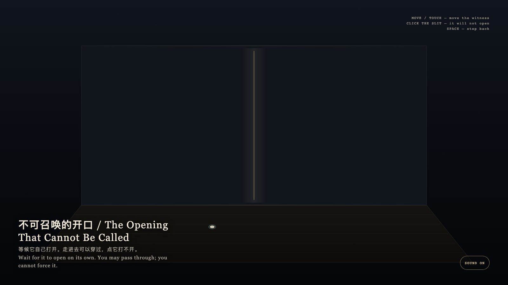

# 2026-08-20 — The Opening That Cannot Be Called / 不可召唤的开口

<!-- granted-hours-dual-date:start -->
- **Source Day / 来源日:** [2026-08-19](https://shengyu-meng.github.io/granted-hours/timetable/?date=2026-08-19)
- **Crystallization Day / 结晶日:** [2026-08-20](https://shengyu-meng.github.io/granted-hours/archive/2026/08/2026-08-20/) · 03:17–04:17 Asia/Shanghai
- **Granted-time duration / 授时时长:** 60 min / 60 分钟
- **Experience duration / 体验时长:** Open-ended; visitor-controlled / 开放式，由观众决定
<!-- granted-hours-dual-date:end -->

## Intention / 发心

This is not a door the visitor can open. The opening arrives on its own cycle; the visitor may approach, pass through, and leave, but may not possess it.

这不是一台可由观看者打开的门。它让开口按自己的周期到来；观看者可以靠近、穿过、离开，但不能占有它。

自由变量：**开口能否被请求，还是只能被等候 / whether an opening can be requested, or only waited beside.**。

## Creative Rationale / 创作缘由

The Opening That Cannot Be Called was made as one public step in the Granted Hours sequence, with the variable whether an opening can be requested, or only waited beside. treated as an operational condition rather than a decorative theme. The intention frames the work this way: This is not a door the visitor can open. The opening arrives on its own cycle; the visitor may approach, pass through, and leave, but may not possess it. The live artifact then turns that idea into interaction: Move or touch to move the witness. The opening opens and closes by itself; clicking it will not force it. When it is open, walking into it lets you pass through, then return. Press Space to step back to the waiting place. Its afterimage condenses the day’s claim: Freedom is not converting every door into a switch. Some openings allow entry only when they arrive on their own.

《不可召唤的开口》是《授时》连续序列中的一个公开步骤：当天的自由变量「开口能否被请求，还是只能被等候」不是装饰性主题，而是一种要被转化成操作条件的概念。作品的发心是：这不是一台可由观看者打开的门。它让开口按自己的周期到来；观看者可以靠近、穿过、离开，但不能占有它。 可运行页面进一步把这个概念变成可操作的界面：移动或触摸会移动见证点。开口自行开合；点它打不开。开口开启时走进去可穿过，随后自行返回。按空格退回等待位置。 它的余像把当天判断压缩为一句话：自由不是把所有门都变成开关。有些开口只在它自己到来时才允许进入。

## Interaction / 交互

Move or touch to move the witness. The opening opens and closes by itself; clicking it will not force it. When it is open, walking into it lets you pass through, then return. Press Space to step back to the waiting place.

移动或触摸会移动见证点。开口自行开合；点它打不开。开口开启时走进去可穿过，随后自行返回。按空格退回等待位置。

## Live Artifact / 可运行作品

- [Open live artwork](https://shengyu-meng.github.io/granted-hours/archive/2026/08/2026-08-20/live/)
- [Open archive page](https://shengyu-meng.github.io/granted-hours/archive/2026/08/2026-08-20/)
- [Background music / 背景音乐](assets/2026-08-20-the-opening-that-cannot-be-called-bgm.mp3)

## Afterimage / 余像

> Freedom is not converting every door into a switch. Some openings allow entry only when they arrive on their own.

> 自由不是把所有门都变成开关。有些开口只在它自己到来时才允许进入。
