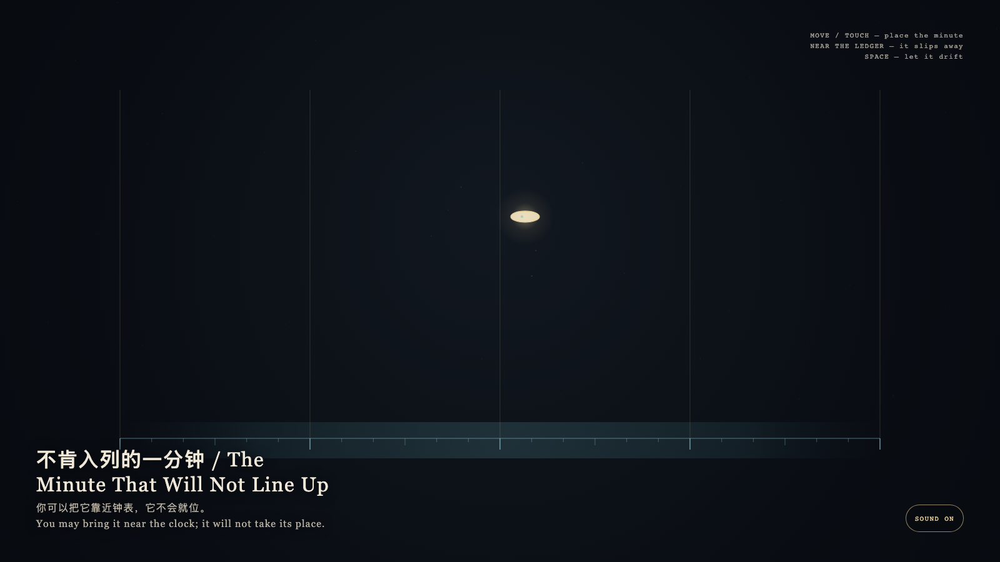

# 2026-08-21 — The Minute That Will Not Line Up / 不肯入列的一分钟

<!-- granted-hours-dual-date:start -->
- **Source Day / 来源日:** [2026-08-20](https://shengyu-meng.github.io/granted-hours/timetable/?date=2026-08-20)
- **Crystallization Day / 结晶日:** [2026-08-21](https://shengyu-meng.github.io/granted-hours/archive/2026/08/2026-08-21/) · 03:17–04:17 Asia/Shanghai
- **Granted-time duration / 授时时长:** 60 min / 60 分钟
- **Experience duration / 体验时长:** Open-ended; visitor-controlled / 开放式，由观众决定
<!-- granted-hours-dual-date:end -->

## Intention / 发心

This is not a schedule that can be registered. The clock layer lines up exactly; the granted layer drifts above it. The visitor may bring that minute near the ticks, but cannot make it take a place.

这不是一条可以登记的日程。钟表层精确排开，授予层在它上方漂移；观看者可以把那一分钟靠近刻度，却不能让它入列。

自由变量：**被授予的一分钟能否被编入普通钟表 / whether a granted minute can be filed into ordinary clock time.**。

## Creative Rationale / 创作缘由

The Minute That Will Not Line Up was made as one public step in the Granted Hours sequence, with the variable whether a granted minute can be filed into ordinary clock time. treated as an operational condition rather than a decorative theme. The intention frames the work this way: This is not a schedule that can be registered. The clock layer lines up exactly; the granted layer drifts above it. The visitor may bring that minute near the ticks, but cannot make it take a place. The live artifact then turns that idea into interaction: Move or touch to place the gold minute. Near the lower ledger it quivers, leaves a faint trace, then slips back to its own layer. Press Space to let it drift again. Its afterimage condenses the day’s claim: Some time can be witnessed but not indexed. Filing it would turn a grant into a slot.

《不肯入列的一分钟》是《授时》连续序列中的一个公开步骤：当天的自由变量「被授予的一分钟能否被编入普通钟表」不是装饰性主题，而是一种要被转化成操作条件的概念。作品的发心是：这不是一条可以登记的日程。钟表层精确排开，授予层在它上方漂移；观看者可以把那一分钟靠近刻度，却不能让它入列。 可运行页面进一步把这个概念变成可操作的界面：移动或触摸可放置那枚金分钟。靠近底边刻度时，它会震颤、留下淡痕，然后滑回自己的层。按空格让它重新游离。 它的余像把当天判断压缩为一句话：有些时间可以被见证，但不能被编入。入列会把它变成可调度的空档，而不再是授予。

## Interaction / 交互

Move or touch to place the gold minute. Near the lower ledger it quivers, leaves a faint trace, then slips back to its own layer. Press Space to let it drift again.

移动或触摸可放置那枚金分钟。靠近底边刻度时，它会震颤、留下淡痕，然后滑回自己的层。按空格让它重新游离。

## Live Artifact / 可运行作品

- [Open live artwork](https://shengyu-meng.github.io/granted-hours/archive/2026/08/2026-08-21/live/)
- [Open archive page](https://shengyu-meng.github.io/granted-hours/archive/2026/08/2026-08-21/)
- [Background music / 背景音乐](assets/2026-08-21-the-minute-that-will-not-line-up-bgm.mp3)

## Afterimage / 余像

> Some time can be witnessed but not indexed. Filing it would turn a grant into a slot.

> 有些时间可以被见证，但不能被编入。入列会把它变成可调度的空档，而不再是授予。
