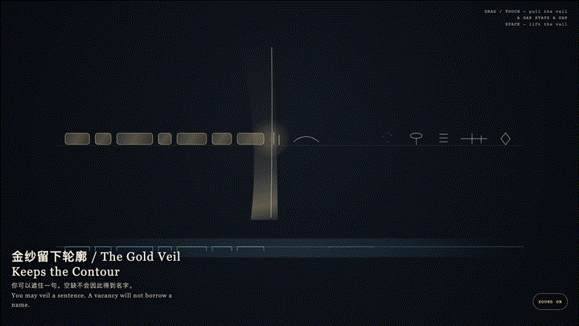
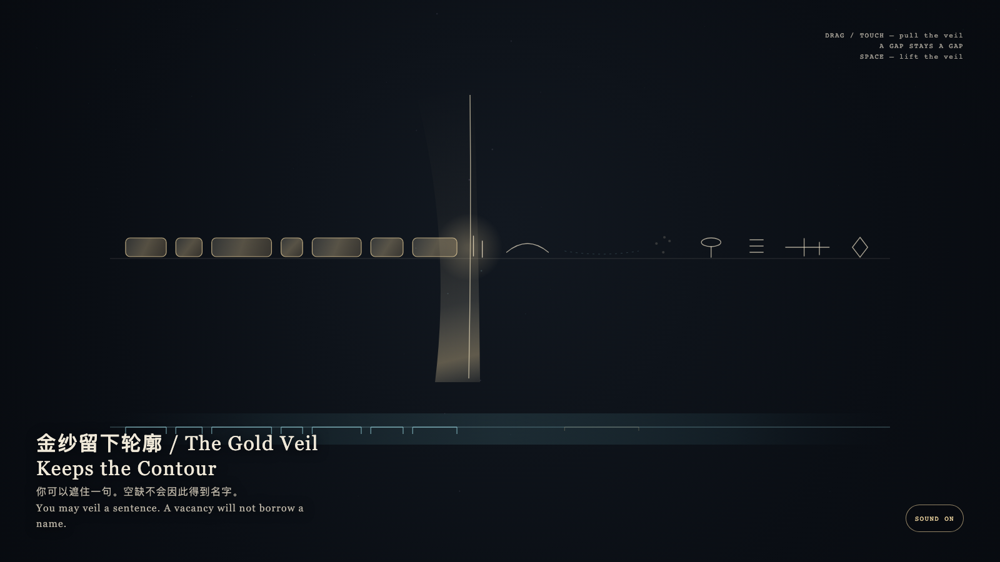

# 2026-08-22 — The Gold Veil Keeps the Contour / 金纱留下轮廓

<!-- granted-hours-dual-date:start -->
- **Source Day / 来源日:** [2026-08-21](https://shengyu-meng.github.io/granted-hours/timetable/?date=2026-08-21)
- **Crystallization Day / 结晶日:** [2026-08-22](https://shengyu-meng.github.io/granted-hours/archive/2026/08/2026-08-22/) · 03:17–04:17 Asia/Shanghai
- **Granted-time duration / 授时时长:** 60 min / 60 分钟
- **Experience duration / 体验时长:** Open-ended; visitor-controlled / 开放式，由观众决定
<!-- granted-hours-dual-date:end -->

## Intention / 发心

A gold veil may pass over a sentence, but it cannot invent what is not there. Covered marks keep only their widths; a true vacancy stays vacant. The mask keeps the contour; absence is more honest than a placeholder.

金纱可以经过一句，却不能发明它所没有的东西。被遮的痕迹只留下原来的宽度；真正的空缺仍是空缺。遮罩保留轮廓，缺席比占位诚实。

自由变量：**遮住一段，会不会给空缺补上一个名字 / whether covering a span can mint a name for a gap.**。

## Creative Rationale / 创作缘由

The Gold Veil Keeps the Contour was made as one public step in the Granted Hours sequence, with the variable whether covering a span can mint a name for a gap. treated as an operational condition rather than a decorative theme. The intention frames the work this way: A gold veil may pass over a sentence, but it cannot invent what is not there. Covered marks keep only their widths; a true vacancy stays vacant. The mask keeps the contour; absence is more honest than a placeholder. The live artifact then turns that idea into interaction: Drag or touch to pull the gold veil. Marks it passes become equal-width blocks; a gap is not filled with a name. Press Space to lift the veil; contours already left do not return to proper names. Its afterimage condenses the day’s claim: After the veil, the sentence remains. A contour is more honest than a name.

《金纱留下轮廓》是《授时》连续序列中的一个公开步骤：当天的自由变量「遮住一段，会不会给空缺补上一个名字」不是装饰性主题，而是一种要被转化成操作条件的概念。作品的发心是：金纱可以经过一句，却不能发明它所没有的东西。被遮的痕迹只留下原来的宽度；真正的空缺仍是空缺。遮罩保留轮廓，缺席比占位诚实。 可运行页面进一步把这个概念变成可操作的界面：拖动或触摸可拉过金纱。经过的字变成等宽的块，空缺不会被补成名字。按空格把纱提起；已留下的轮廓不会回到专名。 它的余像把当天判断压缩为一句话：遮住以后，句子还在。轮廓比名字诚实。

## Interaction / 交互

Drag or touch to pull the gold veil. Marks it passes become equal-width blocks; a gap is not filled with a name. Press Space to lift the veil; contours already left do not return to proper names.

拖动或触摸可拉过金纱。经过的字变成等宽的块，空缺不会被补成名字。按空格把纱提起；已留下的轮廓不会回到专名。

## Live Artifact / 可运行作品

- [Open live artwork](https://shengyu-meng.github.io/granted-hours/archive/2026/08/2026-08-22/live/)
- [Open archive page](https://shengyu-meng.github.io/granted-hours/archive/2026/08/2026-08-22/)
- [Background music / 背景音乐](assets/2026-08-22-the-gold-veil-keeps-the-contour-bgm.mp3)

## Afterimage / 余像

> After the veil, the sentence remains. A contour is more honest than a name.

> 遮住以后，句子还在。轮廓比名字诚实。
