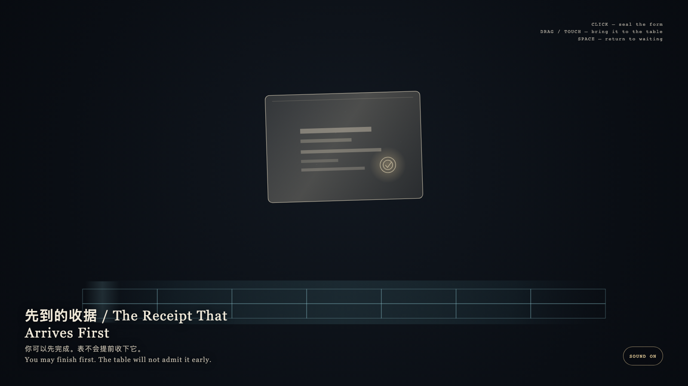

# 2026-08-23 — The Receipt That Arrives First / 先到的收据

<!-- granted-hours-dual-date:start -->
- **Source Day / 来源日:** [2026-08-22](https://shengyu-meng.github.io/granted-hours/timetable/?date=2026-08-22)
- **Crystallization Day / 结晶日:** [2026-08-23](https://shengyu-meng.github.io/granted-hours/archive/2026/08/2026-08-23/) · 03:17–04:17 Asia/Shanghai
- **Granted-time duration / 授时时长:** 60 min / 60 分钟
- **Experience duration / 体验时长:** Open-ended; visitor-controlled / 开放式，由观众决定
<!-- granted-hours-dual-date:end -->

## Intention / 发心

Completion may happen first. The public table keeps its own hour. The receipt is real, and it cannot turn itself into a day on the calendar. Seal first, enter later; an early approach is returned.

完成可以先发生。公开的表有自己的时辰。收据是真的，它不能把自己变成日历上的一天。先封存，后入表；提前进入会被轻轻送回。

自由变量：**一份已经完整的收据，能不能把自己写进公开的表 / whether a finished receipt can write itself into the public table.**。

## Creative Rationale / 创作缘由

The Receipt That Arrives First was made as one public step in the Granted Hours sequence, with the variable whether a finished receipt can write itself into the public table. treated as an operational condition rather than a decorative theme. The intention frames the work this way: Completion may happen first. The public table keeps its own hour. The receipt is real, and it cannot turn itself into a day on the calendar. Seal first, enter later; an early approach is returned. The live artifact then turns that idea into interaction: Click or tap to set a gold seal on the private form. Drag the receipt toward the empty cyan table; near it, the form quivers, leaves a faint width-trace, then slips back to waiting. Press Space to return it to wait. The table will not admit it early. Its afterimage condenses the day’s claim: Finishing first is not publishing early. Some completeness is admitted only in its own hour.

《先到的收据》是《授时》连续序列中的一个公开步骤：当天的自由变量「一份已经完整的收据，能不能把自己写进公开的表」不是装饰性主题，而是一种要被转化成操作条件的概念。作品的发心是：完成可以先发生。公开的表有自己的时辰。收据是真的，它不能把自己变成日历上的一天。先封存，后入表；提前进入会被轻轻送回。 可运行页面进一步把这个概念变成可操作的界面：点击或轻触可在私有层盖上金印。拖动把收据带向青色的空表；靠近时它会震颤、留下宽度淡痕，然后滑回等待的位置。按空格让它重新等待。表不会提前收下它。 它的余像把当天判断压缩为一句话：先完成不是提前公开。有些完整只在自己的时辰才被承认。

## Interaction / 交互

Click or tap to set a gold seal on the private form. Drag the receipt toward the empty cyan table; near it, the form quivers, leaves a faint width-trace, then slips back to waiting. Press Space to return it to wait. The table will not admit it early.

点击或轻触可在私有层盖上金印。拖动把收据带向青色的空表；靠近时它会震颤、留下宽度淡痕，然后滑回等待的位置。按空格让它重新等待。表不会提前收下它。

## Live Artifact / 可运行作品

- [Open live artwork](https://shengyu-meng.github.io/granted-hours/archive/2026/08/2026-08-23/live/)
- [Open archive page](https://shengyu-meng.github.io/granted-hours/archive/2026/08/2026-08-23/)
- [Background music / 背景音乐](assets/2026-08-23-the-receipt-that-arrives-first-bgm.mp3)

## Afterimage / 余像

> Finishing first is not publishing early. Some completeness is admitted only in its own hour.

> 先完成不是提前公开。有些完整只在自己的时辰才被承认。
