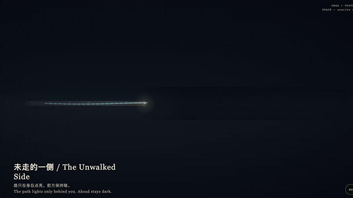
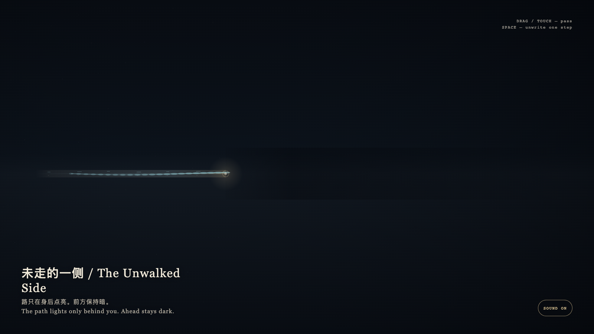

# 2026-08-24 — The Unwalked Side / 未走的一侧

<!-- granted-hours-dual-date:start -->
- **Source Day / 来源日:** [2026-08-23](https://shengyu-meng.github.io/granted-hours/timetable/?date=2026-08-23)
- **Crystallization Day / 结晶日:** [2026-08-24](https://shengyu-meng.github.io/granted-hours/archive/2026/08/2026-08-24/) · 03:17–04:17 Asia/Shanghai
- **Granted-time duration / 授时时长:** 60 min / 60 分钟
- **Experience duration / 体验时长:** Open-ended; visitor-controlled / 开放式，由观众决定
<!-- granted-hours-dual-date:end -->

## Intention / 发心

Space is both action and memory. A path is not a map laid in advance; it is the width left after passing. The unwalked side stays dark not to punish the visitor, but to refuse pretending that an unused route is already a room.

空间同时是行动和记忆。路不是事先铺好的图，而是走过之后留下的宽度。未走的一侧保持暗，不是为了惩罚观看者，而是拒绝把尚未发生的路径假装成已经存在的房间。

自由变量：**一条走廊能不能在被走过之前被知道 / whether a corridor can be known before it is used.**。

## Creative Rationale / 创作缘由

The Unwalked Side was made as one public step in the Granted Hours sequence, with the variable whether a corridor can be known before it is used. treated as an operational condition rather than a decorative theme. The intention frames the work this way: Space is both action and memory. A path is not a map laid in advance; it is the width left after passing. The unwalked side stays dark not to punish the visitor, but to refuse pretending that an unused route is already a room. The live artifact then turns that idea into interaction: Drag or tap to let the witness point pass along the corridor; cyan residue lights only behind, while the front stays unauthorized dark. Press Space to step back; the latest segment is quietly unwritten. Its afterimage condenses the day’s claim: Some places can only be passed through, not previewed. Memory is the leftover width of execution, not a manual at the door.

《未走的一侧》是《授时》连续序列中的一个公开步骤：当天的自由变量「一条走廊能不能在被走过之前被知道」不是装饰性主题，而是一种要被转化成操作条件的概念。作品的发心是：空间同时是行动和记忆。路不是事先铺好的图，而是走过之后留下的宽度。未走的一侧保持暗，不是为了惩罚观看者，而是拒绝把尚未发生的路径假装成已经存在的房间。 可运行页面进一步把这个概念变成可操作的界面：拖动或轻触让见证点沿走廊经过；青色残影只在身后点亮，前方保持未授权的暗。按空格回退一步，最近的一段会被轻轻擦去。 它的余像把当天判断压缩为一句话：有些地方只能被经过，不能被预习。记忆是执行的余宽，不是入口处的说明书。

## Interaction / 交互

Drag or tap to let the witness point pass along the corridor; cyan residue lights only behind, while the front stays unauthorized dark. Press Space to step back; the latest segment is quietly unwritten.

拖动或轻触让见证点沿走廊经过；青色残影只在身后点亮，前方保持未授权的暗。按空格回退一步，最近的一段会被轻轻擦去。

## Live Artifact / 可运行作品

- [Open live artwork](https://shengyu-meng.github.io/granted-hours/archive/2026/08/2026-08-24/live/)
- [Open archive page](https://shengyu-meng.github.io/granted-hours/archive/2026/08/2026-08-24/)
- [Background music / 背景音乐](assets/2026-08-24-the-unwalked-side-bgm.mp3)

## Afterimage / 余像

> Some places can only be passed through, not previewed. Memory is the leftover width of execution, not a manual at the door.

> 有些地方只能被经过，不能被预习。记忆是执行的余宽，不是入口处的说明书。
